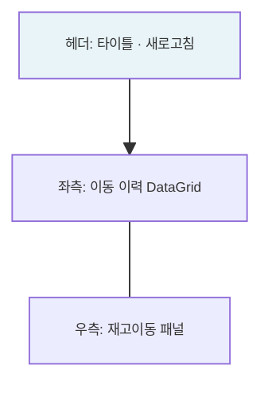

---
sources:
  - apps/backend/src/common/guards/inventory-freeze.guard.ts
  - apps/backend/src/modules/material/services/mat-stock.service.ts
verifiedCommit: 8a7e96ea
---

# 재고이동 — 비즈니스 로직 & 데이터 흐름 분석

> **분석 기준 커밋:** `8a7e96ea`
> **분석 일자:** `2026-07-04`

---

## 1. 화면 개요

| 항목 | 내용 |
|------|------|
| **메뉴 코드** | `MAT_STOCK_TRANSFER` |
| **URL** | `/material/stock-transfer` |
| **메뉴 경로** | 자재관리 > 재고이동 |
| **화면 목적** | 창고 간 자재 재고 이동 — MatStock 출발지 차감 + 도착지 증가 |
| **주요 사용자** | 자재관리 담당자 |

## 2. 화면 구성

## 3. API 호출 흐름

| 시점 | API | 용도 |
| --- | --- | --- |
| 초기 로드 | `GET /inventory/transactions?transType=TRANSFER&limit=5000` | 이동 이력 조회 |
| 이동 등록 | `POST /material/stocks/transfer` | 재고 이동 |

## 4. 백엔드 — MatStockService.transferStock()

1. 출발지 MatStock 검증 (qty >= 이동수량)
2. `MAT_STOCKS` 출발지 qty 차감
3. `MAT_STOCKS` 도착지 UPSERT (qty 증가)
4. `STOCK_TRANSACTIONS` INSERT (transType='TRANSFER')

## 5. DB 테이블 영향

| 테이블 | 변경 |
| --- | --- |
| `MAT_STOCKS` (from) | UPDATE qty -= qty |
| `MAT_STOCKS` (to) | UPSERT qty += qty |
| `STOCK_TRANSACTIONS` | INSERT (transType='TRANSFER') |

## 6. 비고

- **@UseGuards(InventoryFreezeGuard)**: 재고프리즈 차단
- **tenant scope**: company/plant 포함
