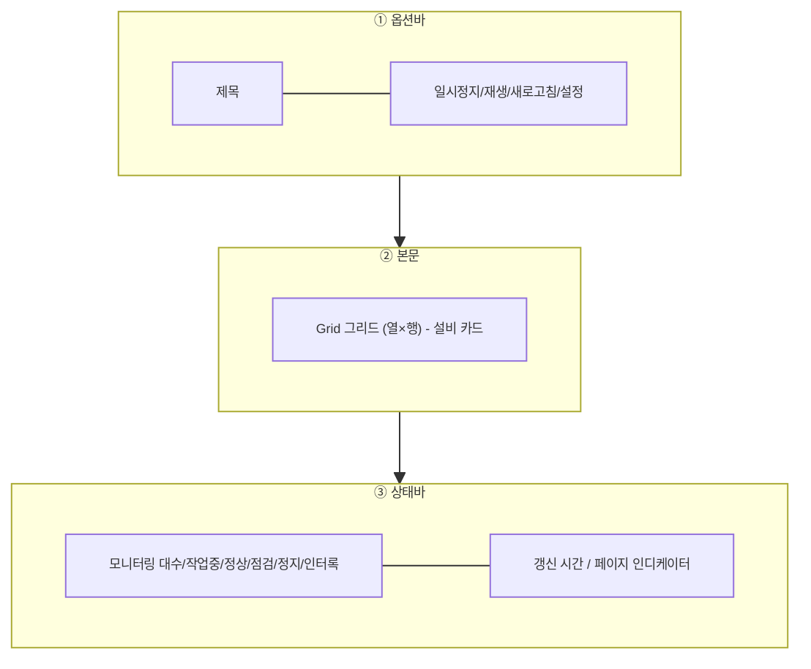

# 설비 가동현황 모니터링 — 비즈니스 로직 & 데이터 흐름 분석

> **분석 기준 커밋:** `8a7e96ea8e9f2710bd79a8c5d12cbbc8ecc1ab26`
> **분석 일자:** `2026-07-04`

---

## 1. 화면 개요

| 항목 | 내용 |
|------|------|
| **메뉴 코드** | `MON_EQUIP_STATUS` |
| **URL** | `/equipment/status` |
| **메뉴 경로** | 모니터링 > 설비 가동현황 |
| **화면 목적** | 설비 상태와 현재 작업 현황을 실시간 모니터링 (사이니지 용) — 스크롤 없이 한 화면 그리드, 자동 롤링 |
| **주요 사용자** | 생산관리자, 설비관리자, 현장 반장 |
| **Workflow 노드** | 해당 없음 |

## 2. 화면 구성

### 2.1 레이아웃

| 영역 | 컴포넌트 | 역할 |
| --- | --- | --- |
| ① 옵션바 | `MonitoringFrame` 내장 | 제목 + `Pause/Play`, `Refresh`, `Settings` 버튼 |
| ② 본문 | `MonitoringFrame` + `EquipStatusCard` | 설비별 상태 카드를 `columns×rows` 그리드로 표시, 페이지 수 >1이면 자동 롤링 |
| ③ 상태바 | `MonitoringFrame` 내장 | 각 상태별 count + 갱신 시각 + 페이지 인디케이터 |

### 2.2 입력 필드

| 필드 | 타입 | 설명 |
| --- | --- | --- |
| `MonitoringSettingsModal` | 모달 | 설비 대상 다중선택, 재조회 주기(sec), 롤링 주기(sec), 그리드 열·행 설정 → `localStorage` 저장 |

### 2.3 버튼/액션

| 버튼 | 핸들 | 설명 |
| --- | --- | --- |
| 일시정지/재생 | `setPaused` | 자동 롤링 일시정지/재생 토글 |
| 새로고침 | `refetch()` | `useApiQuery.refetch()`로 강제 재조회 |
| 설정 | `setSettingsOpen(true)` | 모니터링 설정 모달 열기 |

## 3. 상태 관리

Zustand store 미사용. `useState` + `useMonitoringConfig`(localStorage) + `useApiQuery`(react-query)로 관리:

| 상태 | 타입 | 출처 |
| --- | --- | --- |
| `config` | `MonitoringConfig` | `useMonitoringConfig("monitoring:equip-status")` → localStorage |
| `paused` | boolean | `useState(false)` |
| `equipments` | `EquipCard[]` | `useApiQuery` → `GET /equipment/equips?limit=500` |
| `progressRes` | `ProgressJob[]` | `useApiQuery` → `GET /production/progress?status=RUNNING&limit=500` |
| `jobMap` | `Map<equipCode, RunningJob>` | `useMemo`로 `progressRes` 맵 변환 |
| `filtered` | `EquipCard[]` | `useMemo`로 `selectedCodes` 기준 필터링 |

### useMonitoringConfig (`components/monitoring/useMonitoringConfig.ts`)

| 키 | 설명 | 기본값 |
| --- | --- | --- |
| `selectedCodes` | 모니터링 대상 설비 코드 목록 (빈 배열 = 전체) | `[]` |
| `refetchSec` | 데이터 재조회 주기 (초) | `30` |
| `rollingSec` | 페이지 자동 롤링 주기 (초) | `8` |
| `columns` | 그리드 열 수 | `5` |
| `rows` | 그리드 행 수 | `4` |

설정값은 localStorage `key = "monitoring:equip-status"`에 JSON 형태로 영속화.

## 4. API 호출 흐름

### 4-1. 조회

| 시점 | API | 용도 | 호출 URL |
| --- | --- | --- | --- |
| 마운트 + refetchInterval | `GET /equipment/equips?limit=500` | 운영 중인 설비 목록 (상태, TYPE, 공정 등) | `EquipStatusPage.tsx:39` |
| 마운트 + refetchInterval | `GET /production/progress?status=RUNNING&limit=500` | 현재 RUNNING 상태 작업지시 (설비별 작업 매핑용) | `EquipStatusPage.tsx:47` |

두 API 모두 `refetchInterval: Math.max(5000, config.refetchSec * 1000)` ms로 자동 재조회 (최소 5초).

## 5. 백엔드 처리

### 5-1. `GET /equipment/equips`

Controller: `EquipMasterController.findAll()` (`apps/backend/src/modules/equipment/controllers/equip-master.controller.ts`)

Service: `EquipMasterService.findAll()` (`apps/backend/src/modules/equipment/services/equip-master.service.ts:84`)

- `EquipMasterQueryDto`에서 `page`, `limit`, `equipType`, `lineCode`, `status`, `search`, `company`, `plant` 등 필터링
- 쿼리빌더로 조건 WHERE, `equipCode` ASC 정렬, 페이지네이션
- 공정명(`processName`)과 라인구분(`lineType`)을 `ProcessMaster`에서 함께 조회(N+1 회피)
- `clientId` = `equipCode` (클라이언트용 ID 매핑)

DTO `EquipMasterQueryDto`: `{ page?: number, limit?: number, equipType?: string, lineCode?: string, status?: string, search?: string, ... }`

### 5-2. `GET /production/progress`

Controller: `ProductionViewsController.getProgress()` (`apps/backend/src/modules/production/controllers/production-views.controller.ts:30`)

Service: `ProductionViewsService.getProgress()` (`apps/backend/src/modules/production/services/production-views.service.ts:50`)

- `ProgressQueryDto`: `status`, `planDateFrom`, `planDateTo`, `search`, `shift`, `page`, `limit`
- `JobOrder` + `Part`(leftJoin) 조회, `status=RUNNING` 등 필터
- 작업지시별 계획수량(planQty), 양품수량(goodQty), 불량수량(defectQty) 반환

### 5-3. 엔티티

| 엔티티 | 테이블 | 주요 컬럼 |
| --- | --- | --- |
| `EquipMaster` | `EQUIP_MASTERS` | `equipCode(PK)`, `equipName`, `equipType`, `modelName`, `lineCode`, `processCode`, `status`, `ipAddress`, `maker`, `currentJobOrderId`, `currentWorkerCodes`, `useYn`, `company(PK)`, `plant(PK)` |
| `JobOrder` | `JOB_ORDERS` | `orderNo`, `equipCode`, `part.itemName`, `planQty`, `goodQty`, `defectQty`, `status` |

## 6. 처리 규칙 및 검증

| 규칙 | 설명 |
| --- | --- |
| 실패 시 수동 롤링 | `filtered.length > 0`이면 `paused=false` 상태에서 롤링 계속 |
| 최소 refetch | `Math.max(5000, config.refetchSec * 1000)` — 5초 미만 불가 |
| 빈 select → 전체 | `config.selectedCodes.length === 0` → 필터 없이 전체 설비 표시 |
| card data | 1) `EquipStatusCard`에서 `equip.status`별 색상/펄스dot 정의 (`statusStyle: NORMAL/MAINT/STOP/INTERLOCK`) |
| 작업 매핑 | `progressRes` 데이터를 `useMemo`로 `Map<equipCode, RunningJob>` 변환, 작업 없는 설비는 "작업 대기" 표시 |
| 진행률 | `job.planQty > 0 ? Math.round(job.goodQty / job.planQty * 100) : 0` |

## 7. 상태 전이

해당 없음. 읽기 전용 모니터링 화면.

## 8. 상태 코드 및 공통코드

| 코드 | 표시명 | 스타일 |
| --- | --- | --- |
| `comCode.EQUIP_STATUS.NORMAL` | 정상 | 파랑바 + 초록dot (ping) |
| `comCode.EQUIP_STATUS.MAINT` | 점검 | 호박바 + 흰dot |
| `comCode.EQUIP_STATUS.STOP` | 정지 | 빨강바 + 흰dot |
| `comCode.EQUIP_STATUS.INTERLOCK` | 인터록 | 회색바 + 빨강dot (ping) |

## 9. DB 테이블 영향 및 엔티티

읽기 전용. 조회만 수행.

| 테이블 | 역할 |
| --- | --- |
| `EQUIP_MASTERS` | 설비 목록 + 상태 |
| `PROD_LINE_MASTERS` | 라인 코드/명 매핑 (enrichment) |
| `PROCESS_MASTERS` | 공정 코드/명 매핑 (enrichment) |
| `JOB_ORDERS` | 작업 중 작업지시 조회 |
| `PROD_RESULTS` | 양품/불량 수량 집계 (JOIN) |

## 10. 에러 코드 및 메시지

| 상황 | 처리 |
| --- | --- |
| API 실패 | `useApiQuery` 기본 에러 처리 (에러 바운더리 or 콘솔), 기존 캐시 유지 |
| 설정 모달 유효성 | `refetchSec` 최소옵션 `10`, `rollingSec` 최소옵션 `5` |
| 설정 모달 손상 | `localStorage` 파싱 실패 시 `DEFAULT_MONITORING_CONFIG` 사용 |

## 11. 비고

- `MonitoringFrame`은 `components/monitoring/`의 공통 컴포넌트: 다른 모니터링 화면에서 재사용 가능.
- `useApiQuery`는 `@/hooks/useApi`의 커스텀 래퍼, react-query 기반으로 `refetchInterval`, `enabled` 옵션 지원.
- 설정 `localStorage` key = `"monitoring:equip-status"` (하드코딩 문자열 리터럴).
- 설비 수가 500대를 초과하면 `limit=500` 조정 필요. 현재 `EquipMasterController.findAll` 기본 `limit=20`이므로 명시적 `?limit=500` 전달.
- 페이지 롤링은 `MonitoringFrame`의 `setInterval(rollingIntervalMs)`로, 페이지가 1장이면 롤링하지 않음 (`pages.length <= 1`).
- 각 `EquipStatusCard`는 상단 색상바, 설비코드+배지, 설비명, TYPE+공정, 하단 작업중 모델+진행바로 구성되어 높이 변동 없이 모든 셀이 동일 크기 유지.