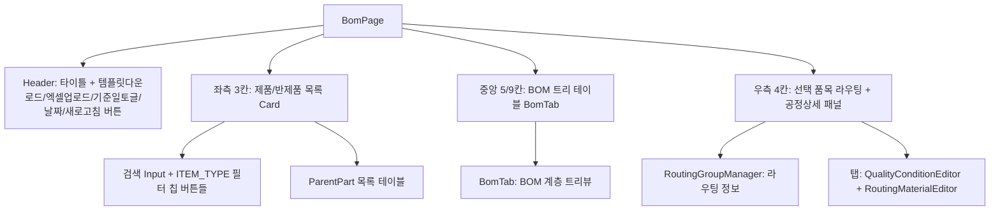
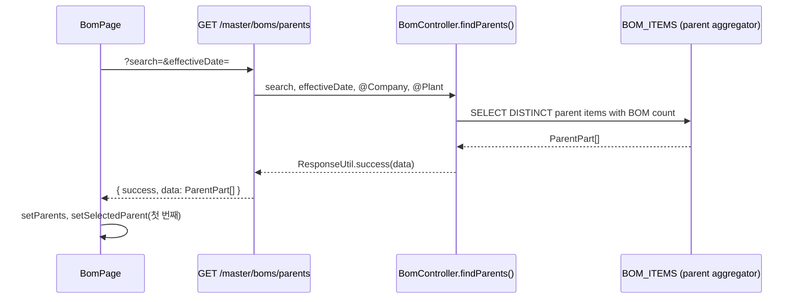
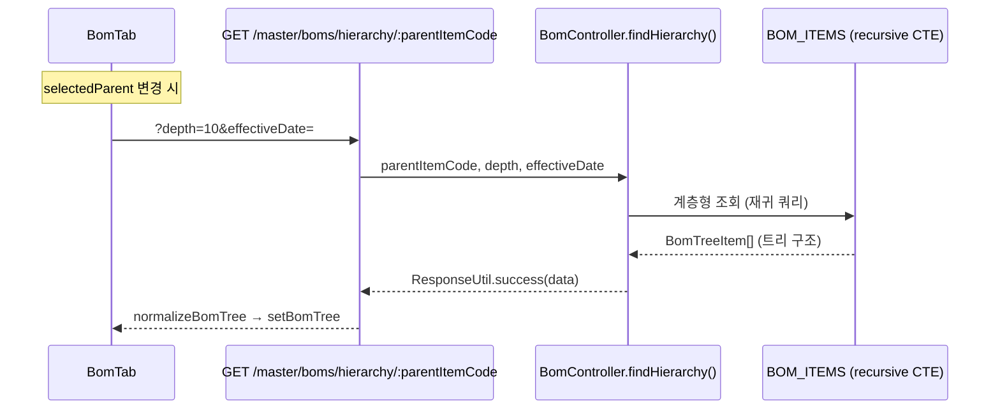
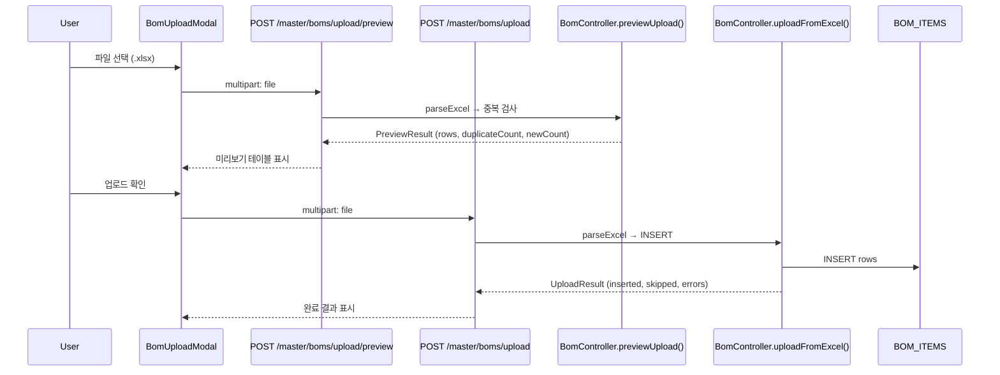

# BOM (MST_BOM) — 비즈니스 로직 & 데이터 흐름 분석

> **분석 기준 커밋:** `8a7e96ea`
> **분석 일자:** `2026-07-04`

## 1. 화면 개요

| 항목 | 내용 |
|---|---|
| 메뉴 코드 | MST_BOM |
| 페이지 경로 | `/master/bom` |
| 화면 제목 | BOM 구조 관리 |
| 주요 기능 | 제품/반제품 BOM 트리 조회, BOM CRUD, Excel 일괄 업로드/내보내기, 선택 품목 라우팅+투입자재 조회 |
| 데이터 소스 | Oracle BOM_ITEMS (BOM 트리) |

## 2. 화면 구성

### 컴포넌트 목록

| 파일 | 역할 |
|---|---|
| `page.tsx` | 메인 레이아웃, 좌/중/우 3분할 그리드 |
| `components/BomTab.tsx` | BOM 계층 트리뷰 + CRUD 액션 버튼 |
| `components/BomFormModal.tsx` | BOM 행 추가/수정 모달 |
| `components/BomUploadModal.tsx` | Excel 업로드 미리보기/실행 모달 |
| `components/BomFieldHelp.tsx` | 폼 필드 헬퍼 |
| `types.ts` | BomTreeItem, ParentPart 타입 |

### 버튼 목록

| 버튼 | 동작 | API |
|---|---|---|
| 템플릿 다운로드 | 빈 Excel 템플릿 다운로드 | `GET /master/boms/template` |
| Excel 업로드 | 업로드 모달 열기 | `POST /master/boms/upload/preview` + `POST /master/boms/upload` |
| 기준일/전체이력 토글 | 기준일자/전체 모드 전환 | — |
| 새로고침 | 부모 목록 재조회 | `GET /master/boms/parents` |
| + BOM 추가 | BomFormModal 열기 | — |
| 내보내기 | Excel 내보내기 | `GET /master/boms/export` |
| 라우팅관리 이동 | `/master/routing?itemCode=` 페이지 이동 | — |

## 3. 상태 관리

- `parents[]`: BOM 상위 품목 목록 (GET /master/boms/parents)
- `selectedParent`: 선택된 상위 품목
- `selectedBomItem`: BOM 트리에서 선택된 행의 품목 정보
- `routingInfo`: 선택 BOM 품목의 라우팅 정보 (BomRoutingInfo)
- `selectedProcess`: 라우팅 내 선택된 공정
- `bomDateMode`: `"effective"` (기준일 조회) / `"all"` (전체 이력)
- `effectiveDate`: 기준일자

## 4. API 호출 흐름

### BOM 부모 목록 조회

### BOM 계층 조회

### BOM Excel 업로드

## 5. 백엔드 처리

| 엔드포인트 | 컨트롤러 | 서비스 | 설명 |
|---|---|---|---|
| `GET /master/boms/parents` | `BomController.findParents` | `BomService.findParents` | BOM 상위 품목 목록 |
| `GET /master/boms/hierarchy/:parentItemCode` | `BomController.findHierarchy` | `BomService.findHierarchy` | 계층 트리 조회 (depth 파라미터) |
| `GET /master/boms/parent/:parentItemCode` | `BomController.findByParentId` | `BomService.findByParentId` | 상위품목별 BOM 행 조회 |
| `GET /master/boms` | `BomController.findAll` | `BomService.findAll` | BOM 목록 페이징 |
| `GET /master/boms/:id` | `BomController.findById` | `BomService.findById` | 단건 조회 |
| `POST /master/boms` | `BomController.create` | `BomService.create` | BOM 행 생성 |
| `PUT /master/boms/:id` | `BomController.update` | `BomService.update` | BOM 행 수정 |
| `DELETE /master/boms/:id` | `BomController.delete` | `BomService.delete` | BOM 행 삭제 |
| `GET /master/boms/export` | `BomController.exportToExcel` | `BomService.exportToExcel` | Excel 내보내기 |
| `GET /master/boms/template` | `BomController.downloadTemplate` | `BomService.downloadTemplate` | 템플릿 다운로드 |
| `POST /master/boms/upload/preview` | `BomController.previewUpload` | `BomService.previewUpload` | 업로드 미리보기 (중복 검사) |
| `POST /master/boms/upload` | `BomController.uploadFromExcel` | `BomService.uploadFromExcel` | Excel 업로드 실행 |
| `GET /master/routing-groups/by-item/:itemCode` | `RoutingGroupController.findByItem` | `RoutingGroupService.findByItemCode` | 품목별 라우팅 조회 |

## 6. 처리 규칙 및 검증

- BOM 유형 필터는 `RAW_MATERIAL`, `CONSUMABLE` 제외한 ITEM_TYPE만 표시
- 기준일 모드: 특정 날짜 기준 유효한 BOM만 조회 (`validFrom <= date <= validTo`)
- Excel 업로드 시 중복 검사: 동일 `parentItemCode + childItemCode + validFrom` 조합이 DB에 있으면 중복
- 중복 건이 있으면 업로드 실행 불가 (사전 수정 필요)
- `depth=10` 기본값으로 계층 깊이 제한

## 7. 상태 전이

BOM 행은 이력 관리됨 (`validFrom` / `validTo`). 상태 전이는 없고 버전/기간 관리.

## 8. 상태 코드 및 공통코드

| 코드 그룹 | 사용처 |
|---|---|
| `ITEM_TYPE` | 품목 유형별 필터, 아이콘 색상 |

## 9. DB 테이블 영향 및 엔티티

| 테이블 | 작업 | 비고 |
|---|---|---|
| `BOM_ITEMS` | SELECT/INSERT/UPDATE/DELETE | BOM 구조 메인 테이블 |
| `ROUTING_GROUPS` | SELECT | 라우팅 정보 조회 (BOM 연계) |
| `ROUTING_PROCESSES` | SELECT | 공정 순서 조회 |
| `ROUTING_CONDITIONS` | SELECT | 양품 조건 조회 |
| `ROUTING_MATERIALS` | SELECT | 투입자재 조회 |

주요 엔티티 필드: `PARENT_ITEM_CODE`, `CHILD_ITEM_CODE`, `QTY_PER`, `UNIT`, `VALID_FROM`, `VALID_TO`, `REVISION`, `SIDE`, `SEQ`, `PROCESS_CODE`

## 10. 에러 코드

- `400`: Excel 파일 형식 오류 / 중복 데이터
- `404`: 상위 품목 없음

## 11. 비고

- BOM 트리는 계층형으로 최대 10 depth까지 조회
- 선택한 BOM 행의 품목에 대해 라우팅 정보를 우측 패널에서 바로 확인 가능
- 라우팅 공정 선택 시 QualityConditionEditor / RoutingMaterialEditor 탭으로 세부 설정 조회
- 템플릿 다운로드: 빈 BOM_template.xlsx 파일 반환
