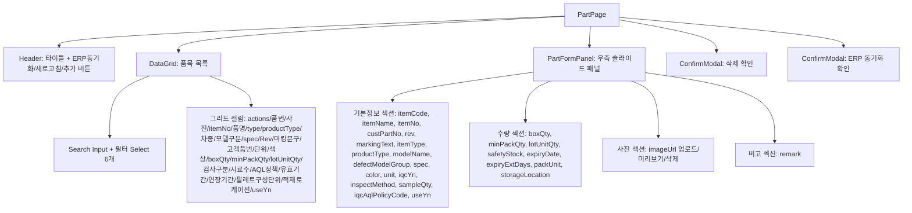
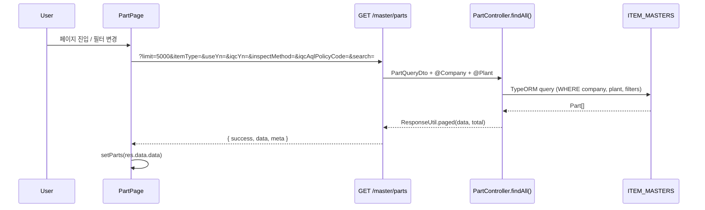
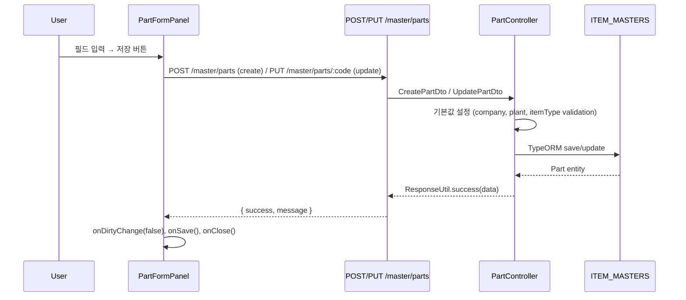
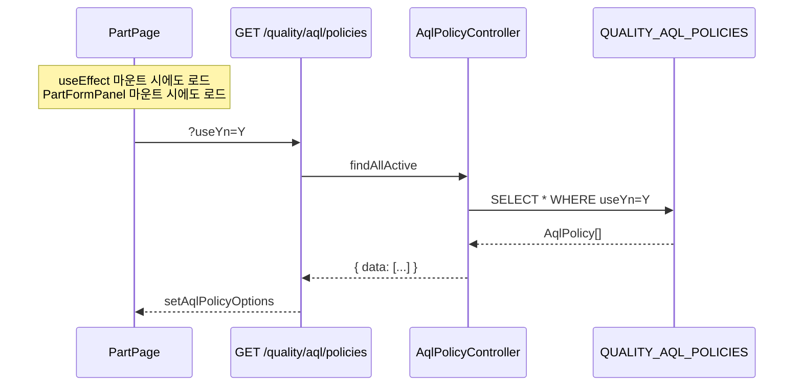
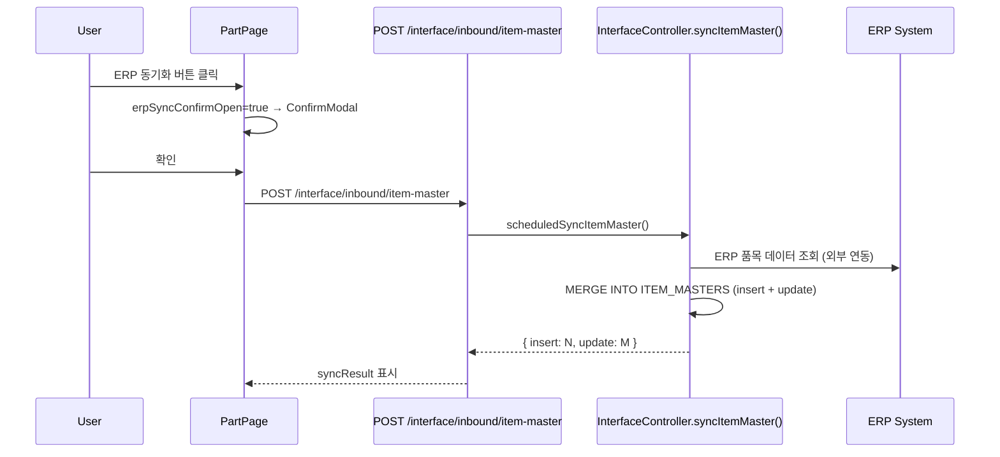

---
sources:
  - apps/backend/src/modules/interface/controllers/interface.controller.ts
  - apps/backend/src/modules/interface/services/interface.service.ts
  - apps/backend/src/modules/master/controllers/part.controller.ts
  - apps/backend/src/modules/master/dto/part.dto.ts
  - apps/backend/src/modules/master/services/part.service.ts
  - apps/frontend/src/app/(authenticated)/master/part/components/PartFormPanel.tsx
  - apps/frontend/src/components/ui/Modal.tsx
  - apps/frontend/src/hooks/useMasterOptions.ts
  - apps/frontend/src/hooks/useUnsavedGuard.ts
verifiedCommit: 8a7e96ea
---

# 품목 마스터 (MST_PART) — 비즈니스 로직 & 데이터 흐름 분석

> **분석 기준 커밋:** `8a7e96ea`
> **분석 일자:** `2026-07-04`

## 1. 화면 개요

| 항목 | 내용 |
|---|---|
| 메뉴 코드 | MST_PART |
| 페이지 경로 | `/master/part` |
| 화면 제목 | 품목 마스터 관리 (Part Master) |
| 주요 기능 | 품목 CRUD, 이미지 업로드/삭제, ERP 동기화, IQC 설정(AQL 정책 연결) |
| 데이터 소스 | Oracle TM_ITEMS / ITEM_MASTERS |

## 2. 화면 구성

### 컴포넌트 목록

| 파일 | 역할 |
|---|---|
| `page.tsx` | 메인 페이지, 검색/필터/그리드/패널 상태 관리 |
| `components/PartFormPanel.tsx` | 품목 추가/수정 슬라이드 폼 패널 |
| `components/PartFieldHelp.tsx` | 폼 필드 헬퍼 컴포넌트 |
| `partColumns.tsx` | DataGrid 컬럼 정의 |
| `types.ts` | Part 인터페이스, PartType 상수 |

### 버튼 목록

| 버튼 | 동작 | API |
|---|---|---|
| ERP 동기화 | `POST /interface/inbound/item-master` | ERP 품목 마스터 → MES 동기화 |
| + 품목 추가 | 우측 패널 열기 (create mode) | — |
| 행 편집 아이콘 | 우측 패널 열기 (edit mode) | — |
| 행 삭제 아이콘 | 삭제 확인 모달 → `DELETE` | `DELETE /master/parts/:itemCode` |
| 저장 | 폼 제출 | `POST /master/parts` / `PUT /master/parts/:itemCode` |
| 이미지 업로드 | 파일 선택 → `POST /master/parts/:id/image` | multipart/form-data |
| 이미지 삭제 | `DELETE /master/parts/:id/image` | — |

## 3. 상태 관리

- `parts[]`: 품목 목록 (useState)
- `searchText`, `debouncedSearch`: 검색어 + 300ms 디바운스
- `partTypeFilter`, `useYnFilter`, `iqcYnFilter`, `inspectMethodFilter`, `aqlPolicyFilter`: 필터 상태
- `isPanelOpen`, `editingPart`, `panelAnimateRef`: 패널 제어 (useRef로 애니메이션 적용)
- `erpSyncing`, `syncResult`: ERP 동기화 피드백
- `useUnsavedGuard`: 패널 내 미저장 변경 감지 → 행 전환 시 확인

## 4. API 호출 흐름

### 품목 목록 조회

### 품목 저장 (create/edit)

### AQL 정책 옵션 로드

### ERP 동기화

## 5. 백엔드 처리

| 엔드포인트 | 컨트롤러 | 서비스 | 설명 |
|---|---|---|---|
| `GET /master/parts` | `PartController.findAll()` | `PartService.findAll` | 페이징+필터링 목록 조회 |
| `GET /master/parts/:id` | `PartController.findById()` | `PartService.findById` | 단건 상세 조회 |
| `POST /master/parts` | `PartController.create()` | `PartService.create` | 품목 생성 (HttpStatus.CREATED) |
| `PUT /master/parts/:id` | `PartController.update()` | `PartService.update` | 품목 수정 |
| `DELETE /master/parts/:id` | `PartController.delete()` | `PartService.delete` | 품목 삭제 |
| `POST /master/parts/:id/image` | `PartController.uploadImage()` | `PartService.updateImage` | 이미지 업로드 (multipart, 5MB 제한, jpg/png/gif/webp) |
| `DELETE /master/parts/:id/image` | `PartController.removeImage()` | `PartService.updateImage(null)` | 이미지 삭제 (파일+DB 경로) |
| `GET /master/parts/types/:type` | `PartController.findByType()` | `PartService.findByType` | 유형별 목록 |
| `GET /quality/aql/policies` | AqlPolicyController | — | AQL 정책 목록 |
| `POST /interface/inbound/item-master` | `InterfaceController.syncItemMaster()` | `InterfaceService.scheduledSyncItemMaster` | ERP 품목 동기화 |

### 처리규칙

- `itemCode`는 수정 불가 (disabled in edit mode)
- `itemType`은 ITEM_TYPE 공통코드 기반 (`RAW_MATERIAL`, `SEMI_PRODUCT`, `FINISHED`, `CONSUMABLE`)
- `productType`은 PRODUCT_TYPE 공통코드 기반
- `unit`은 UNIT_TYPE 공통코드 기반
- `iqcYn=Y` && `inspectMethod` 설정일 때 `iqcAqlPolicyCode` 필수 (`requiresIqcAqlPolicy`)
- 이미지 파일은 `./uploads/parts/`에 저장 (5MB 제한)
- ERP 동기화는 ERP 품목 마스터 전체를 읽어 MERGE 처리

## 6. 처리 규칙 및 검증

- 필수 필드: `itemCode`, `itemNo`, `itemName`, `productType`
- AQL 정책 필수 조건: `iqcYn=Y` and `inspectMethod`가 설정된 경우
- `useYn=N` 행은 DataGrid에서 빨간색 텍스트 표시
- 이미지 업로드: jpeg/png/gif/webp만 허용
- `storageLocation`은 `useLocationOptions()` (로케이션 마스터)에서 선택

## 7. 상태 전이

품목 마스터 자체는 상태 전이가 없는 단순 CRUD 데이터. IQC 설정은 IQC 프로세스(`IQC_INSPECT_METHOD`)와 연결.

## 8. 상태 코드 및 공통코드

| 코드 그룹 | 사용처 | 비고 |
|---|---|---|
| `ITEM_TYPE` | 품목 유형 | RAW_MATERIAL/SEMI_PRODUCT/FINISHED/CONSUMABLE |
| `PRODUCT_TYPE` | 제품유형/품목그룹 | 공통코드 |
| `DEFECT_MODEL_GROUP` | 불량 모델구분 | 공통코드 |
| `UNIT_TYPE` | 단위 (EA 등) | 공통코드 |
| `IQC_INSPECT_METHOD` | 검사구분 (FULL/SKIP) | IQC 검사방식 |
| `USE_YN` | 사용여부 | Y/N |

## 9. DB 테이블 영향 및 엔티티

| 테이블 | 작업 | 비고 |
|---|---|---|
| `ITEM_MASTERS` (`TM_ITEMS`) | SELECT/INSERT/UPDATE/DELETE | 품목 마스터 메인 테이블 |
| `ITEM_IMAGES` (또는 imageUrl 컬럼) | UPDATE | 이미지 URL 저장 |
| `QUALITY_AQL_POLICIES` | SELECT | AQL 정책 옵션 로드 |
| `INTERFACE_LOGS` | INSERT | ERP 동기화 로그 |

주요 엔티티 필드: `ITEM_CODE(PK)`, `ITEM_NAME`, `ITEM_NO(PARTNO)`, `ITEM_TYPE`, `PRODUCT_TYPE`, `UNIT`, `IQC_YN`, `INSPECT_METHOD`, `IQC_AQL_POLICY_CODE`, `BOX_QTY`, `MIN_PACK_QTY`, `LOT_UNIT_QTY`, `SAFETY_STOCK`, `EXPIRY_DATE`, `USE_YN`, `COMPANY`, `PLANT_CD`

## 10. 에러 코드

- `409 Conflict`: 중복 품목 코드
- `400 Bad Request`: 필수 필드 누락
- `404 Not Found`: 존재하지 않는 품목
- `413 Payload Too Large`: 이미지 5MB 초과
- `415 Unsupported Media Type`: 지원하지 않는 이미지 형식

## 11. 비고

- 화면 하단에 `SELECT * FROM ITEM_MASTERS WHERE COMPANY = '40' AND PLANT_CD = '1000'` SQL 표시 (DataGrid sqlQuery prop)
- PartType 색상 매핑: `RAW_MATERIAL=파랑`, `SEMI_PRODUCT=노랑`, `FINISHED=초록`, `CONSUMABLE=보라`
- `@harness/shared`의 `requiresIqcAqlPolicy()` 로직을 공유하여 IQC 정책 필수 조건 판단
