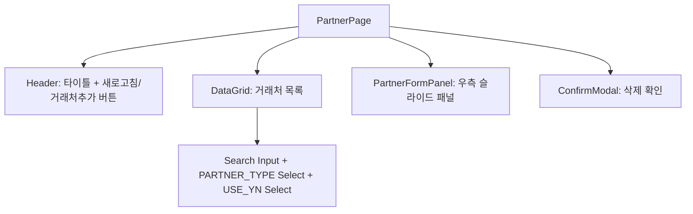
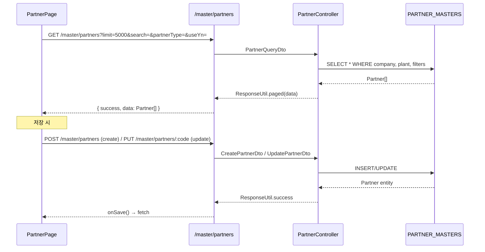

# 거래처 마스터 (MST_PARTNER) — 비즈니스 로직 & 데이터 흐름 분석

> **분석 기준 커밋:** `8a7e96ea`
> **분석 일자:** `2026-07-04`

## 1. 화면 개요

| 항목 | 내용 |
|---|---|
| 메뉴 코드 | MST_PARTNER |
| 페이지 경로 | `/master/partner` |
| 화면 제목 | 거래처 마스터 관리 (Partner Master) |
| 주요 기능 | 거래처 CRUD, 유형별 필터/검색, 소프트 삭제 |
| 데이터 소스 | Oracle PARTNER_MASTERS |

## 2. 화면 구성

### 컴포넌트 목록

| 파일 | 역할 |
|---|---|
| `page.tsx` | 메인 페이지: DataGrid + 패널 상태 관리 |
| `components/PartnerFormPanel.tsx` | 거래처 추가/수정 슬라이드 폼 |
| `components/PartnerFieldHelp.tsx` | 폼 필드 헬퍼 |
| `partnerColumns.tsx` | DataGrid 컬럼 정의 |

### 버튼 목록

| 버튼 | 동작 | API |
|---|---|---|
| 새로고침 | 목록 재조회 | `GET /master/partners` |
| + 거래처 추가 | 우측 패널 열기 | — |
| 행 편집 아이콘 | 우측 패널 열기 (edit) | — |
| 행 삭제 아이콘 | 삭제 확인 모달 → `DELETE` | `DELETE /master/partners/:partnerCode` |

## 3. 상태 관리

- `partners[]`: 거래처 목록
- `searchText`, `typeFilter`, `useYnFilter`: 검색/필터
- `isPanelOpen`, `editingPartner`, `panelMode`: 패널 제어

## 4. API 호출 흐름

## 5. 백엔드 처리

| 엔드포인트 | 컨트롤러 메서드 | 설명 |
|---|---|---|
| `GET /master/partners` | `PartnerController.findAll` | 거래처 목록 조회 (페이징+필터) |
| `GET /master/partners/:id` | `PartnerController.findById` | 단건 조회 |
| `GET /master/partners/statistics` | `PartnerController.getStatistics` | 통계 |
| `GET /master/partners/types/:type` | `PartnerController.findByType` | 유형별 목록 |
| `GET /master/partners/code/:partnerCode` | `PartnerController.findByCode` | 코드로 조회 |
| `POST /master/partners` | `PartnerController.create` | 생성 |
| `PUT /master/partners/:id` | `PartnerController.update` | 수정 |
| `DELETE /master/partners/:id` | `PartnerController.delete` | 삭제 (소프트) |

## 6. DB 테이블 영향

| 테이블 | 작업 | 비고 |
|---|---|---|
| `PARTNER_MASTERS` | SELECT/INSERT/UPDATE/DELETE | 거래처 마스터 메인 |

주요 필드: `PARTNER_CODE(PK)`, `PARTNER_NAME`, `PARTNER_TYPE`(SUPPLIER/CUSTOMER), `BIZ_NO`, `CEO_NAME`, `TEL`, `CONTACT_PERSON`, `EMAIL`, `USE_YN`, `COMPANY`, `PLANT_CD`

## 7. 공통코드

| 코드 그룹 | 사용처 |
|---|---|
| `PARTNER_TYPE` | 거래처 유형 (SUPPLIER/CUSTOMER) |
| `USE_YN` | 사용여부 |

## 8. 비고

- `useYn=N` 행은 DataGrid에서 빨간색 텍스트로 표시
- 소프트 삭제 (useYn=N) 방식
- `PartnerFormPanel`에 Partner 타입이 함께 정의됨 (types.ts 없이 panel 파일에 포함)
