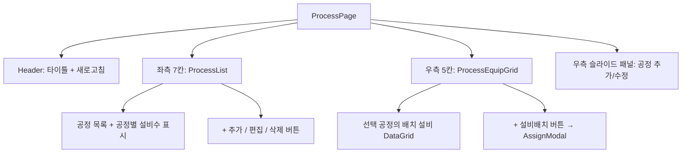

# 공정 마스터 (MST_PROCESS) — 비즈니스 로직 & 데이터 흐름 분석

> **분석 기준 커밋:** `8a7e96ea`
> **분석 일자:** `2026-07-04`

## 1. 화면 개요

| 항목 | 내용 |
|---|---|
| 메뉴 코드 | MST_PROCESS |
| 페이지 경로 | `/master/process` |
| 화면 제목 | 공정 관리 (Process Master) |
| 주요 기능 | 공정 CRUD, 공정별 설비 배치/해제, 공정별 설비 수 통계 |
| 데이터 소스 | Oracle PROCESS_MASTERS, PROCESS_EQUIPMENTS |

## 2. 화면 구성

### 컴포넌트 목록

| 파일 | 역할 |
|---|---|
| `page.tsx` | 메인 페이지: 공정/설비 상태 관리 |
| `components/ProcessList.tsx` | 공정 목록 리스트 |
| `components/ProcessEquipGrid.tsx` | 공정별 배치 설비 DataGrid |
| `components/ProcessFieldHelp.tsx` | 폼 필드 헬퍼 |

### 버튼 목록

| 버튼 | 동작 | API |
|---|---|---|
| 새로고침 | 전체 재조회 | — |
| + 공정 추가 | 우측 패널 열기 | — |
| 편집 | 패널 열기 | — |
| 삭제 | ConfirmModal → `DELETE` | `DELETE /master/processes/:processCode` |
| + 설비 배치 | AssignModal 열기 | `POST /master/processes/:id/equipments` |
| 설비 제거 | ConfirmModal → `DELETE` | `DELETE /master/processes/:id/equipments/:equipCode` |

## 3. API 호출

| 엔드포인트 | 컨트롤러 | 설명 |
|---|---|---|
| `GET /master/processes` | `ProcessController.findAll` | 공정 목록 |
| `GET /master/processes/:id` | `ProcessController.findById` | 상세 조회 |
| `GET /master/processes/equipment-counts` | `ProcessController.getEquipmentCounts` | 공정별 설비 수 |
| `GET /master/processes/:id/equipments` | `ProcessController.findEquipments` | 공정 배치 설비 목록 |
| `POST /master/processes` | `ProcessController.create` | 공정 생성 |
| `PUT /master/processes/:id` | `ProcessController.update` | 공정 수정 |
| `DELETE /master/processes/:id` | `ProcessController.delete` | 공정 삭제 (소프트) |
| `POST /master/processes/:id/equipments` | `ProcessController.assignEquipment` | 설비 배치 |
| `DELETE /master/processes/:id/equipments/:equipCode` | `ProcessController.removeEquipment` | 설비 배치 해제 |
| `GET /equipment/equips` | `EquipMasterController.findAll` | 전체 설비 목록 (할당 선택용) |

## 4. DB 테이블 영향

| 테이블 | 작업 | 비고 |
|---|---|---|
| `PROCESS_MASTERS` | SELECT/INSERT/UPDATE/DELETE | 공정 마스터 |
| `PROCESS_EQUIPMENTS` | SELECT/INSERT/DELETE | 공정-설비 배치 관계 |
| `EQUIP_MASTERS` | SELECT | 설비 목록 (할당용) |

주요 공정 필드: `PROCESS_CODE(PK)`, `PROCESS_NAME`, `PROCESS_TYPE`, `PROCESS_CATEGORY`, `LINE_TYPE`, `SORT_ORDER`, `REMARK`, `USE_YN`

## 5. 공통코드

| 코드 그룹 | 사용처 |
|---|---|
| `PROCESS_TYPE` | 공정 유형 |
| `PROCESS_CATEGORY` | 공정 카테고리 |
| `LINE_TYPE` | 라인 구분 |

## 6. 처리 규칙

- 공정 필수 필드: `processCode`, `processName`, `processType`, `processCategory`, `lineType`
- 설비 배치 시: 같은 공정에 중복 배치 불가 (assignOptions에서 제외)
- 공정 삭제 시 연결된 설비 배치도 함께 정리
- 모든 설비 목록은 `GET /equipment/equips?limit=10000&useYn=Y`로 로드
