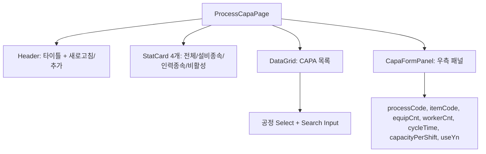

# 공정 CAPA (MST_PROCESS_CAPA) — 비즈니스 로직 & 데이터 흐름 분석

> **분석 기준 커밋:** `8a7e96ea`
> **분석 일자:** `2026-07-04`

## 1. 화면 개요

| 항목 | 내용 |
|---|---|
| 메뉴 코드 | MST_PROCESS_CAPA |
| 페이지 경로 | `/master/process-capa` |
| 화면 제목 | 공정 CAPA 관리 (Process Capability) |
| 주요 기능 | 공정 × 제품별 생산능력(CAPA) 마스터 CRUD, 통계 현황(StatCard 4개), 공정별 필터 |
| 데이터 소스 | Oracle PROCESS_CAPAS |

## 2. 화면 구성

### 컴포넌트 목록

| 파일 | 역할 |
|---|---|
| `page.tsx` | 메인 페이지 |
| `components/CapaFormPanel.tsx` | CAPA 추가/수정 패널 |
| `processCapaColumns.tsx` | DataGrid 컬럼 + ProcessCapaItem 타입 |

## 3. API 호출

| 엔드포인트 | 컨트롤러 | 설명 |
|---|---|---|
| `GET /master/process-capas` | `ProcessCapaController.findAll` | 목록 조회 (공정별 필터) |
| `POST /master/process-capas` | `ProcessCapaController.create` | 생성 |
| `PUT /master/process-capas/:processCode/:itemCode` | `ProcessCapaController.update` | 수정 (복합키) |
| `DELETE /master/process-capas/:processCode/:itemCode` | `ProcessCapaController.delete` | 삭제 |
| `GET /master/processes` | `ProcessController.findAll` | 공정 옵션 로드 |

## 4. DB 테이블 영향

| 테이블 | 작업 |
|---|---|
| `PROCESS_CAPAS` | SELECT/INSERT/UPDATE/DELETE |

주요 필드: `PROCESS_CODE(PK)`, `ITEM_CODE(PK)`, `EQUIP_CNT`, `WORKER_CNT`, `CYCLE_TIME`, `CAPACITY_PER_SHIFT`, `USE_YN`, `COMPANY`, `PLANT_CD`

## 5. 통계 계산

- `total`: 전체 건수
- `equipBased`: equipCnt > 0 건수
- `workerBased`: workerCnt > 0 건수
- `inactive`: useYn = 'N' 건수

## 6. 처리 규칙

- 복합키: `(processCode, itemCode)`
- 공정 필터는 `GET /master/processes`에서 옵션 로드
- 클라이언트 사이드 통계 (StatCard)
