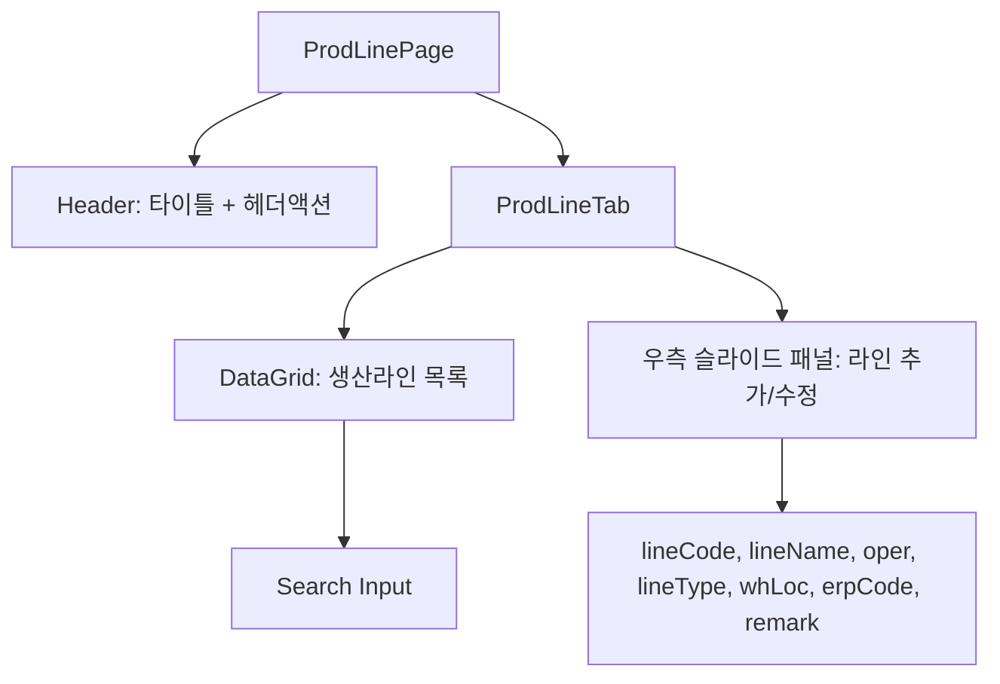

---
sources:
  - apps/backend/src/modules/master/controllers/prod-line.controller.ts
verifiedCommit: 8a7e96ea
---

# 생산라인 마스터 (MST_PROD_LINE) — 비즈니스 로직 & 데이터 흐름 분석

> **분석 기준 커밋:** `8a7e96ea`
> **분석 일자:** `2026-07-04`

## 1. 화면 개요

| 항목 | 내용 |
|---|---|
| 메뉴 코드 | MST_PROD_LINE |
| 페이지 경로 | `/master/prod-line` |
| 화면 제목 | 생산라인 관리 (Prod Line Master) |
| 주요 기능 | 생산라인 CRUD, DataGrid 목록 표시 |
| 데이터 소스 | Oracle PROD_LINE_MASTERS |

## 2. 화면 구성

### 컴포넌트 목록

| 파일 | 역할 |
|---|---|
| `page.tsx` | 페이지 레이아웃, 헤더 액션 영역 |
| `components/ProdLineTab.tsx` | `components/master/ProdLineTab.tsx` — CRUD 전체 (shared component) |
| `components/ProdLineFieldHelp.tsx` | 폼 필드 헬퍼 |

## 3. API 호출

| 엔드포인트 | 컨트롤러 | 설명 |
|---|---|---|
| `GET /master/prod-lines` | `ProdLineController.findAll` | 목록 조회 |
| `GET /master/prod-lines/:id` | `ProdLineController.findById` | 상세 조회 |
| `POST /master/prod-lines` | `ProdLineController.create` | 생성 |
| `PUT /master/prod-lines/:id` | `ProdLineController.update` | 수정 |
| `DELETE /master/prod-lines/:id` | `ProdLineController.delete` | 삭제 |

## 4. DB 테이블 영향

| 테이블 | 작업 |
|---|---|
| `PROD_LINE_MASTERS` | SELECT/INSERT/UPDATE/DELETE |

주요 필드: `LINE_CODE(PK)`, `LINE_NAME`, `LINE_TYPE`, `OPER`, `WH_LOC`, `ERP_CODE`, `REMARK`, `USE_YN`, `COMPANY`, `PLANT_CD`

## 5. 처리 규칙

- 필수 필드: `lineCode`, `lineName`, `lineType`
- 라인코드는 수정 불가
- `useYn=N` 행은 빨간색 텍스트

## 6. 공통코드

| 코드 그룹 | 사용처 |
|---|---|
| `LINE_TYPE` | 라인 구분 |

## 7. 비고

- `ProdLineTab`은 `@/components/master/ProdLineTab` 공유 컴포넌트로 다른 화면에서도 재사용
- 간단한 단일 테이블 CRUD (서브 테이블 없음)
