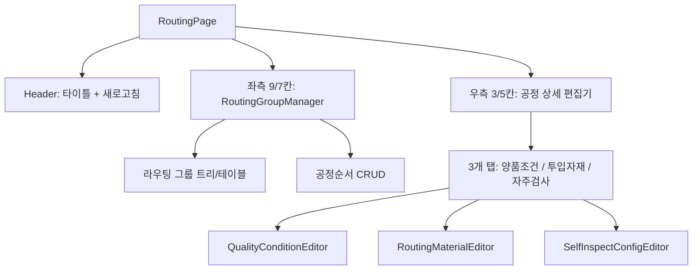

# 라우팅 관리 (MST_ROUTING) — 비즈니스 로직 & 데이터 흐름 분석

> **분석 기준 커밋:** `8a7e96ea`
> **분석 일자:** `2026-07-04`

## 1. 화면 개요

| 항목 | 내용 |
|---|---|
| 메뉴 코드 | MST_ROUTING |
| 페이지 경로 | `/master/routing` |
| 화면 제목 | 라우팅 관리 (Routing Group Manager) |
| 주요 기능 | 라우팅 그룹 CRUD, 공정순서 관리, 양품조건(QC) 설정, 투입자재 설정, 자주검사 설정 |
| 데이터 소스 | Oracle ROUTING_GROUPS, ROUTING_PROCESSES, ROUTING_CONDITIONS, ROUTING_MATERIALS, SELF_INSPECT_CONFIGS |

## 2. 화면 구성

### 컴포넌트 목록

| 파일 | 역할 |
|---|---|
| `page.tsx` | 메인 레이아웃, 선택 공정 관리 |
| `components/RoutingGroupManager.tsx` | 라우팅 그룹 + 공정 순서 CRUD |
| `components/QualityConditionEditor.tsx` | 양품조건(검사규격) 편집 |
| `components/RoutingMaterialEditor.tsx` | 투입자재 편집 |
| `components/SelfInspectConfigEditor.tsx` | 자주검사 설정 편집 |
| `components/RoutingFieldHelp.tsx` | 폼 필드 헬퍼 |

### 버튼 목록

| 버튼 | 동작 | API |
|---|---|---|
| 새로고침 | 전체 초기화 | — |
| + 라우팅 그룹 추가 | 그룹 생성 모달 | `POST /master/routing-groups` |
| + 공정 추가 | 공정순서 생성 | `POST /master/routing-groups/:code/processes` |
| 편집/삭제 | 각각 PUT/DELETE | — |
| 양품조건 저장 | 일괄 저장 | `PUT /master/routing-groups/:code/processes/:seq/conditions/bulk` |
| 투입자재 저장 | 일괄 저장 | `PUT /master/routing-groups/:code/processes/:seq/materials/bulk` |

## 3. API 호출

| 엔드포인트 | 컨트롤러 | 설명 |
|---|---|---|
| `GET /master/routing-groups` | `RoutingGroupController.findAll` | 그룹 목록 |
| `GET /master/routing-groups/:code` | `RoutingGroupController.findOne` | 그룹 상세 |
| `GET /master/routing-groups/by-item/:itemCode` | `RoutingGroupController.findByItem` | 품목코드로 라우팅 조회 |
| `POST /master/routing-groups` | `RoutingGroupController.create` | 그룹 생성 |
| `PUT /master/routing-groups/:code` | `RoutingGroupController.update` | 그룹 수정 |
| `DELETE /master/routing-groups/:code` | `RoutingGroupController.delete` | 그룹 삭제 (하위 포함) |
| `GET /master/routing-groups/:code/processes` | `RoutingGroupController.findProcesses` | 공정순서 목록 |
| `POST /master/routing-groups/:code/processes` | `RoutingGroupController.createProcess` | 공정순서 추가 |
| `PUT /master/routing-groups/:code/processes/:seq` | `RoutingGroupController.updateProcess` | 공정순서 수정 |
| `DELETE /master/routing-groups/:code/processes/:seq` | `RoutingGroupController.deleteProcess` | 공정순서 삭제 |
| `GET /master/routing-groups/:code/processes/:seq/conditions` | `RoutingGroupController.findConditions` | 양품조건 목록 |
| `PUT /master/routing-groups/:code/processes/:seq/conditions/bulk` | `RoutingGroupController.bulkSave` | 양품조건 일괄 저장 |
| `GET /master/routing-groups/:code/processes/:seq/materials` | `RoutingGroupController.findMaterials` | 투입자재 목록 |
| `PUT /master/routing-groups/:code/processes/:seq/materials/bulk` | `RoutingGroupController.bulkSaveMaterials` | 투입자재 일괄 저장 |
| `GET /master/routings` | `RoutingController.findAll` | 라우팅 목록 |
| `POST /master/routings` | `RoutingController.create` | 라우팅 생성 |
| `PUT /master/routings/:itemCode/:seq` | `RoutingController.update` | 라우팅 수정 |
| `DELETE /master/routings/:itemCode/:seq` | `RoutingController.delete` | 라우팅 삭제 |

## 4. DB 테이블 영향

| 테이블 | 작업 |
|---|---|
| `ROUTING_GROUPS` | SELECT/INSERT/UPDATE/DELETE |
| `ROUTING_PROCESSES` | SELECT/INSERT/UPDATE/DELETE |
| `ROUTING_CONDITIONS` | SELECT/INSERT/UPDATE/DELETE (양품조건) |
| `ROUTING_MATERIALS` | SELECT/INSERT/UPDATE/DELETE (투입자재) |
| `SELF_INSPECT_CONFIGS` | SELECT/INSERT/UPDATE/DELETE (자주검사) |
| `ROUTINGS` (process_map) | SELECT/INSERT/UPDATE/DELETE (라우팅 마스터) |

## 5. 공통코드

| 코드 그룹 | 사용처 |
|---|---|
| `PROCESS_TYPE` | 공정 유형 |
| `INSPECT_TYPE` | 검사 유형 (양품조건) |
| `MATERIAL_TYPE` | 자재 유형 (투입자재) |

## 6. 처리 규칙

- 라우팅 그룹 삭제 시 cascade로 하위 공정 + 양품조건 + 투입자재 모두 삭제
- 양품조건/투입자재는 일괄 저장 (bulk) — 전체 교체 방식
- 복합키: `(routingCode, seq)`로 공정순서 식별
- BOM 페이지에서도 QualityConditionEditor / RoutingMaterialEditor 재사용

## 7. 비고

- 3개 편집기(양품조건/투입자재/자주검사)는 routing 및 bom 페이지에서 공유됨
- `layoutFocus`로 중앙/상세 레이아웃 전환 가능
