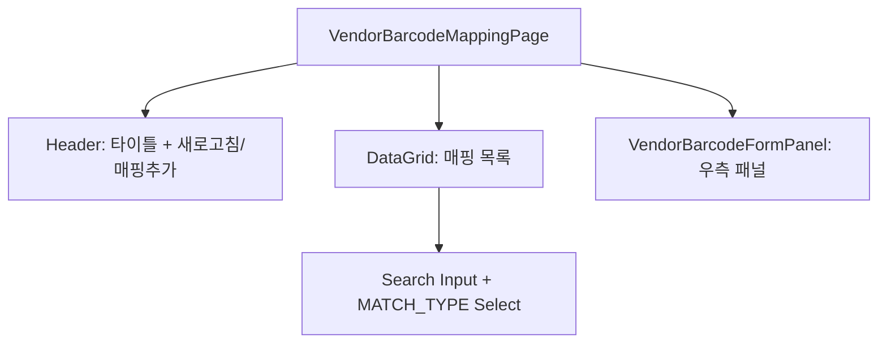

# 제조사 바코드 매핑 (MST_VENDOR_BARCODE) — 비즈니스 로직 & 데이터 흐름 분석

> **분석 기준 커밋:** `8a7e96ea`
> **분석 일자:** `2026-07-04`

## 1. 화면 개요

| 항목 | 내용 |
|---|---|
| 메뉴 코드 | MST_VENDOR_BARCODE |
| 페이지 경로 | `/master/vendor-barcode` |
| 화면 제목 | 제조사 바코드 매핑 (Vendor Barcode Mapping) |
| 주요 기능 | 제조사 바코드 ↔ MES 품목 매핑 CRUD, 매칭 유형(EXACT/PREFIX/REGEX), 바코드 스캔 시 품목 자동 매칭 |
| 데이터 소스 | Oracle VENDOR_BARCODE_MAPPINGS |

## 2. 화면 구성

### 컴포넌트 목록

| 파일 | 역할 |
|---|---|
| `page.tsx` | 메인 페이지 |
| `components/VendorBarcodeFormPanel.tsx` | 매핑 추가/수정 패널 |
| `vendorBarcodeColumns.tsx` | DataGrid 컬럼 + MATCH_TYPE_OPTIONS |

## 3. API 호출

| 엔드포인트 | 컨트롤러 | 설명 |
|---|---|---|
| `GET /master/vendor-barcode-mappings` | `VendorBarcodeMappingController.findAll` | 목록 조회 |
| `GET /master/vendor-barcode-mappings/:vendorBarcode` | `VendorBarcodeMappingController.findByBarcode` | 상세 조회 |
| `POST /master/vendor-barcode-mappings` | `VendorBarcodeMappingController.create` | 생성 |
| `PUT /master/vendor-barcode-mappings/:vendorBarcode` | `VendorBarcodeMappingController.update` | 수정 |
| `DELETE /master/vendor-barcode-mappings/:vendorBarcode` | `VendorBarcodeMappingController.delete` | 삭제 |
| `POST /master/vendor-barcode-mappings/resolve` | `VendorBarcodeMappingController.resolveBarcode` | 바코드 스캔 → 품목 매칭 |

## 4. DB 테이블 영향

| 테이블 | 작업 |
|---|---|
| `VENDOR_BARCODE_MAPPINGS` | SELECT/INSERT/UPDATE/DELETE |

주요 필드: `VENDOR_BARCODE(PK)`, `ITEM_CODE`, `VENDOR_CODE`, `MATCH_TYPE` (EXACT/PREFIX/REGEX), `MATCH_PATTERN`, `USE_YN`

## 5. 공통코드

| 코드 그룹 | 사용처 |
|---|---|
| `MATCH_TYPE` | 매칭 유형 (EXACT/PREFIX/REGEX) |

## 6. 처리 규칙

- 매칭 유형: EXACT(정확일치), PREFIX(접두사), REGEX(정규식)
- `POST /resolve`는 입고/수입검사 등에서 바코드 스캔 시 호출
- 클라이언트 측 필터링: matchType + vendorBarcode/itemCode/itemName/vendorName 검색
- 필터링은 DB가 아닌 프론트에서 client-side 처리
