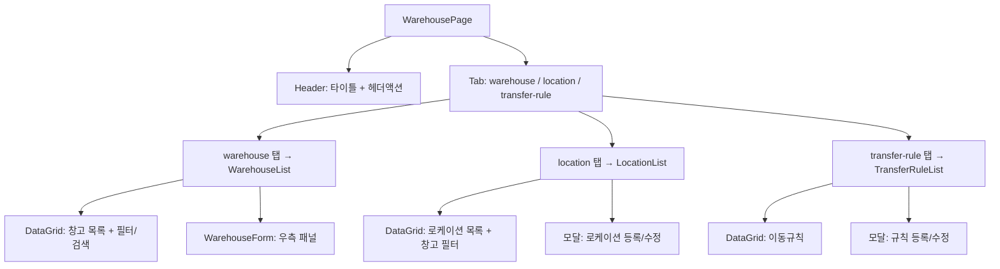

---
sources:
  - apps/backend/src/modules/inventory/inventory.controller.ts
  - apps/backend/src/modules/master/controllers/transfer-rule.controller.ts
verifiedCommit: 8a7e96ea
---

# 창고 관리 (MST_WAREHOUSE) — 비즈니스 로직 & 데이터 흐름 분석

> **분석 기준 커밋:** `8a7e96ea`
> **분석 일자:** `2026-07-04`

## 1. 화면 개요

| 항목 | 내용 |
|---|---|
| 메뉴 코드 | MST_WAREHOUSE |
| 페이지 경로 | `/master/warehouse` |
| 화면 제목 | 창고 관리 (Warehouse Master) |
| 주요 기능 | 창고 마스터 CRUD, 로케이션(세부위치) 관리, 창고간 이동규칙 관리 |
| 데이터 소스 | Oracle WAREHOUSES, WAREHOUSE_LOCATIONS, TRANSFER_RULES |

## 2. 화면 구성

### 컴포넌트 목록

| 파일 | 역할 |
|---|---|
| `page.tsx` | 메인 페이지, 탭 관리 |
| `components/WarehouseList.tsx` | 창고 목록 CRUD |
| `components/WarehouseForm.tsx` | 창고 등록/수정 폼 |
| `components/LocationList.tsx` | 로케이션 CRUD |
| `components/TransferRuleList.tsx` | 이동규칙 CRUD |
| `components/WarehouseFieldHelp.tsx` | 폼 필드 헬퍼 |

## 3. API 호출

| 엔드포인트 | 컨트롤러 | 설명 |
|---|---|---|
| `GET /inventory/warehouses` | `InventoryController.getWarehouses` | 창고 목록 |
| `GET /inventory/warehouses/:id` | `InventoryController.getWarehouse` | 창고 상세 |
| `POST /inventory/warehouses` | `InventoryController.createWarehouse` | 창고 생성 |
| `PUT /inventory/warehouses/:id` | `InventoryController.updateWarehouse` | 창고 수정 |
| `DELETE /inventory/warehouses/:id` | `InventoryController.deleteWarehouse` | 창고 삭제 (소프트) |
| `GET /inventory/warehouse-locations` | — | 로케이션 목록 (LocationList) |
| `POST /inventory/warehouse-locations` | — | 로케이션 생성 |
| `PUT /inventory/warehouse-locations/:id` | — | 로케이션 수정 |
| `DELETE /inventory/warehouse-locations/:id` | — | 로케이션 삭제 |
| `GET /master/transfer-rules` | `TransferRuleController.findAll` | 이동규칙 목록 |
| `POST /master/transfer-rules` | `TransferRuleController.create` | 이동규칙 생성 |
| `PUT /master/transfer-rules/:from/:to` | `TransferRuleController.update` | 이동규칙 수정 |
| `DELETE /master/transfer-rules/:from/:to` | `TransferRuleController.delete` | 이동규칙 삭제 |

## 4. DB 테이블 영향

| 테이블 | 작업 | 비고 |
|---|---|---|
| `WAREHOUSES` | SELECT/INSERT/UPDATE/DELETE | 창고 마스터 (소프트 삭제) |
| `WAREHOUSE_LOCATIONS` | SELECT/INSERT/UPDATE/DELETE | 로케이션 |
| `TRANSFER_RULES` | SELECT/INSERT/UPDATE/DELETE | 이동규칙 (복합키: from WH + to WH) |

주요 창고 필드: `WAREHOUSE_CODE(PK)`, `WAREHOUSE_NAME`, `WAREHOUSE_TYPE` (RAW/WIP/FG/CONSUMABLE/SCRAP), `LINE_CODE`, `PROCESS_CODE`, `IS_DEFAULT`, `USE_YN`

## 5. 공통코드

| 코드 그룹 | 사용처 |
|---|---|
| `WAREHOUSE_TYPE` | 창고 유형 |
| `WAREHOUSE_TYPE_DTO` | 창고 유형 (DataGrid 표시용) |

## 6. 처리 규칙

- 창고 유형별 색상 구분: RAW(파랑), WIP(노랑), FG(초록), SCRAP(빨강), CONSUMABLE(보라)
- `isDefault`: 기본 창고 지정
- 이동규칙 복합키: `(fromWarehouseId, toWarehouseId)`
- 창고 삭제는 소프트 삭제
