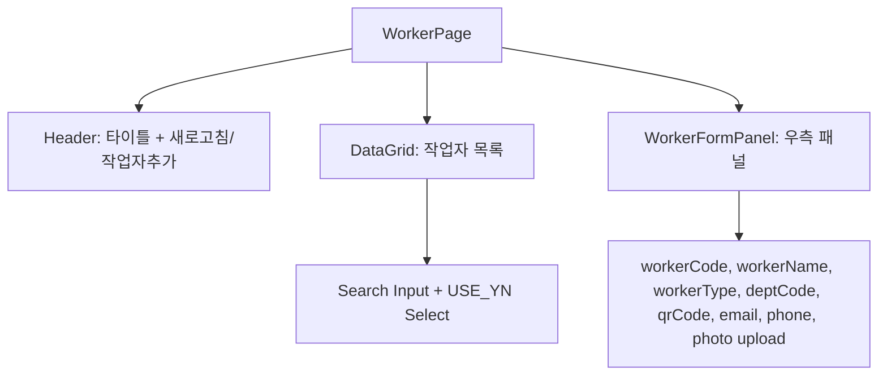

# 작업자 마스터 (MST_WORKER) — 비즈니스 로직 & 데이터 흐름 분석

> **분석 기준 커밋:** `8a7e96ea`
> **분석 일자:** `2026-07-04`

## 1. 화면 개요

| 항목 | 내용 |
|---|---|
| 메뉴 코드 | MST_WORKER |
| 페이지 경로 | `/master/worker` |
| 화면 제목 | 작업자 관리 (Worker Master) |
| 주요 기능 | 작업자 CRUD, 사진 업로드, 유형 배지 표시, QR 코드 조회 |
| 데이터 소스 | Oracle WORKER_MASTERS / TM_EHR |

## 2. 화면 구성

### 컴포넌트 목록

| 파일 | 역할 |
|---|---|
| `page.tsx` | 메인 페이지 |
| `components/WorkerFormPanel.tsx` | 작업자 추가/수정 패널 |
| `workerColumns.tsx` | DataGrid 컬럼 정의 |
| `types.ts` | Worker 타입 정의 |

## 3. API 호출

| 엔드포인트 | 컨트롤러 | 설명 |
|---|---|---|
| `GET /master/workers` | `WorkerController.findAll` | 목록 조회 |
| `GET /master/workers/:id` | `WorkerController.findById` | 상세 조회 |
| `GET /master/workers/by-qr/:qrCode` | `WorkerController.findByQrCode` | QR 코드 조회 (PDA) |
| `POST /master/workers` | `WorkerController.create` | 생성 |
| `PUT /master/workers/:id` | `WorkerController.update` | 수정 |
| `DELETE /master/workers/:id` | `WorkerController.delete` | 삭제 |
| `POST /master/workers/upload-photo` | `WorkerController.uploadPhoto` | 사진 업로드 (multipart) |

## 4. DB 테이블 영향

| 테이블 | 작업 |
|---|---|
| `WORKER_MASTERS` | SELECT/INSERT/UPDATE/DELETE |

주요 필드: `WORKER_CODE(PK)`, `WORKER_NAME`, `WORKER_TYPE`, `DEPT_CODE`, `QR_CODE`, `EMAIL`, `PHONE`, `PHOTO_URL`, `USE_YN`

## 5. 공통코드

| 코드 그룹 | 사용처 |
|---|---|
| `WORKER_TYPE` | 작업자 유형 |
| `USE_YN` | 사용여부 |

## 6. 처리 규칙

- QR 코드로 PDA 조회 지원 (`by-qr/:qrCode`)
- 사진 업로드: `./uploads/workers/` 경로 (5MB 제한, 이미지만)
- 작업자 유형/부서는 공통코드 기반
