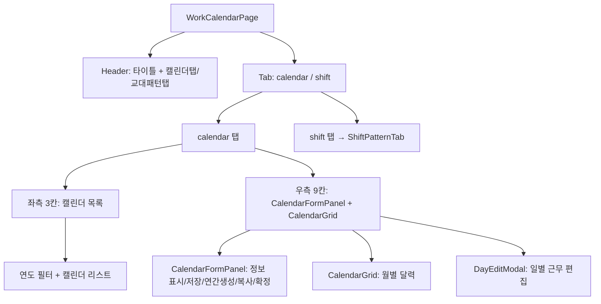
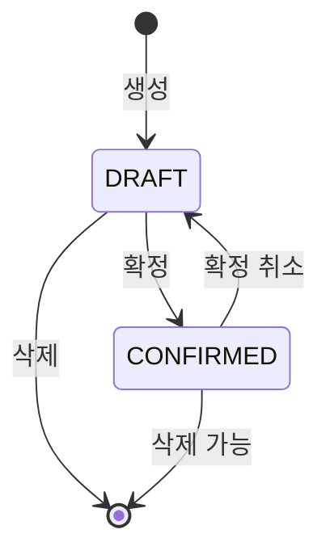

---
sources:
  - apps/backend/src/modules/master/controllers/process.controller.ts
  - apps/backend/src/modules/master/controllers/shift-pattern.controller.ts
  - apps/backend/src/modules/master/controllers/work-calendar.controller.ts
  - apps/frontend/src/app/(authenticated)/master/work-calendar/components/AddCalendarModal.tsx
  - apps/frontend/src/app/(authenticated)/master/work-calendar/components/CalendarFormPanel.tsx
  - apps/frontend/src/app/(authenticated)/master/work-calendar/components/DayEditModal.tsx
  - apps/frontend/src/components/ui/Modal.tsx
verifiedCommit: 8a7e96ea
---

# 생산월력 (MST_WORK_CALENDAR) — 비즈니스 로직 & 데이터 흐름 분석

> **분석 기준 커밋:** `8a7e96ea`
> **분석 일자:** `2026-07-04`

## 1. 화면 개요

| 항목 | 내용 |
|---|---|
| 메뉴 코드 | MST_WORK_CALENDAR |
| 페이지 경로 | `/master/work-calendar` |
| 화면 제목 | 생산월력 관리 (Work Calendar) |
| 주요 기능 | 근무 캘린더 CRUD, 연간 일정 자동 생성, 캘린더 복사, 확정/취소, 일별 근무 편집, 교대 패턴 관리 |
| 데이터 소스 | Oracle WORK_CALENDARS, WORK_CALENDAR_DAYS, SHIFT_PATTERNS |

## 2. 화면 구성

### 컴포넌트 목록

| 파일 | 역할 |
|---|---|
| `page.tsx` | 메인 페이지, 탭/상태 관리 |
| `components/CalendarGrid.tsx` | 월별 달력 그리드 |
| `components/CalendarFormPanel.tsx` | 캘린더 정보 헤더 폼 |
| `components/DayEditModal.tsx` | 일별 근무 편집 모달 |
| `components/AddCalendarModal.tsx` | 새 캘린더 생성 모달 |
| `components/ShiftPatternTab.tsx` | 교대 패턴 CRUD |

### 버튼 목록

| 버튼 | 동작 | API |
|---|---|---|
| 새로고침 | 캘린더 + 패턴 재조회 | — |
| 연간생성 | ConfirmModal → 생성 | `POST /master/work-calendars/:id/generate` |
| 복사 | ConfirmModal → 복사 | `POST /master/work-calendars/:id/copy-from/:sourceId` |
| + 추가 | AddCalendarModal 열기 | `POST /master/work-calendars` |
| 저장 | 캘린더 정보 저장 | `PUT /master/work-calendars/:id` |
| 확정 | 상태 → CONFIRMED | `POST /master/work-calendars/:id/confirm` |
| 확정취소 | 상태 → DRAFT | `POST /master/work-calendars/:id/unconfirm` |
| 삭제 | 캘린더 삭제 | `DELETE /master/work-calendars/:id` |
| 일자 클릭 | DayEditModal 열기 | — |
| 일자 저장 | 근무 저장 | `PUT /master/work-calendars/:id/days/bulk` |

## 3. API 호출

| 엔드포인트 | 컨트롤러 | 설명 |
|---|---|---|
| `GET /master/work-calendars` | `WorkCalendarController.findAll` | 캘린더 목록 |
| `GET /master/work-calendars/:calendarId` | `WorkCalendarController.findOne` | 캘린더 상세 |
| `POST /master/work-calendars` | `WorkCalendarController.create` | 생성 |
| `PUT /master/work-calendars/:calendarId` | `WorkCalendarController.update` | 수정 |
| `DELETE /master/work-calendars/:calendarId` | `WorkCalendarController.delete` | 삭제 (하위 일자 포함) |
| `POST /master/work-calendars/:calendarId/generate` | `WorkCalendarController.generate` | 연간 일정 자동 생성 |
| `POST /master/work-calendars/:calendarId/copy-from/:sourceId` | `WorkCalendarController.copyFrom` | 타 캘린더 복사 |
| `GET /master/work-calendars/:calendarId/days` | `WorkCalendarController.findDays` | 월별 일자 조회 |
| `PUT /master/work-calendars/:calendarId/days/bulk` | `WorkCalendarController.bulkUpdateDays` | 일별 근무 일괄 저장 |
| `POST /master/work-calendars/:calendarId/confirm` | `WorkCalendarController.confirm` | 확정 |
| `POST /master/work-calendars/:calendarId/unconfirm` | `WorkCalendarController.unconfirm` | 확정 취소 |
| `GET /master/work-calendars/:calendarId/summary` | `WorkCalendarController.getSummary` | 근무 요약 |
| `GET /master/shift-patterns` | `ShiftPatternController.findAll` | 교대 패턴 목록 |
| `POST /master/shift-patterns` | `ShiftPatternController.create` | 교대 패턴 생성 |
| `PUT /master/shift-patterns/:shiftCode` | `ShiftPatternController.update` | 교대 패턴 수정 |
| `DELETE /master/shift-patterns/:shiftCode` | `ShiftPatternController.delete` | 교대 패턴 삭제 |
| `GET /master/processes` | `ProcessController.findAll` | 공정 목록 (옵션용) |

## 4. DB 테이블 영향

| 테이블 | 작업 | 비고 |
|---|---|---|
| `WORK_CALENDARS` | SELECT/INSERT/UPDATE/DELETE | 캘린더 마스터 |
| `WORK_CALENDAR_DAYS` | SELECT/INSERT/UPDATE/DELETE | 일별 근무 데이터 |
| `SHIFT_PATTERNS` | SELECT/INSERT/UPDATE/DELETE | 교대 패턴 |
| `PROCESS_MASTERS` | SELECT | 공정 옵션 |

주요 캘린더 필드: `CALENDAR_ID(PK)`, `CALENDAR_YEAR`, `PROCESS_CD`, `DEFAULT_SHIFT_COUNT`, `DEFAULT_SHIFTS`, `STATUS`, `REMARK`

## 5. 공통코드

| 코드 그룹 | 사용처 |
|---|---|
| `WORK_CALENDAR_STATUS` | 캘린더 상태 |
| `SHIFT_CODE` | 교대 코드 |

## 6. 처리 규칙

- 캘린더 상태: `DRAFT` → `CONFIRMED` (확정 후 편집 불가)
- 연간 생성: saturdayWork/sundayWork 옵션에 따라 토/일 근무일 설정
- 확정 취소: `CONFIRMED` → `DRAFT`로 상태 변경
- 캘린더 삭제 시 cascade로 모든 일자 데이터 삭제
- `defaultShiftCount`: 기본 교대 수 (1일 최대 교대 개수)

## 7. 상태 전이

## 8. 비고

- ShiftPatternTab은 calendar 탭과 분리된 별도 서브 탭
- 연간 생성은 confirm 상태와 무관하게 실행 가능
- 확정 상태에서는 연간 생성/복사/편집 비활성화
