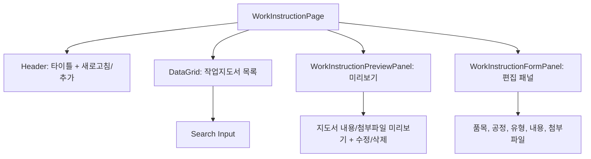

---
sources:
  - apps/backend/src/modules/master/services/work-instruction.service.ts
  - apps/frontend/src/app/(authenticated)/master/work-instruction/page.tsx
  - apps/frontend/src/app/(authenticated)/master/work-instruction/workInstructionColumns.tsx
  - apps/backend/src/modules/master/controllers/work-instruction.controller.ts
  - apps/frontend/src/app/(authenticated)/master/work-instruction/components/WorkInstructionFormPanel.tsx
  - apps/frontend/src/app/(authenticated)/master/work-instruction/components/WorkInstructionPreviewPanel.tsx
verifiedCommit: c98ed7b2
---

# 작업지도서 (MST_WORK_INST) — 비즈니스 로직 & 데이터 흐름 분석

> **분석 기준 커밋:** `c98ed7b2` 및 2026-09-08 작업트리 보완
> **분석 일자:** `2026-07-04`

## 1. 화면 개요

| 항목 | 내용 |
|---|---|
| 메뉴 코드 | MST_WORK_INST |
| 페이지 경로 | `/master/work-instruction` |
| 화면 제목 | 작업지도서 관리 (Work Instruction) |
| 주요 기능 | 품목/공정별 작업 지침 CRUD, 파일 업로드, 미리보기 패널 |
| 데이터 소스 | Oracle WORK_INSTRUCTIONS |

## 2. 화면 구성

### 컴포넌트 목록

| 파일 | 역할 |
|---|---|
| `page.tsx` | 메인 페이지 |
| `components/WorkInstructionFormPanel.tsx` | 등록/수정 패널 |
| `components/WorkInstructionPreviewPanel.tsx` | 미리보기 패널 |
| `workInstructionColumns.tsx` | DataGrid 컬럼 |

## 3. API 호출

| 엔드포인트 | 컨트롤러 | 설명 |
|---|---|---|
| `GET /master/work-instructions` | `WorkInstructionController.findAll` | 목록 조회 |
| `GET /master/work-instructions/:id` | `WorkInstructionController.findById` | 상세 조회 |
| `POST /master/work-instructions` | `WorkInstructionController.create` | 생성 |
| `PUT /master/work-instructions/:id` | `WorkInstructionController.update` | 수정 |
| `DELETE /master/work-instructions/:id` | `WorkInstructionController.delete` | 삭제 |
| `POST /master/work-instructions/upload` | `WorkInstructionController.uploadFile` | 파일 업로드 |

## 4. DB 테이블 영향

| 테이블 | 작업 |
|---|---|
| `WORK_INSTRUCTIONS` | SELECT/INSERT/UPDATE/DELETE |

주요 필드: `INSTRUCTION_ID`, `ITEM_CODE`, `PROCESS_CODE`, `DOC_TYPE`, `TITLE`, `CONTENT`, `FILE_URL`, `REVISION`, `USE_YN`

## 5. 처리 규칙

- 파일 업로드: `./uploads/work-instructions/` (10MB 제한, 이미지/PDF/Office 문서)
- 삭제는 완전 삭제 (하드 delete)
- 패널 모드: preview → edit 전환 가능

## 6. 공통코드

| 코드 그룹 | 사용처 |
|---|---|
| `DOC_TYPE` | 문서 유형 |
| `INSTRUCTION_TYPE` | 지도서 유형 |

## 작업지도서 기준정보 연결 (2026-09-08)

- 목록·상세 service는 WORK_INSTRUCTIONS에 품목/공정 마스터를 회사·사업장까지 일치시켜 left join한다. 마스터가 없는 기존 문서도 유지하고 이름만 null로 반환한다.
- 목록 API의 search는 문서명·품목코드·품목명·공정코드를 조회한다. 화면 사용여부 기본값은 Y이며 전체/미사용으로 변경 가능하다.
- 입력폼은 ProcessSelect 공통 공정 선택기를 사용한다. 신규 저장은 같은 회사·사업장의 사용 중인 공정을 검증한다. 기존 수정은 품목/공정/리비전 복합키를 변경하지 않는다.
- 목록은 품목명·공정명, 미리보기는 공정코드(공정명)를 표시한다. 수정일은 dateTimeKst 공용 포맷으로 한국시간 YYYY-MM-DD HH:mm을 표시한다.
- 수정폼은 기존 content를 초기화에 사용해 문서 본문을 보존한다.

| 변경 대상 | 함께 확인할 파일 |
| --- | --- |
| 이름/검색/저장 공정 규칙 | work-instruction.service.ts, work-instruction.service.spec.ts |
| 화면 필터 | page.tsx, UseYnSelect |
| 컬럼/수정일 | workInstructionColumns.tsx, utils/dateTimeKst.ts |
| 입력/상세 필드 | WorkInstructionFormPanel.tsx, WorkInstructionPreviewPanel.tsx |
