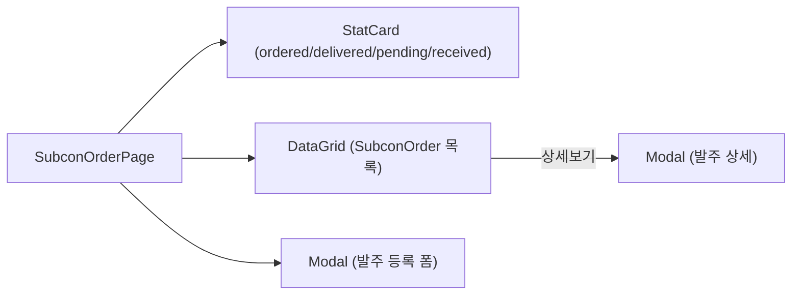
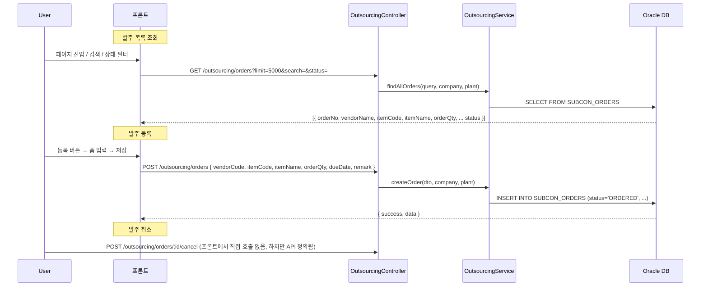
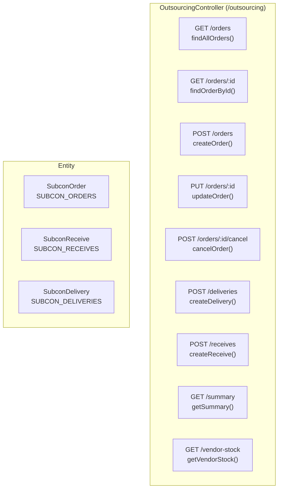
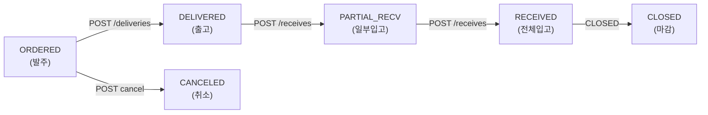

# 외주 발주 관리 — 비즈니스 로직 & 데이터 흐름 분석
> **분석 기준 커밋:** `8a7e96ea`
> **분석 일자:** `2026-07-04`

## 1. 화면 개요

외주처에 가공/제조를 의뢰하는 발주서를 관리하는 메뉴. 발주 등록, 상세 조회, 상태별 통계 제공.

| 항목 | 내용 |
|------|------|
| 메뉴 코드 | OUT_ORDER |
| 경로 | `/outsourcing/order` |
| 페이지 | `page.tsx` → `SubconOrderPage` |
| 주요 역할 | 외주 발주 CRUD + 상태 조회 |
| 권한 | JwtAuthGuard |
| API 베이스 | `/outsourcing/orders` |

## 2. 화면 구성

| 컴포넌트 | 파일 | 설명 |
|----------|------|------|
| `SubconOrderPage` | `page.tsx` | 메인 페이지 |
| `createSubconOrderGridColumns` | `subconOrderColumns.tsx` | DataGrid 컬럼 |
| `SubconOrder` 타입 | `types.ts` | 발주 인터페이스 |
| `ComCodeSelect` | `@/components/shared` | SUBCON_ORDER_STATUS 필터 |
| `StatusBadge` | `@/components/shared/StatusBadge` | 상태 배지 |

## 3. 상태 관리

| 상태 | 설명 |
|------|------|
| `data` | 발주 목록 (SubconOrder[]) |
| `loading, saving` | API 호출 중 |
| `isModalOpen` | 등록 모달 열림 |
| `isDetailModalOpen` | 상세 모달 열림 |
| `selectedOrder` | 조회 대상 발주 |
| `searchTerm` | 검색어 |
| `statusFilter` | 상태 필터 |
| `form` | { vendorCode, itemCode, itemName, orderQty, dueDate, remark } |

## 4. API 호출 흐름

## 5. 백엔드 처리

## 6. 처리 규칙 및 검증

| 규칙 | 설명 |
|------|------|
| 발주 상태 흐름 | ORDERED → DELIVERED → RECEIVED → CLOSED |
| 발주 등록 시 | status='ORDERED' 기본 |
| orderNo 채번 | 자연키 (NumberingService) |
| 수량 | orderQty, deliveredQty, receivedQty, defectQty |
| 입고 시 | POST /outsourcing/receives 로 receiveNo 채번 + order 수량 업데이트 |

## 7. 상태 전이

## 8. 상태 코드 및 공통코드

| 코드 그룹 | 값 | 설명 |
|-----------|-----|------|
| `SUBCON_ORDER_STATUS` | ORDERED, DELIVERED, PARTIAL_RECV, RECEIVED, CLOSED, CANCELED | 발주 상태 |

## 9. DB 테이블 영향 및 엔티티

| 테이블 | 엔티티 | 설명 |
|--------|--------|------|
| `SUBCON_ORDERS` | `SubconOrder` | 외주발주 (PK: ORDER_NO) |
| `SUBCON_RECEIVES` | `SubconReceive` | 외주 입고 |
| `SUBCON_DELIVERIES` | `SubconDelivery` | 외주 출고 |
| `VENDOR_MASTERS` | `VendorMaster` | 거래처 정보 |

SubconOrder 주요 컬럼:
- `ORDER_NO` (PK), `VENDOR_CODE`, `ITEM_CODE`, `ITEM_NAME`
- `ORDER_QTY`, `DELIVERED_QTY`, `RECEIVED_QTY`, `DEFECT_QTY`
- `STATUS`, `ORDER_DATE`, `DUE_DATE`
- `JOB_ORDER_NO`, `PROCESS_CODE`, `UNIT_PRICE`
- `COMPANY`, `PLANT_CD`

## 10. 에러 코드

| HTTP | 상황 |
|------|------|
| 201 | 발주 등록 성공 |
| 200 | 조회/수정 성공 |
| 404 | 발주 미존재 |

## 11. 비고

- 화면 상세 모달에서 주문별 수량 정보(orderQty/deliveredQty/receivedQty/defectQty) 표시
- 통계 StatCard: ORDERED, DELIVERED, PENDING(DELIVERED+PARTIAL_RECV), RECEIVED 건수
- 등록 폼에서 vendorCode는 자유입력 (외주처 검색/선택 UI 없음)
- 발주 수정(PUT)과 취소(POST cancel) API는 정의되었으나 화면 버튼은 미구현
