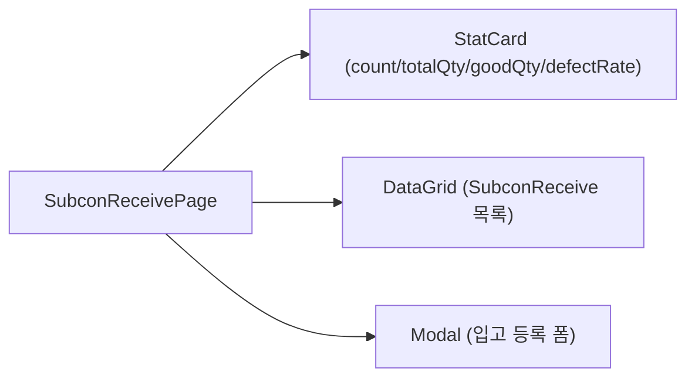
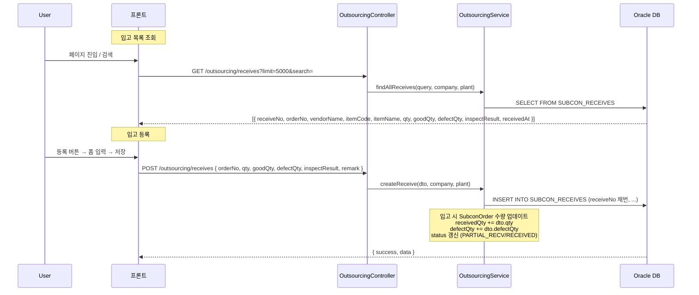
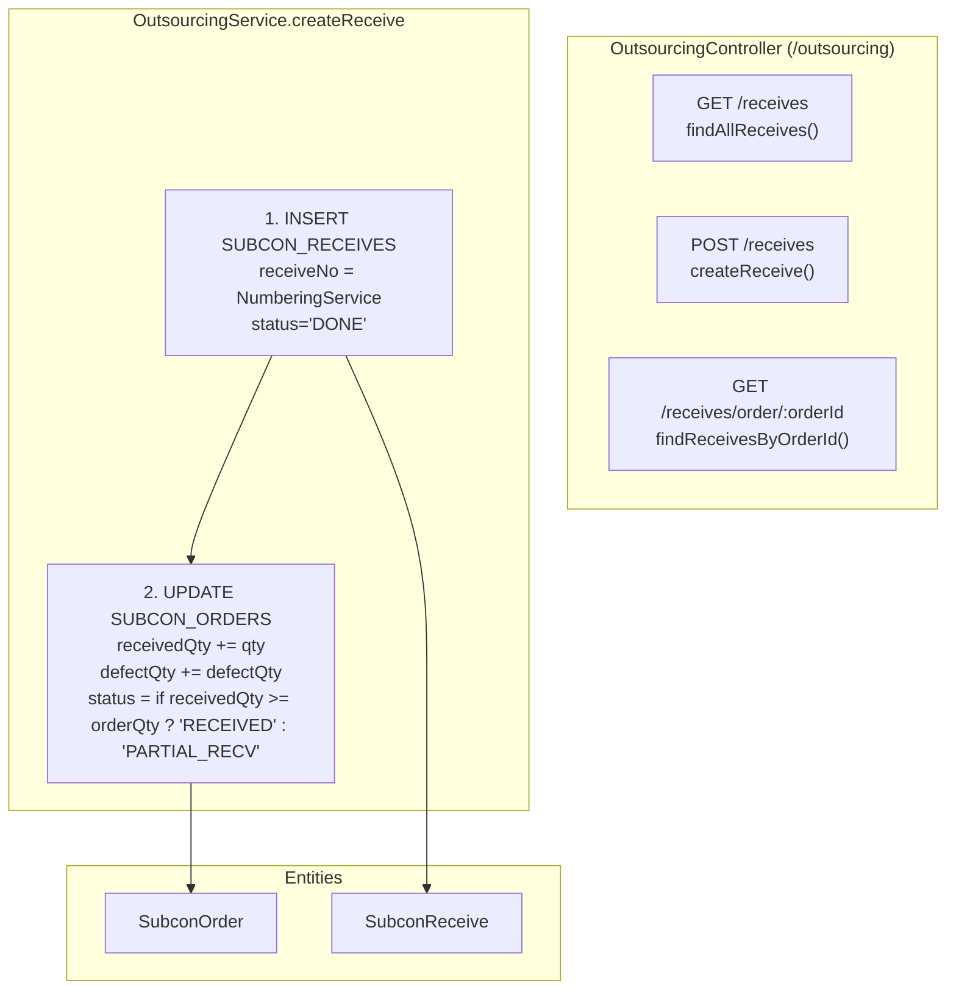

# 외주 입고 관리 — 비즈니스 로직 & 데이터 흐름 분석
> **분석 기준 커밋:** `8a7e96ea`
> **분석 일자:** `2026-07-04`

## 1. 화면 개요

외주처에서 가공 완료된 품목을 입고/검수하는 메뉴. 검사결과(PASS/PARTIAL/FAIL)를 포함한 입고 등록 및 이력 조회.

| 항목 | 내용 |
|------|------|
| 메뉴 코드 | OUT_RECEIVE |
| 경로 | `/outsourcing/receive` |
| 페이지 | `page.tsx` → `SubconReceivePage` |
| 주요 역할 | 외주 입고 등록 + 이력 조회 |
| 권한 | JwtAuthGuard |
| API 베이스 | `/outsourcing/receives` |

## 2. 화면 구성



| 컴포넌트 | 파일 | 설명 |
|----------|------|------|
| `SubconReceivePage` | `page.tsx` | 메인 페이지 |
| `createSubconReceiveGridColumns` | `subconReceiveColumns.tsx` | DataGrid 컬럼 |
| `SubconReceive` 타입 | `types.ts` | 입고 인터페이스 |
| `ComCodeSelect` | `@/components/shared` | SUBCON_INSPECT_RESULT 선택 |
| `StatusBadge` | `@/components/shared/StatusBadge` | 검사결과 배지 |

## 3. 상태 관리

| 상태 | 설명 |
|------|------|
| `data` | 입고 목록 (SubconReceive[]) |
| `loading, saving` | API 호출 중 |
| `isModalOpen` | 등록 모달 열림 |
| `searchTerm` | 검색어 |
| `form` | { orderNo, qty, goodQty, defectQty, inspectResult, remark } |

## 4. API 호출 흐름



## 5. 백엔드 처리



## 6. 처리 규칙 및 검증

| 규칙 | 설명 |
|------|------|
| 입고 시 발주 업데이트 | `SubconOrder.receivedQty` + qty, `defectQty` + defectQty |
| 상태 자동 전이 | 입고 후 order의 receivedQty >= orderQty → RECEIVED, 미만 → PARTIAL_RECV |
| receiveNo 채번 | NumberingService로 자동 채번 |
| goodQty 검증 | goodQty + defectQty = qty (화면에서 수동 입력, 백엔드 검증?) |
| 검사결과 | PASS, PARTIAL(부분불량), FAIL (SUBCON_INSPECT_RESULT) |
| 입고 이력 | SUBCON_RECEIVES에 저장 (workderName은 백엔드에서 설정) |

## 7. 상태 전이 (SubconOrder 기준)

```mermaid
flowchart LR
  DELIVERED["DELIVERED"] -->|입고| PARTIAL_RECV["PARTIAL_RECV"]
  DELIVERED -->|입고 (전량)| RECEIVED["RECEIVED"]
  PARTIAL_RECV -->|추가 입고| RECEIVED
```

## 8. 상태 코드 및 공통코드

| 코드 그룹 | 값 | 설명 |
|-----------|-----|------|
| `SUBCON_INSPECT_RESULT` | PASS, PARTIAL, FAIL | 외주 입고 검사 결과 |
| `SUBCON_ORDER_STATUS` | DELIVERED, PARTIAL_RECV, RECEIVED | 발주 상태 |

## 9. DB 테이블 영향 및 엔티티

| 테이블 | 엔티티 | 설명 |
|--------|--------|------|
| `SUBCON_RECEIVES` | `SubconReceive` | 외주 입고 (PK: RECEIVE_NO) |
| `SUBCON_ORDERS` | `SubconOrder` | 발주 수량/상태 업데이트 |

SubconReceive 주요 컬럼:
- `RECEIVE_NO` (PK), `ORDER_ID`, `MAT_UID`
- `QTY`, `GOOD_QTY`, `DEFECT_QTY`
- `RECEIVE_DATE`, `INSPECT_RESULT`
- `WORKER_CODE`, `STATUS` ('DONE'), `REMARK`
- `COMPANY`, `PLANT_CD`

## 10. 에러 코드

| HTTP | 상황 |
|------|------|
| 201 | 입고 등록 성공 |
| 200 | 조회 성공 |
| 404 | 발주 미존재 (orderNo 불일치) |
| 400 | 수량 오류 |

## 11. 비고

- 화면에서는 vendorCode 별도 선택 없이 orderNo로 발주 조회 (발주에 vendor 정보 포함)
- 통계 StatCard: 입고건수, 총수량, 양품수량, 불량률(백분율)
- 검사결과(SUBCON_INSPECT_RESULT)는 `StatusBadge`로 표시 (공통코드 기반)
- SqlQuery 표시는 `OS_RECEIVES`로 되어 있으나 실제 테이블은 `SUBCON_RECEIVES`
