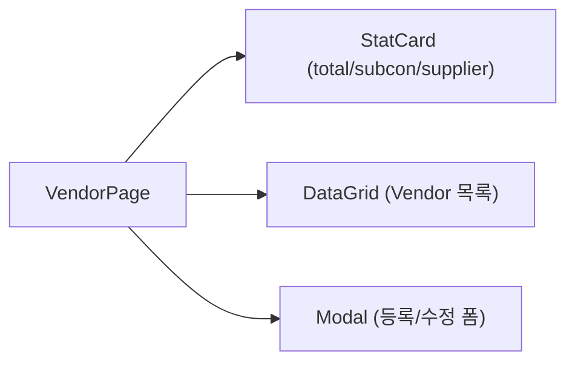
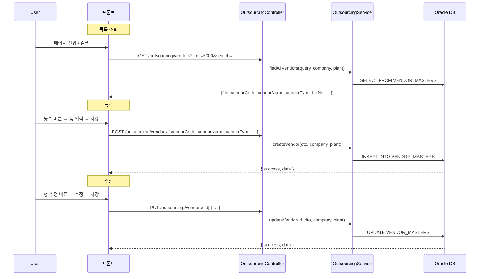
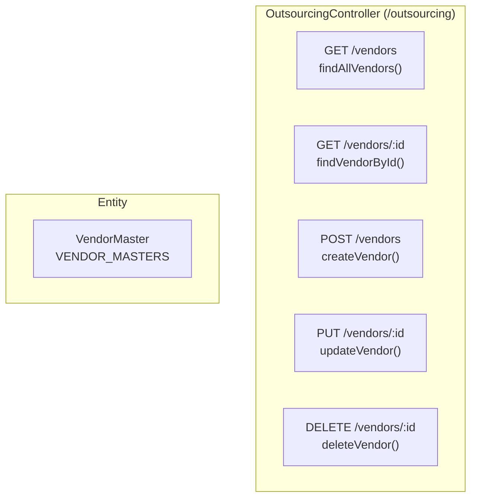

---
sources:
  - apps/backend/src/common/guards/jwt-auth.guard.ts
  - apps/backend/src/modules/outsourcing/controllers/outsourcing.controller.ts
  - apps/backend/src/modules/outsourcing/services/outsourcing.service.ts
verifiedCommit: 8a7e96ea
---

# 외주처 관리 — 비즈니스 로직 & 데이터 흐름 분석
> **분석 기준 커밋:** `8a7e96ea`
> **분석 일자:** `2026-07-04`

## 1. 화면 개요

외주 가공/제조를 의뢰하는 협력업체(외주처) 정보를 관리하는 메뉴.

| 항목 | 내용 |
|------|------|
| 메뉴 코드 | OUT_VENDOR |
| 경로 | `/outsourcing/vendor` |
| 페이지 | `page.tsx` → `VendorPage` |
| 주요 역할 | 외주처 CRUD |
| 권한 | JwtAuthGuard |
| API 베이스 | `/outsourcing/vendors` |

## 2. 화면 구성

| 컴포넌트 | 파일 | 설명 |
|----------|------|------|
| `VendorPage` | `page.tsx` | 메인 페이지 |
| `createVendorGridColumns` | `vendorColumns.tsx` | DataGrid 컬럼 정의 |
| `Vendor` 타입 | `types.ts` | 외주처 인터페이스 |
| `ComCodeSelect` | `@/components/shared` | VENDOR_TYPE 선택 |
| `DataGrid` | `@/components/data-grid` | 공통 그리드 |

## 3. 상태 관리

| 상태 | 설명 |
|------|------|
| `data` | 외주처 목록 (Vendor[]) |
| `loading, saving` | API 호출 중 |
| `isModalOpen` | 등록/수정 모달 열림 |
| `selectedItem` | 수정 대상 (Vendor\|null) |
| `searchTerm` | 검색어 |
| `form` | { vendorCode, vendorName, vendorType, bizNo, ceoName, tel, email, contactPerson, address } |

## 4. API 호출 흐름

## 5. 백엔드 처리

## 6. 처리 규칙 및 검증

| 규칙 | 설명 |
|------|------|
| 유형 | SUBCON(외주가공), SUPPLIER(자재공급) |
| PK | COMPANY + PLANT_CD + VENDOR_CODE |
| 삭제 | DELETE /vendors/:id (하드 삭제 가능) |
| useYn | 별도 컬럼으로 사용 여부 관리 |

## 7. DB 테이블 영향 및 엔티티

| 테이블 | 엔티티 | 설명 |
|--------|--------|------|
| `VENDOR_MASTERS` | `VendorMaster` | 외주처 마스터 |

VendorMaster 주요 컬럼:
- `VENDOR_CODE` (PK), `VENDOR_NAME`, `BIZ_NO`
- `CEO_NAME`, `ADDRESS`, `TEL`, `FAX`, `EMAIL`
- `CONTACT_PERSON`, `VENDOR_TYPE` (SUBCON/SUPPLIER)
- `USE_YN`, `COMPANY` (PK), `PLANT_CD` (PK)

## 8. 에러 코드

| HTTP | 상황 |
|------|------|
| 200/201 | 조회/등록/수정 성공 |
| 404 | 외주처 미존재 |

## 9. 비고

- 화면에서 sqlQuery 표시는 `OS_VENDORS`로 되어 있으나 실제 엔티티는 `VENDOR_MASTERS` (화면 sqlQuery는 추정치)
- 통계 StatCard로 유형별(SUBCON/SUPPLIER) 건수 표시
- 등록 시 `vendorCode` 수정 불가 (disabled 처리, PK)
