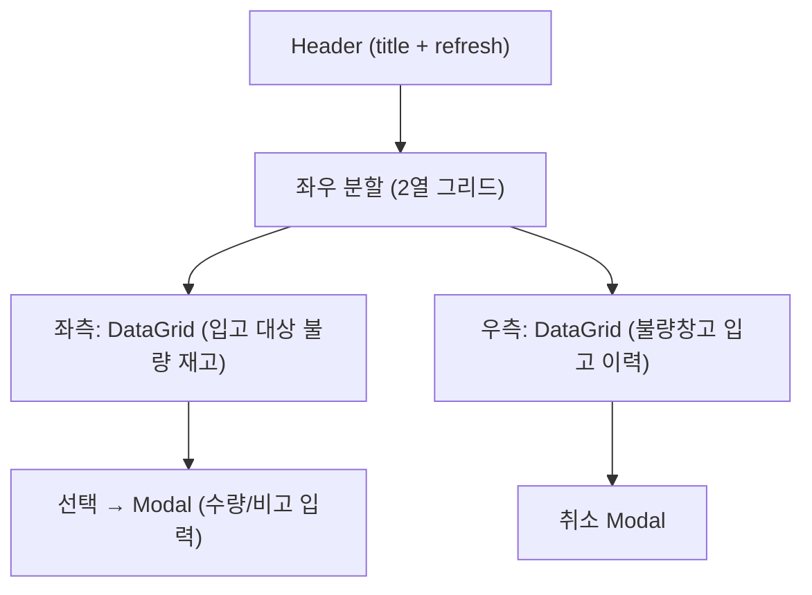
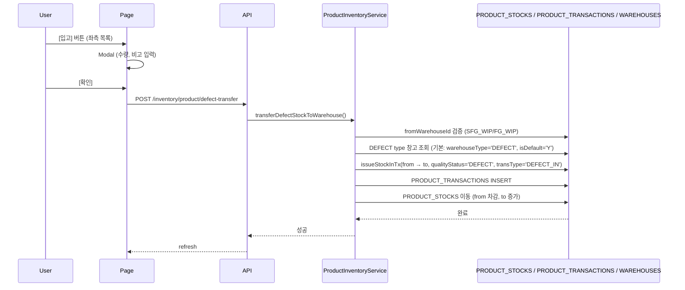
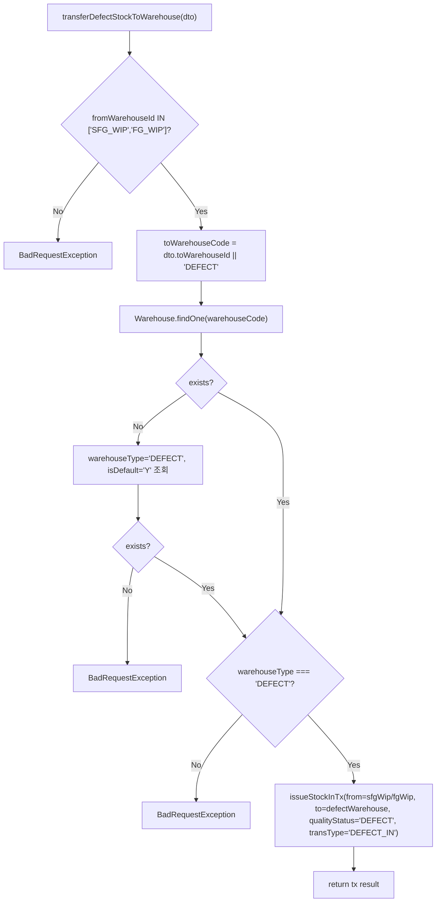
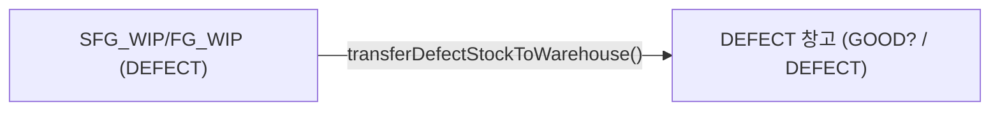

---
sources:
  - apps/frontend/src/app/(authenticated)/product/defect-transfer/page.tsx
verifiedCommit: 8a7e96ea
---

# 제품 불량창고입고 — 비즈니스 로직 & 데이터 흐름 분석
> **분석 기준 커밋:** `8a7e96ea`
> **분석 일자:** `2026-07-04`

## 1. 화면 개요

| 항목 | 내용 |
|------|------|
| **메뉴 코드** | `PROD_DEFECT_TRANSFER` |
| **메뉴명** | 제품 불량창고입고 |
| **URL** | `/product/defect-transfer` |
| **소스 경로** | `apps/frontend/src/app/(authenticated)/product/defect-transfer/page.tsx` |
| **목적** | 공정 WIP(SFG_WIP/FG_WIP)의 불량 제품재고를 불량창고(DEFECT)로 이동 |
| **사용자** | 품질관리자, 생산관리자 |
| **워크플로우 노드** | 불량 대상 조회 → 전송 → 이력 조회 → 필요시 취소 |

## 2. 화면 구성

### 2.1 레이아웃



### 2.2 컴포넌트

| 구분 | 컴포넌트 | 소스 위치 |
|------|---------|----------|
| 레이아웃 | `Card`, `CardContent`, `Modal` | `@/components/ui` |
| Button | `Button` | `@/components/ui` |
| Input | `Input` | `@/components/ui` |
| 수량 입력 | `QtyInput` | `@/components/shared` |
| 기간 필터 | `DateRangeFilter` | `@/components/shared/DateRangeFilter` |
| 배지 | `StatusBadge`, `StatusHeaderHelp` | `@/components/shared` |
| 그리드 | `DataGrid` | `@/components/data-grid/DataGrid` |
| 컬럼 정의 | `createProductDefectTargetGridColumns`, `createProductDefectHistoryGridColumns` | `./productDefectTransferColumns.tsx` |

### 2.3 좌측 컬럼 (입고 대상)

| 컬럼명 | 표시 | 유형 |
|--------|------|------|
| [입고] | 액션 버튼 | `Button` (ArchiveRestore) |
| 품목코드 | itemCode | 모노텍스트 |
| 품목명 | itemName | 텍스트 |
| 출고창고 | warehouseName | 텍스트 |
| 품질상태 | qualityStatus=DEFECT | 빨강 배지 |
| 가용수량 | availableQty | 숫자 (빨강) |

### 2.4 우측 컬럼 (입고 이력)

| 컬럼명 | 표시 | 유형 |
|--------|------|------|
| [취소] | 액션 버튼 | `Button` (XCircle) |
| 거래일 | transDate | 날짜 |
| 전표번호 | transNo | 모노텍스트 |
| 유형 | transType | `StatusBadge` (TRANSACTION_TYPE) |
| 품목코드 | part.itemCode | 모노텍스트 |
| 품목명 | part.itemName | 텍스트 |
| 출고창고 | fromWarehouse | 텍스트 |
| 도착창고 | toWarehouse | 텍스트 |
| 품질상태 | qualityStatus | 배지 |
| 수량 | qty | 숫자 |
| 상태 | status | 배지 (DONE/CANCELED) |

## 3. 상태 관리

```typescript
targetData: ProductDefectStock[]      // 입고 대상 불량 재고
historyData: ProductDefectTransferTx[]  // 입고 이력
targetLoading, historyLoading: boolean
saving: boolean
selectedStock: ProductDefectStock | null
transferQty: number (기본 1)
transferRemark: string
selectedTx: ProductDefectTransferTx | null
cancelReason: string
```

## 4. API 호출 흐름

### 4.1 API 목록

| Method | Endpoint | 용도 | 호출 시점 |
|--------|----------|------|----------|
| `GET` | `/inventory/product/stocks` | SFG_WIP/FG_WIP 불량 재고 조회 | 최초 로드 / Refresh |
| `GET` | `/inventory/product/transactions` | 불량창고 입고 이력 (DEFECT_IN) | 최초 로드 / Refresh |
| `POST` | `/inventory/product/defect-transfer` | 불량창고 입고 실행 | Modal 확인 |
| `POST` | `/inventory/cancel` | 불량 입고 취소 | 취소 Modal 확인 |

### 4.2 API 추적

| API | Controller | Service |
|-----|-----------|---------|
| `GET /inventory/product/stocks` | `InventoryController.getProductStocks()` | `ProductInventoryService.getStock()` |
| `GET /inventory/product/transactions` | `InventoryController.getProductTransactions()` | `ProductInventoryService.getTransactions()` |
| `POST /inventory/product/defect-transfer` | `InventoryController.transferProductDefectToWarehouse()` | `ProductInventoryService.transferDefectStockToWarehouse()` |
| `POST /inventory/cancel` | `InventoryController.cancelTransaction()` | `ProductInventoryService.cancelTransaction()` |

### 4.3 불량이동 시퀀스



## 5. 백엔드 처리

### 5.1 `transferDefectStockToWarehouse()` (product-inventory.service.ts:666-708)



## 6. 처리 규칙 및 검증

1. **출발 창고 제한**: `SFG_WIP`(반제품 공정창고) 또는 `FG_WIP`(완제품 공정창고)만 허용
2. **도착 창고**: 기본 `DEFECT` 창고 또는 명시적 지정. warehouseType='DEFECT' 검증
3. **DEFECT qualityStatus**: 이동 시 qualityStatus='DEFECT'로 고정
4. **이중입고 가드**: 동일 박스 NOT APPLICABLE (수량 기반 이동)
5. **취소 가능**: DONE 상태의 DEFECT_IN 트랜잭션은 일반 취소 로직으로 취소 가능

## 7. 상태 전이



## 8. DB 테이블 영향 및 엔티티

| 테이블 | 엔티티 | 용도 | 읽기/쓰기 |
|--------|--------|------|----------|
| `PRODUCT_STOCKS` | `ProductStock` | 제품 현재고 | RW (이동: from 차감, to 증가) |
| `PRODUCT_TRANSACTIONS` | `ProductTransaction` | 제품 수불 이력 | W (INSERT DEFECT_IN) |
| `WAREHOUSES` | `Warehouse` | 창고 정보 | R |

## 9. 공통코드

| 코드 그룹 | 값 |
|----------|-----|
| transType | DEFECT_IN, DEFECT_IN_CANCEL |
| qualityStatus | DEFECT |

## 10. 에러 코드

| 조건 | 예외 | HTTP |
|------|------|------|
| 잘못된 출발창고 | `BadRequestException` | 400 |
| 불량창고 미설정 | `BadRequestException` | 400 |
| 도착창고가 불량창고 아님 | `BadRequestException` | 400 |
| 재고 부족 | `BadRequestException` | 400 |

## 11. 비고

- `QtyInput` 공통 컴포넌트 사용 (with maxValue)
- 취소 로직은 `POST /inventory/cancel` (source='product')로 통일
- 좌/우측 DataGrid 각각 독립적인 컬럼 정의 사용 (`createProductDefectTargetGridColumns`, `createProductDefectHistoryGridColumns`)
