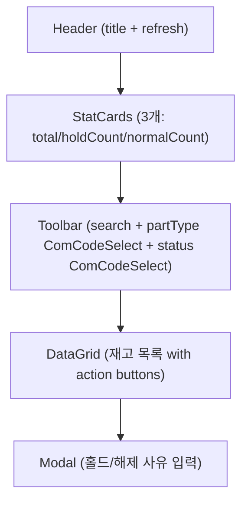
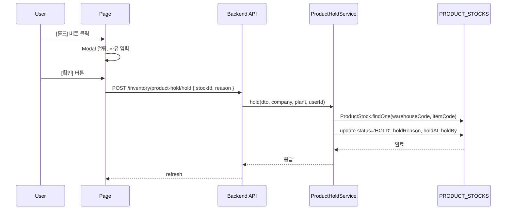
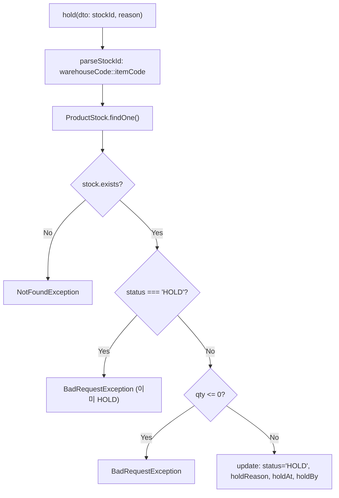
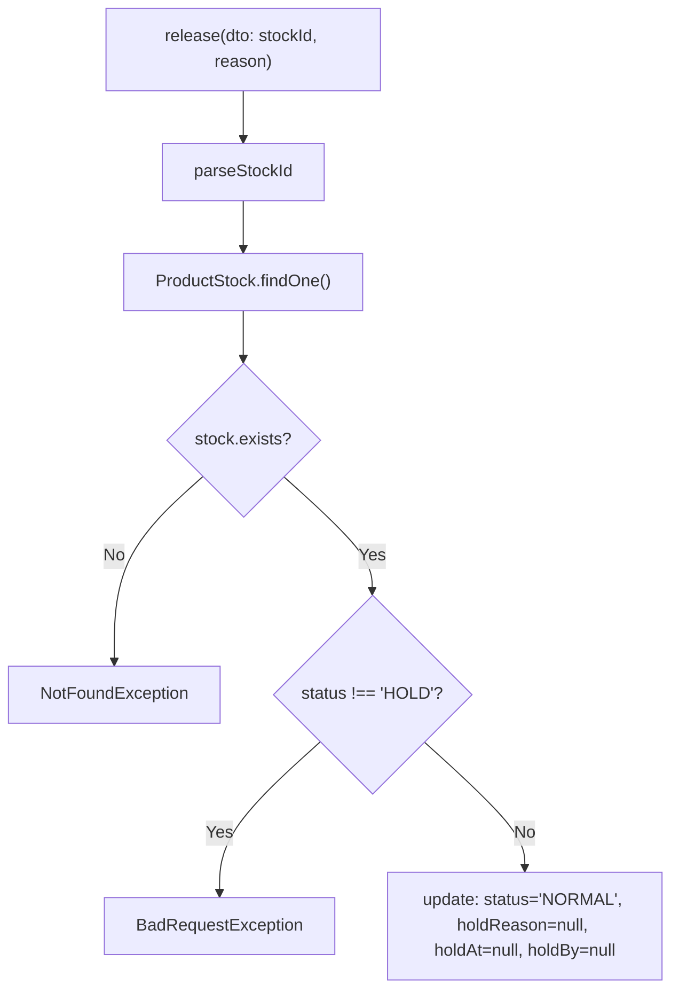
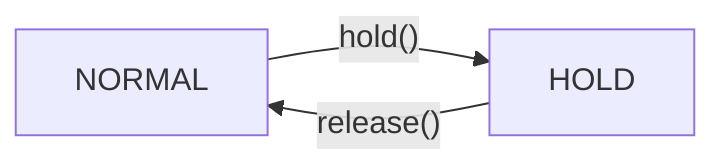

# 제품재고홀드 — 비즈니스 로직 & 데이터 흐름 분석
> **분석 기준 커밋:** `8a7e96ea`
> **분석 일자:** `2026-07-04`

## 1. 화면 개요

| 항목 | 내용 |
|------|------|
| **메뉴 코드** | `PROD_HOLD` |
| **메뉴명** | 제품재고홀드 |
| **URL** | `/inventory/product-hold` |
| **소스 경로** | `apps/frontend/src/app/(authenticated)/inventory/product-hold/page.tsx` |
| **목적** | PRODUCT_STOCKS의 제품재고 홀드/해제 관리 |
| **사용자** | 품질관리자, 재고관리자 |
| **워크플로우 노드** | 조회 → 홀드/해제 실행 |

## 2. 화면 구성

### 2.1 레이아웃



### 2.2 컴포넌트

| 구분 | 컴포넌트 | 소스 위치 |
|------|---------|----------|
| 레이아웃 | `Card`, `CardContent`, `Modal` | `@/components/ui` |
| 통계 | `StatCard` | `@/components/ui` |
| Input | `Input` | `@/components/ui` |
| Button | `Button` | `@/components/ui` |
| 배지 | `ComCodeBadge` | `@/components/ui` |
| 공통코드 Select | `ComCodeSelect` | `@/components/shared` |
| 그리드 | `DataGrid` | `@/components/data-grid/DataGrid` |
| 컬럼 정의 | `createProductHoldGridColumns` | `./productHoldColumns.tsx` |

### 2.3 필드/컬럼

| 컬럼명 | 표시 | 유형 |
|--------|------|------|
| 액션 | [홀드/해제] 버튼 | `Button` |
| 품목코드 | itemCode | 모노텍스트 |
| 품목명 | itemName | 텍스트 |
| 품목유형 | itemType | `ComCodeBadge` (ITEM_TYPE) |
| 창고코드 | warehouseCode | 텍스트 |
| 수량 | qty | 숫자 |
| 상태 | status | `StatusBadge` (PRODUCT_HOLD_STATUS) |
| 홀드사유 | holdReason | 텍스트 |

### 2.4 Filter

| 필터명 | 코드 그룹 | 유형 |
|--------|----------|------|
| 검색 | - | Input (searchText) |
| 품목유형 | `ITEM_TYPE` | `ComCodeSelect` |
| 상태 | `PRODUCT_HOLD_STATUS` | `ComCodeSelect` |

## 3. 상태 관리

```typescript
data: ProductHoldStock[]
loading, saving: boolean
searchText: string
statusFilter: string      // PRODUCT_HOLD_STATUS
typeFilter: string        // ITEM_TYPE
isModalOpen: boolean
selectedStock: ProductHoldStock | null
actionType: "hold" | "release"
reason: string
```

## 4. API 호출 흐름

### 4.1 API 목록

| Method | Endpoint | 용도 | 호출 시점 |
|--------|----------|------|----------|
| `GET` | `/inventory/product-hold` | 제품재고 목록 조회 (홀드 상태 포함) | 최초 로드 / Refresh / 액션 후 |
| `POST` | `/inventory/product-hold/hold` | 홀드 처리 | [홀드] Modal 확인 |
| `POST` | `/inventory/product-hold/release` | 홀드 해제 | [해제] Modal 확인 |

### 4.2 API 추적

| API | Controller | Service |
|-----|-----------|---------|
| `GET /inventory/product-hold` | `ProductHoldController.findAll()` | `ProductHoldService.findAll()` |
| `POST /inventory/product-hold/hold` | `ProductHoldController.hold()` | `ProductHoldService.hold()` |
| `POST /inventory/product-hold/release` | `ProductHoldController.release()` | `ProductHoldService.release()` |

### 4.3 주요 시퀀스



## 5. 백엔드 처리

### 5.1 홀드 서비스 (`product-hold.service.ts`)

**`hold()` 처리 흐름:**



**`release()` 처리 흐름:**



## 6. 처리 규칙 및 검증

1. **재고 행 식별**: `warehouseCode::itemCode` 복합키로 PRODUCT_STOCKS 식별
2. **홀드 전제조건**: qty > 0 이어야 함, 이미 HOLD면 거부
3. **해제 전제조건**: status === 'HOLD' 여야 함
4. **트랜잭션**: `TransactionService.run()` 내에서 처리

## 7. 상태 전이



## 8. 상태 코드 및 공통코드

| 코드 그룹 | 코드값 | 설명 |
|----------|--------|------|
| `PRODUCT_HOLD_STATUS` | NORMAL | 정상 |
| `PRODUCT_HOLD_STATUS` | HOLD | 홀드 |
| `ITEM_TYPE` | SEMI_PRODUCT | 반제품 |
| `ITEM_TYPE` | FINISHED | 완제품 |

## 9. DB 테이블 영향 및 엔티티

| 테이블 | 엔티티 | 용도 | 읽기/쓰기 |
|--------|--------|------|----------|
| `PRODUCT_STOCKS` | `ProductStock` | 제품 현재고 (홀드 필드 포함) | RW (UPDATE status, holdReason, holdAt, holdBy) |
| `ITEM_MASTER` | `ItemMaster` | 품목 정보 | R |

## 10. 에러 코드

| 조건 | 예외 | HTTP |
|------|------|------|
| 재고 없음 | `NotFoundException` | 404 |
| 이미 HOLD | `BadRequestException` | 400 |
| qty=0 홀드 | `BadRequestException` | 400 |
| HOLD 아니고 해제 | `BadRequestException` | 400 |

## 11. 비고

- 별도의 트랜잭션 이력 테이블을 사용하지 않고 PRODUCT_STOCKS 필드 직접 갱신
- 홀드 사유는 500자 제한 (PRODUCT_STOCKS.HOLD_REASON)
- `productHoldColumns.tsx:85`에서 `PRODUCT_HOLD_STATUS` 공통코드 사용
