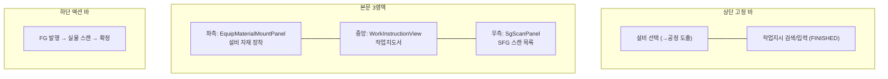
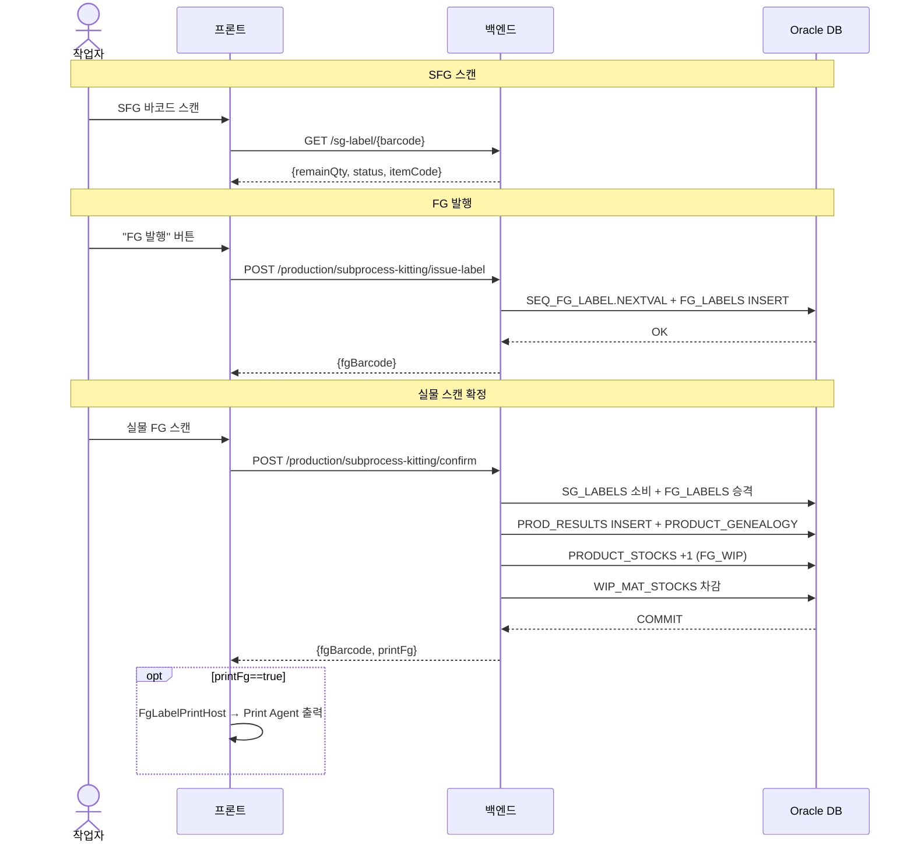

# 실적입력(조립) — 비즈니스 로직 & 데이터 흐름 분석

> **Menu Code:** `PROD_INPUT_ASSEMBLY`
> **Path:** `/production/input-assembly`
> **Label:** `menu.production.inputAssembly`
> **분석 기준 커밋:** `8a7e96ea`
> **분석 일자:** `2026-07-04`

## 1. 화면 개요

반제품 SFG 라벨을 스캔하여 완제품(FG)을 조립하는 현장 실적 입력 화면. 설비 선택 → 작업지시 선택 → SFG 스캔 → FG 발행 → 실물 스캔 확정 순서로 진행된다.

## 2. 화면 구성



| 영역 | 컴포넌트 | 역할 |
| --- | --- | --- |
| 상단 | 설비선택 / JobOrder | 공정도출 + FINISHED 작업지시 선택 |
| 좌측 | EquipMaterialMountPanel | 설비 자재 장착 (RAW_MATERIAL) |
| 중앙 | WorkInstructionView | 작업지도서 |
| 우측 | SgScanPanel | 이전 공정 SFG 스캔 + BOM 검증 |
| 하단 | AssemblyActionBar | FG 발행 → 실물 스캔 확정 |

## 3. 상태 관리

| 상태 | 용도 | 초기값 |
| --- | --- | --- |
| `selectedOrder` | 선택된 작업지시 (itemType=FINISHED) | `null` |
| `processCode/equipCode` | 선택 설비 → 공정 | `""` |
| `sgList[]` | 스캔된 SFG 목록 | `[]` |
| `issuedFg` | 발행된 FG 바코드 | `null` |
| `issuing/confirming` | API 호출 플래그 | `false` |

## 4. API 호출 흐름

| 시점 | API | 용도 |
| --- | --- | --- |
| 진입 | `GET /equipment/equips?limit=500` | 설비 목록 |
| 설비 선택 | `GET /equipment/equips/{code}` | 설비 현재 작업지시 복원 |
| | `PATCH /equipment/equips/{code}/job-order` | 설비에 작업지시 할당 |
| 작업지시 검색 | `GET /production/job-orders?search=&statuses=WAITING,RUNNING&itemType=FINISHED&assignableEquipCode=` | 작업지시 검색 |
| 작업지시 선택 | `GET /production/subprocess-kitting/assembly-requirements/{orderNo}` | BOM 요구사항 |
| SFG 스캔 | `GET /sg-label/{barcode}` | SFG 정보 조회 |
| FG 발행 | `POST /production/subprocess-kitting/issue-label` | FG 라벨 발행 (SEQ_FG_LABEL) |
| 확정 | `POST /production/subprocess-kitting/confirm` | 조립 확정 (단일 TX) |



## 5. 백엔드 처리

**공유:** `subprocess-kitting.service.ts` (PROD_KITTING과 동일 서비스)

- `issueLabel()` → `issueSgLabel()` 대칭 (FG_LABELS INSERT, status=ISSUED)
- `confirm()` → `confirmSubKit()` 대칭 (FG 승격/재고적재)

## 6. 처리 규칙

- `itemType=FINISHED` 작업지시만 선택 가능
- SFG → FG 승격 시 BOM 기준 자재 차감
- `printFg` 응답 플래그로 FG 라벨 출력 여부 제어 (라우팅 `ISSUE_LABEL_TYPE`)
- 설비 미선택 시 자재 차감 스킵

## 7. DB 테이블 영향

| 테이블 | 변경 | 설명 |
| --- | --- | --- |
| `FG_LABELS` | INSERT (발행) / UPDATE (승격) | FG 라벨 관리 |
| `SG_LABELS` | UPDATE (소비) | 입력 SFG 소진 |
| `PROD_RESULTS` | INSERT | 실적 기록 |
| `PRODUCT_GENEALOGY` | INSERT | FG→SFG 계보 |
| `PRODUCT_STOCKS` | INSERT/UPSERT | FG_WIP 재고 적재 |
| `WIP_MAT_STOCKS` | 차감 | 설비 자재 차감 |
| `JOB_ORDERS` | UPDATE | WAITING→RUNNING (최초 시) |

## 8. 상태 전이

```
SG_LABELS: IN_STOCK → MOUNTED/CONSUMED
FG_LABELS: ISSUED → IN_STOCK
JOB_ORDERS: WAITING → RUNNING → DONE
```

## 9. 비고

- `alert()/confirm()/prompt()` 사용 없음
- 설비 선택은 localStorage에 저장 (재진입 시 복원)
- input-kiosk와 설비/작업지시/자재 장착 컴포넌트 재사용
- FG 라벨 출력은 Print Agent로 별도 모듈 처리
