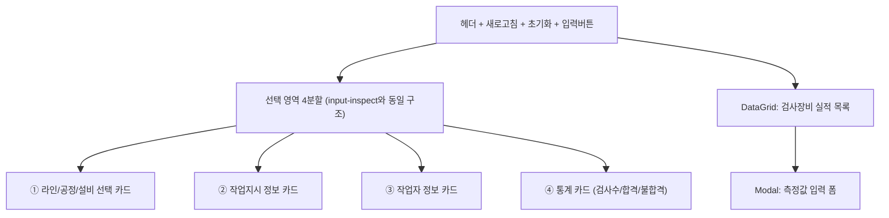
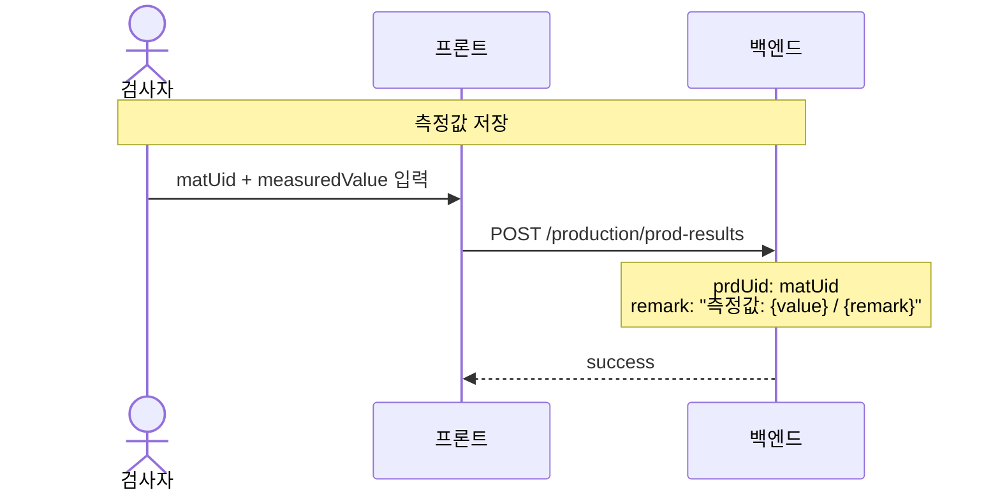

---
sources:
  - apps/frontend/src/stores/inputEquipStore.ts
verifiedCommit: 8a7e96ea
---

# 실적입력(검사장비) — 비즈니스 로직 & 데이터 흐름 분석

> **Menu Code:** `PROD_INPUT_EQUIP`
> **Path:** `/production/input-equip`
> **Label:** `menu.production.inputEquip`
> **분석 기준 커밋:** `8a7e96ea`
> **분석 일자:** `2026-07-04`

## 1. 화면 개요

라인→공정→설비→작업지시→작업자 5단계 선택 후 검사장비 측정값을 입력하는 실적 화면. 설비별 검사 기준 범위 표시 및 자동 합격/불합격 판정 지원.

## 2. 화면 구성

## 3. 상태 관리 (Zustand + persist)

**Store:** `inputEquipStore.ts` (`useInputEquipStore`) — `inputInspectStore`와 동일 구조

## 4. API 호출 흐름

| 시점 | API | 용도 |
| --- | --- | --- |
| 라인+공정 | `GET /equipment/equips?lineCode=&limit=200` | 설비 목록 |
| 작업지시 | `PATCH /equipment/equips/{id}/job-order` | 설비 할당 |
| 실적 조회 | `GET /production/prod-results` | 검사 실적 목록 |
| 실적 저장 | `POST /production/prod-results` | 측정값 + 검사 결과 등록 |

## 5. 특이사항

- **측정값 저장 방식**: `prod-results` 엔티티에 측정값 전용 컬럼이 없으므로 `remark` 필드에 `"측정값: {value}"` 형식으로 저장
- input-inspect와 동일한 `POST /production/prod-results` 엔드포인트 사용

## 6. DB 테이블 영향

| 테이블 | 작업 | 설명 |
| --- | --- | --- |
| `PROD_RESULTS` | INSERT | 검사장비 실적 등록 |

## 7. 비고

- `alert()/confirm()/prompt()` 사용 없음
- 5단계 선택 흐름은 input-inspect와 동일
- measuredValue 전용 DB 컬럼 없음 → remark에 텍스트 저장 (향후 개선 필요)
