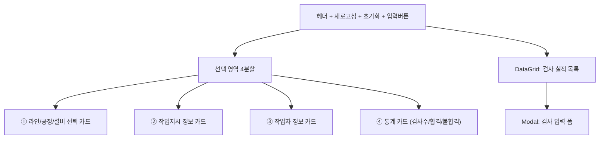
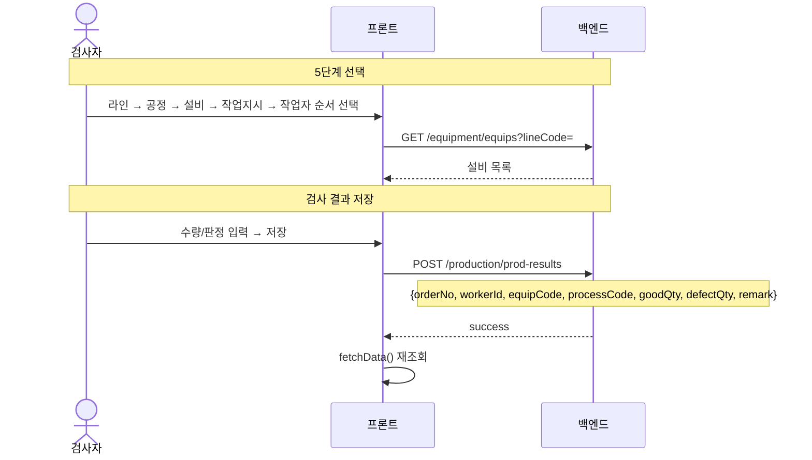

# 실적입력(단순검사) — 비즈니스 로직 & 데이터 흐름 분석

> **Menu Code:** `PROD_INPUT_INSPECT`
> **Path:** `/production/input-inspect`
> **Label:** `menu.production.inputInspect`
> **분석 기준 커밋:** `8a7e96ea`
> **분석 일자:** `2026-07-04`

## 1. 화면 개요

라인→공정→설비→작업지시→작업자 5단계 선택 후 검사 결과를 입력하는 단순검사 실적 화면.

## 2. 화면 구성

## 3. 상태 관리 (Zustand + persist)

**Store:** `inputInspectStore.ts` (`useInputInspectStore`)

| 상태 | 초기화 규칙 |
| --- | --- |
| `selectedLine` | 변경 시 process/equip/jobOrder 초기화 |
| `selectedProcess` | 변경 시 equip/jobOrder 초기화 |
| `selectedEquip` | 변경 시 jobOrder 초기화 |
| `selectedJobOrder` | 독립 |
| `selectedWorker` | 독립 |

## 4. API 호출 흐름

| 시점 | API | 용도 |
| --- | --- | --- |
| 라인+공정 선택 | `GET /equipment/equips?lineCode=&limit=200` | 설비 목록 (공정 필터) |
| 작업지시 선택 | `PATCH /equipment/equips/{id}/job-order` | 설비에 할당 |
| 실적 조회 | `GET /production/prod-results` | 검사 실적 목록 |
| 실적 저장 | `POST /production/prod-results` | 검사 결과 등록 |

## 5. 백엔드 처리

**Controller:** `ProdResultController.create()`
**Service:** `ProdResultService.create()`

`POST /production/prod-results`로 검사 실적 등록. 일반 생산실적과 동일한 엔드포인트 공유.

## 6. DB 테이블 영향

| 테이블 | 작업 | 설명 |
| --- | --- | --- |
| `PROD_RESULTS` | INSERT | 검사 실적 등록 |

## 7. 비고

- `alert()/confirm()/prompt()` 사용 없음
- Zustand persist로 localStorage에 선택 상태 저장 (페이지 이동 후 유지)
- 공용 `JobOrderSelectModal` + `WorkerSelectModal` 사용
- 설비 목록은 선택된 라인+공정 기준으로 필터링
