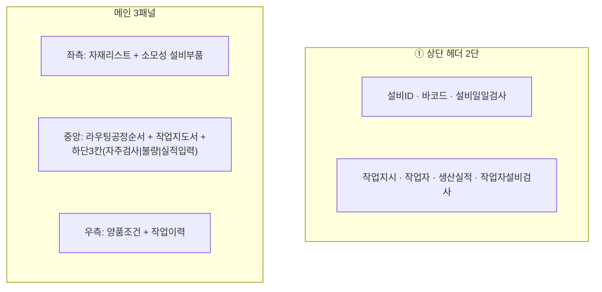
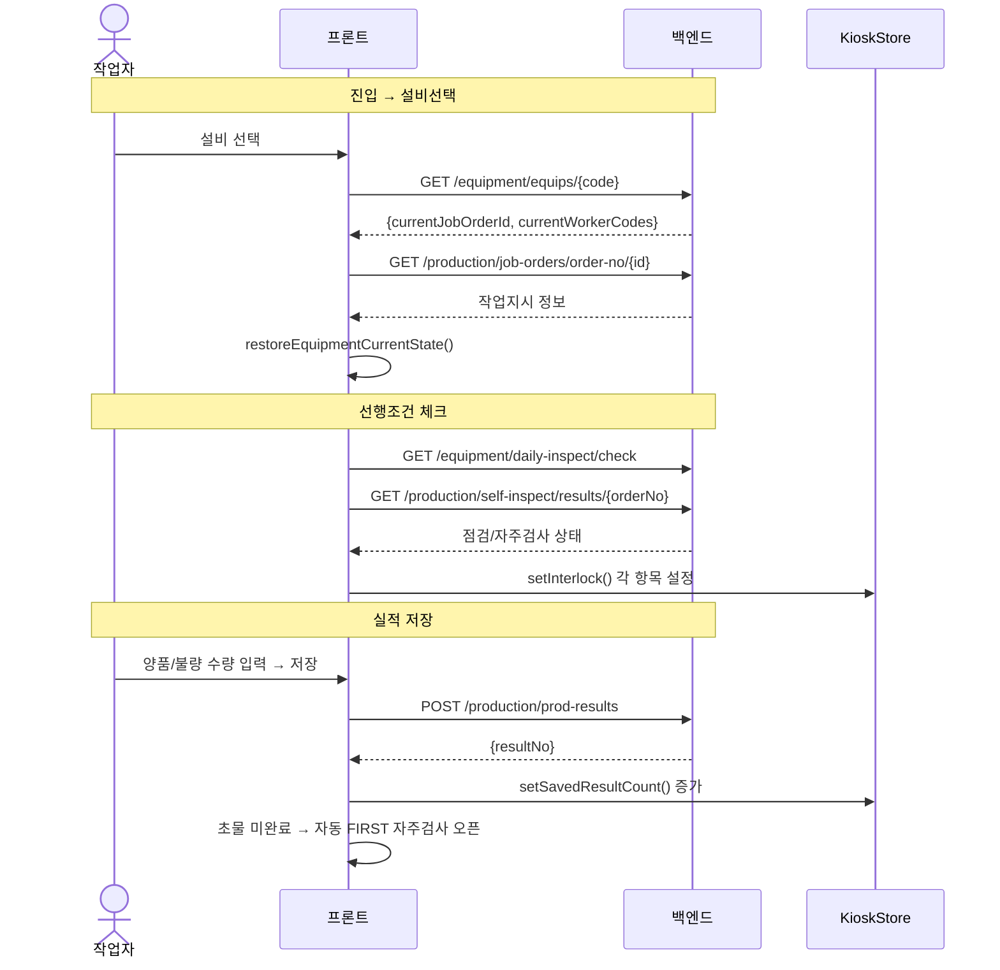

# 생산실적 키오스크 — 비즈니스 로직 & 데이터 흐름 분석

> **Menu Code:** `PROD_INPUT_KIOSK`
> **Path:** `/production/input-kiosk`
> **Label:** `menu.production.inputKiosk`
> **분석 기준 커밋:** `8a7e96ea`
> **분석 일자:** `2026-07-04`

## 1. 화면 개요

현장 설비 옆 태블릿/PC용 생산실적 키오스크. 설비선택 → 선행조건(일일점검/자재스캔/소모품스캔/자주검사) 완료 후 실적 입력. 자주검사(FIRST/MID/LAST) 자동 트리거 포함.

## 2. 화면 구성

| 영역 | 컴포넌트 | 역할 |
| --- | --- | --- |
| 헤더 | EquipHeader | 설비선택/작업지시/작업자/일일점검/작업자점검 |
| 좌측 | MaterialListPanel | BOM 자재 목록 + 소모성 부품 |
| 중앙 | RoutingFlowBar | 라우팅 공정 순서 바 |
| 중앙 | WorkInstructionView | 작업지도서 |
| 중앙-하단 | SelfInspectPanel | 자주검사 현황 (FIRST/MID/LAST) |
| 중앙-하단 | DefectSummaryPanel | 불량 요약 |
| 중앙-하단 | ProductionInputBar | 실적 입력 (goodQty/defectQty) |
| 우측 | WorkHistoryPanel | 작업 이력 |

## 3. 상태 관리 (Zustand + persist)

**Store:** `kioskStore.ts` (`useKioskStore`)

| 상태 | 용도 |
| --- | --- |
| `selectedEquip` | 선택 설비 (persist: localStorage) |
| `selectedJobOrder` | 선택 작업지시 |
| `selectedWorkers[]` | 현재 작업자 목록 |
| `interlock` | 선행조건 완료 여부 (dailyInspect/workerInspect/materialScan/consumableScan) |
| `savedResultCount` | 현재 작업지시 누적 생산수량 |
| `hasPendingDelegate` | 의뢰검사 대기 여부 |
| `midInspectDone` | 중물 자주검사 완료 여부 |

**인터락 조건** (모두 true여야 실적 입력 가능):
1. `dailyInspectDone` — 설비 일일점검 완료 (1일 1회)
2. `workerInspectDone` — 작업자설비점검 완료 (작업지시 변경 시)
3. `materialScanDone` — BOM 자재 스캔 확인
4. `consumableScanDone` — 소모성 부품 스캔 확인
5. `hasPendingDelegate == false` — 의뢰검사 대기 없음
6. `isMidBlock == false` — 중물 자주검사 차단 해제

## 4. API 호출 흐름

| 시점 | API | 용도 |
| --- | --- | --- |
| 진입 | `GET /equipment/equips?limit=500` | 설비 목록 |
| 설비 선택 | `GET /equipment/equips/{code}` | 설비 상태 + 작업지시 + 작업자 복원 |
| | `PATCH /equipment/equips/{code}/job-order` | 작업지시 할당 |
| | `PATCH /equipment/equips/{code}/workers` | 작업자 할당 |
| 작업지시 선택 | `GET /production/job-orders/order-no/{orderNo}` | 작업지시 상세 |
| 일일점검 확인 | `GET /equipment/daily-inspect/check?equipCode=&inspectType=DAILY` | 일일점검 완료 여부 |
| 작업자점검 확인 | `GET /equipment/daily-inspect/check?equipCode=&inspectType=WORKER&orderNo=` | 작업자점검 완료 여부 |
| 자주검사 현황 | `GET /production/self-inspect/results/{orderNo}` | 초물/중물/종물 상태 |
| 의뢰검사 대기 | `GET /production/self-inspect/pending/{orderNo}` | 의뢰검사 대기 여부 |
| 진행수량 동기화 | `GET /production/job-orders/order-no/{orderNo}` | 서버 실적 집계 동기화 |
| 작업자 조회 | `GET /master/workers/{code}` | 작업자 정보 |

**키오스크 모달별 API:**
| 모달 | 내부 API |
| --- | --- |
| `DailyInspectModal` | 설비일일점검 등록 |
| `WorkerInspectModal` | 작업자설비점검 등록 |
| `MaterialScanModal` | 자재 스캔/장착 |
| `ConsumableScanModal` | 소모품 스캔/장착 |
| `DefectInputModal` | 불량 등록 |
| `SelfInspectModal` | 자주검사 등록 |
| `ProductionInputBar` | 실적 저장 → `POST /production/prod-results` |

## 5. 자주검사 트리거 규칙

| 시점 | 트리거 | 조건 |
| --- | --- | --- |
| FIRST(초물) | 실적 저장 후 | `firstInspectDone == false` → 자동 `SelfInspectModal(FIRST)` |
| MID(중물) | 진행률 도달 | `progressPct >= midBlockPct(60%)` && `!midInspectDone` → 차단 |
| LAST(종물) | 버튼 클릭 | `SelfInspectModal(LAST)` |

## 6. 처리 규칙

- **4가지 인터락**이 모두 `true`여야 실적 입력 버튼 활성화
- **중물 차단**: 진행률이 `QC_MID_BLOCK_PCT`(기본 60%) 이상이면 MID 검사 완료까지 실적 차단
- **의뢰검사 대기**: `hasPendingDelegate == true`면 실적 입력 차단 (10초 주기 폴링)
- **생산 유형**: `firstInspectDone`에 따라 TRIAL(시생산) / MASS(양산) 구분
- **SFG 라벨 자동 출력**: 발행공정 라우팅인 경우 Print Agent로 자동 출력

## 7. DB 테이블 영향

| 테이블 | 작업 | 설명 |
| --- | --- | --- |
| `PROD_RESULTS` | INSERT (실적 저장) | 생산실적 |
| `EQUIP_MASTERS` | SELECT/UPDATE | 설비 상태 + 작업지시/작업자 할당 |
| `DAILY_INSPECTS` | SELECT/INSERT | 일일점검 이력 |
| `SELF_INSPECTS` | SELECT/INSERT | 자주검사 이력 |
| `DEFECT_LOGS` | INSERT | 불량 등록 |
| `MATERIAL_MOUNTS` | INSERT | 자재 장착 |
| `CONSUMABLE_USAGES` | INSERT | 소모품 사용 |
| `SG_LABELS` | INSERT (라우팅 발행) | 반제품 라벨 발행 |

## 8. 공통코드

| 그룹코드 | 용도 |
| --- | --- |
| `QC_SELF` | 자주검사 설정 (QC_MID_NOTIFY_PCT, QC_MID_BLOCK_PCT) |
| `INSPECT_TIMING` | 검사시점 (FIRST/MID/LAST) |

## 9. 비고

- `Zustand persist`로 설비만 localStorage 저장 (작업지시/작업자는 DB에서 복원)
- `alert()/confirm()/prompt()` 사용 없음
- 10초 간격 폴링: 자주검사 상태, 의뢰검사 대기
- 세부 모달들은 각각 독립 컴포넌트 (DailyInspectModal, MaterialScanModal 등)
