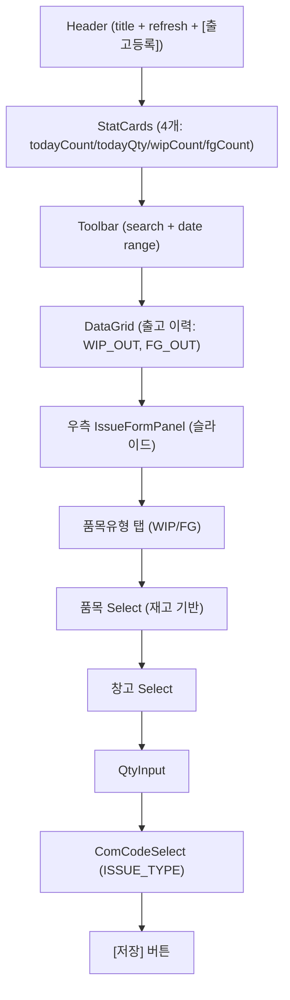
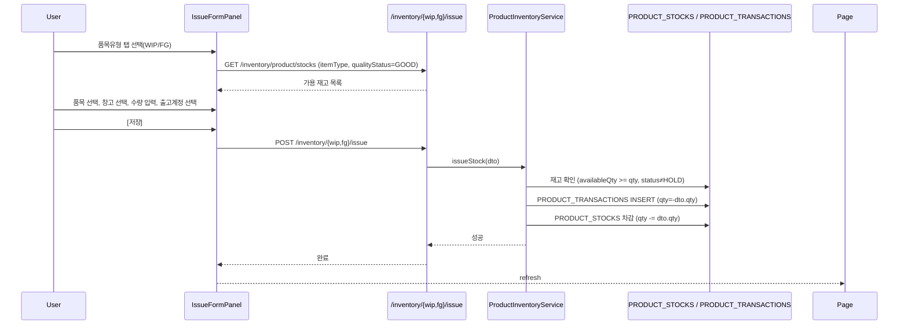
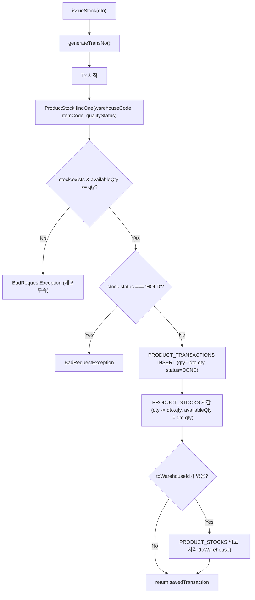

---
sources:
  - apps/frontend/src/app/(authenticated)/product/issue/page.tsx
verifiedCommit: 8a7e96ea
---

# 제품출고 — 비즈니스 로직 & 데이터 흐름 분석
> **분석 기준 커밋:** `8a7e96ea`
> **분석 일자:** `2026-07-04`

## 1. 화면 개요

| 항목 | 내용 |
|------|------|
| **메뉴 코드** | `PROD_ISSUE` |
| **메뉴명** | 제품출고관리 |
| **URL** | `/product/issue` |
| **소스 경로** | `apps/frontend/src/app/(authenticated)/product/issue/page.tsx` |
| **목적** | 반제품/완제품 출고 처리 (폐기, 창고이동, 기타) |
| **사용자** | 생산관리자, 창고관리자 |
| **워크플로우 노드** | 출고 이력 조회 → 출고 등록(우측 패널) → 저장 |

## 2. 화면 구성

### 2.1 레이아웃



### 2.2 컴포넌트

| 구분 | 컴포넌트 | 소스 위치 |
|------|---------|----------|
| 레이아웃 | `Card`, `CardContent` | `@/components/ui` |
| 통계 | `StatCard` | `@/components/ui` |
| Input | `Input` | `@/components/ui` |
| Button | `Button` | `@/components/ui` |
| 수량 입력 | `QtyInput` | `@/components/shared` |
| 공통코드 Select | `ComCodeSelect` | `@/components/shared` |
| 기간 필터 | `DateRangeFilter` | `@/components/shared/DateRangeFilter` |
| 배지 | `ComCodeBadge`, `StatusBadge`, `StatusHeaderHelp` | `@/components/shared`, `@/components/ui` |
| 그리드 | `DataGrid` | `@/components/data-grid/DataGrid` |
| **출고 패널** | `IssueFormPanel` | `./components/IssueFormPanel.tsx` |

### 2.3 컬럼 (좌측 출고 이력)

| 컬럼명 | 표시 | 유형 |
|--------|------|------|
| 거래일 | transDate | 날짜 |
| 전표번호 | transNo | 모노텍스트 |
| 유형 | transType | `StatusBadge` (TRANSACTION_TYPE) |
| 품목코드 | part.itemCode | 모노텍스트 |
| 품목명 | part.itemName | 텍스트 |
| 출고창고 | fromWarehouse | 텍스트 |
| 도착창고 | toWarehouse | 텍스트 |
| 품질 | qualityStatus | 배지 (양품/불량) |
| 출고계정 | issueType | `ComCodeBadge` (ISSUE_TYPE) |
| 수량 | qty | 숫자 |
| 상태 | status | 배지 (DONE/CANCELED) |

## 3. 상태 관리

```typescript
data: ProductIssueTx[]
loading: boolean
searchText: string
fromDate, toDate: string
isPanelOpen: boolean
saving: boolean
```

## 4. API 호출 흐름

### 4.1 API 목록

| Method | Endpoint | 용도 | 호출 시점 |
|--------|----------|------|----------|
| `GET` | `/inventory/product/transactions` | 출고 이력 조회 (WIP_OUT,FG_OUT) | 최초 로드 / Refresh |
| `GET` | `/inventory/product/stocks` | 가용 재고 조회 (IssueFormPanel) | 패널 열릴 때 |
| `POST` | `/inventory/wip/issue` | 반제품(WIP) 출고 | 패널 저장 |
| `POST` | `/inventory/fg/issue` | 완제품(FG) 출고 | 패널 저장 |

### 4.2 API 추적

| API | Controller | Service |
|-----|-----------|---------|
| `GET /inventory/product/transactions` | `InventoryController.getProductTransactions()` → `productInventoryService.getTransactions()` |
| `GET /inventory/product/stocks` | `InventoryController.getProductStocks()` → `productInventoryService.getStock()` |
| `POST /inventory/wip/issue` | `InventoryController.issueWip()` → `productInventoryService.issueStock()` |
| `POST /inventory/fg/issue` | `InventoryController.issueFg()` → `productInventoryService.issueStock()` |

### 4.3 출고 시퀀스



## 5. 백엔드 처리

### 5.1 `ProductInventoryService.issueStock()` (product-inventory.service.ts:357-439)



## 6. 처리 규칙 및 검증

1. **재고 확인**: `availableQty >= dto.qty` 확인 (HOLD 상태 재고 출고 불가)
2. **품질**: `qualityStatus='GOOD'` 양품만 출고 가능
3. **출고계정(ISSUE_TYPE)**: 공통코드 기반 필수 선택
4. **이동(toWarehouseId)**: 있는 경우 창고간 이동 처리 (출고+입고)
5. **트랜잭션 번호**: `PTX` prefix + YYYYMMDD + 5자리 시퀀스

## 7. DB 테이블 영향 및 엔티티

| 테이블 | 엔티티 | 용도 | 읽기/쓰기 |
|--------|--------|------|----------|
| `PRODUCT_TRANSACTIONS` | `ProductTransaction` | 제품 수불 이력 | W (INSERT) |
| `PRODUCT_STOCKS` | `ProductStock` | 제품 현재고 | RW (UPDATE qty) |
| `WAREHOUSES` | `Warehouse` | 창고 정보 | R |
| `ITEM_MASTER` | `ItemMaster` | 품목 정보 | R |

## 8. 공통코드

| 코드 그룹 | 설명 |
|----------|------|
| `TRANSACTION_TYPE` | WIP_OUT, FG_OUT |
| `ISSUE_TYPE` | 출고계정 (필수) |
| `ITEM_TYPE` | SEMI_PRODUCT, FINISHED |

## 9. 에러 코드

| 조건 | 예외 | HTTP |
|------|------|------|
| 재고 부족 | `BadRequestException` | 400 |
| HOLD 상태 출고 | `BadRequestException` | 400 |

## 10. 비고

- `IssueFormPanel`에서 품목 선택 시 `handlePartChange`로 창고 자동 설정
- 재고 기반 품목 옵션 (가용재고 > 0인 품목만 표시)
- WIP 출고는 `POST /inventory/wip/issue`, FG 출고는 `POST /inventory/fg/issue`
- `ComCodeSelect(groupCode="ISSUE_TYPE")` 사용
