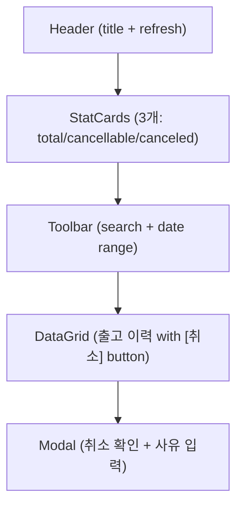
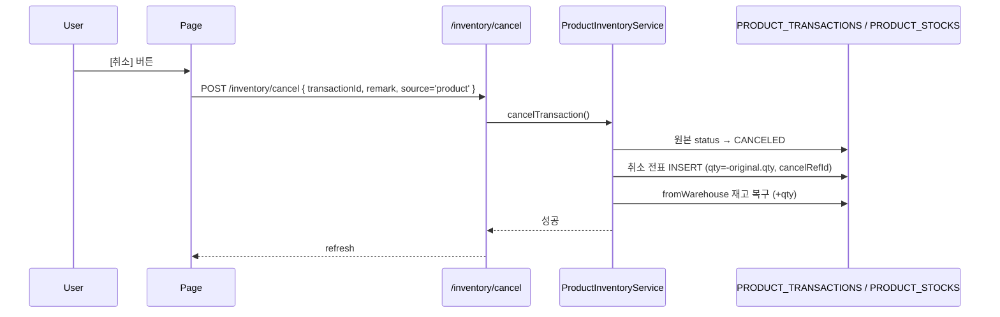
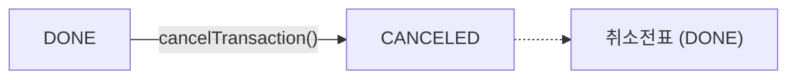

# 제품출고취소 — 비즈니스 로직 & 데이터 흐름 분석
> **분석 기준 커밋:** `8a7e96ea`
> **분석 일자:** `2026-07-04`

## 1. 화면 개요

| 항목 | 내용 |
|------|------|
| **메뉴 코드** | `PROD_ISSUE_CANCEL` |
| **메뉴명** | 제품출고취소 |
| **URL** | `/product/issue-cancel` |
| **소스 경로** | `apps/frontend/src/app/(authenticated)/product/issue-cancel/page.tsx` |
| **목적** | WIP_OUT/FG_OUT 출고 트랜잭션 역분개 취소 |
| **사용자** | 생산관리자, 재고관리자 |
| **워크플로우 노드** | 출고 이력 조회 → 취소 대상 선택 → 사유 입력 → 취소 실행 |

## 2. 화면 구성

### 2.1 레이아웃



### 2.2 컴포넌트

| 구분 | 컴포넌트 | 소스 위치 |
|------|---------|----------|
| 레이아웃 | `Card`, `CardContent`, `Modal` | `@/components/ui` |
| 통계 | `StatCard` | `@/components/ui` |
| Input | `Input` | `@/components/ui` |
| Button | `Button` | `@/components/ui` |
| 배지 | `ComCodeBadge` | `@/components/ui` |
| 배지 | `StatusBadge`, `StatusHeaderHelp` | `@/components/shared` |
| 기간 필터 | `DateRangeFilter` | `@/components/shared/DateRangeFilter` |
| 그리드 | `DataGrid` | `@/components/data-grid/DataGrid` |
| 컬럼 정의 | `createProductIssueCancelGridColumns` | `./productIssueCancelColumns.tsx` |

### 2.3 컬럼

| 컬럼명 | 표시 | 유형 |
|--------|------|------|
| [취소] | 액션 버튼 (취소 가능 시만) | `Button` (XCircle) |
| 거래일 | transDate | 날짜 |
| 전표번호 | transNo | 모노텍스트 |
| 유형 | transType | `StatusBadge` (TRANSACTION_TYPE) |
| 품목코드 | part.itemCode | 모노텍스트 |
| 품목명 | part.itemName | 텍스트 |
| 출고창고 | fromWarehouse.warehouseName | 텍스트 |
| 도착창고 | toWarehouse.warehouseName | 텍스트 |
| 품질 | qualityStatus | 배지 (양품/불량) |
| 출고계정 | issueType | `ComCodeBadge` (ISSUE_TYPE) |
| 수량 | qty | 숫자 (+/-) |
| 상태 | status | 배지 (DONE/CANCELED) |

## 3. 상태 관리

```typescript
data: ProductIssueTx[]
loading, saving: boolean
searchText: string
fromDate, toDate: string
isModalOpen: boolean
selectedTx: ProductIssueTx | null
reason: string
```

## 4. API 호출 흐름

### 4.1 API 목록

| Method | Endpoint | 용도 | 호출 시점 |
|--------|----------|------|----------|
| `GET` | `/inventory/product/transactions` | 출고 이력 조회 (WIP_OUT,FG_OUT,...) | 최초 로드 / Refresh |
| `POST` | `/inventory/cancel` | 출고 취소 실행 | Modal 확인 |

### 4.2 API 추적

| API | Controller | Service |
|-----|-----------|---------|
| `GET /inventory/product/transactions` | `InventoryController.getProductTransactions()` | `ProductInventoryService.getTransactions()` |
| `POST /inventory/cancel` (source='product') | `InventoryController.cancelTransaction()` | `ProductInventoryService.cancelTransaction()` |

### 4.3 취소 시퀀스 (PROD_RECEIPT_CANCEL과 동일 구조)



## 5. 백엔드 처리

`ProductInventoryService.cancelTransaction()` (product-inventory.service.ts:710-845)

취소 처리 흐름은 PROD_RECEIPT_CANCEL과 동일한 `cancelTransaction()` 메서드 사용:
- `getCancelTransType()`: WIP_OUT→WIP_OUT_CANCEL, FG_OUT→FG_OUT_CANCEL
- 원본의 `fromWarehouseId`로 재고 복구
- 출고 취소 시 `fromWarehouse`에 재고 ADD

## 6. 처리 규칙 및 검증

1. **취소 가능 대상**: WIP_OUT, FG_OUT 중 `status='DONE'`, `cancelRefId=null`
2. **취소 불가**: `status='CANCELED'` || `cancelRefId` 존재 || `transType.includes('CANCEL')`
3. `source='product'` 전달로 ProductInventoryService 라우팅

## 7. 상태 전이



## 8. DB 테이블 영향 및 엔티티

| 테이블 | 엔티티 | 용도 | 읽기/쓰기 |
|--------|--------|------|----------|
| `PRODUCT_TRANSACTIONS` | `ProductTransaction` | 제품 수불 이력 | RW |
| `PRODUCT_STOCKS` | `ProductStock` | 제품 현재고 | RW |
| `WAREHOUSES` | `Warehouse` | 창고 정보 | R |
| `ITEM_MASTER` | `ItemMaster` | 품목 정보 | R |

## 9. 공통코드

| 코드 그룹 | 설명 |
|----------|------|
| `TRANSACTION_TYPE` | WIP_OUT, FG_OUT, WIP_OUT_CANCEL, FG_OUT_CANCEL |
| `ISSUE_TYPE` | 출고계정 |
| `PROD_RESULT_STATUS` | DONE, CANCELED |

## 10. 에러 코드

| 조건 | 예외 | HTTP |
|------|------|------|
| 원본 없음 | `NotFoundException` | 404 |
| 이미 취소됨 | `BadRequestException` | 400 |
| 재고 부족 | `BadRequestException` | 400 |

## 11. 비고

- PROD_RECEIPT_CANCEL과 동일한 백엔드 로직 (`cancelTransaction`) 사용
- 출고 취소는 출고 창고(`fromWarehouseId`) 재고 복구가 핵심 (입고 취소는 `toWarehouseId` 재고 차감)
- `ComCodeBadge(groupCode="ISSUE_TYPE")`로 출고계정 표시
