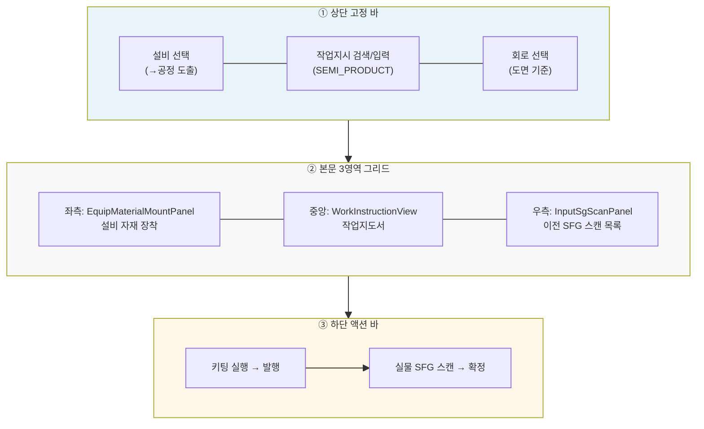
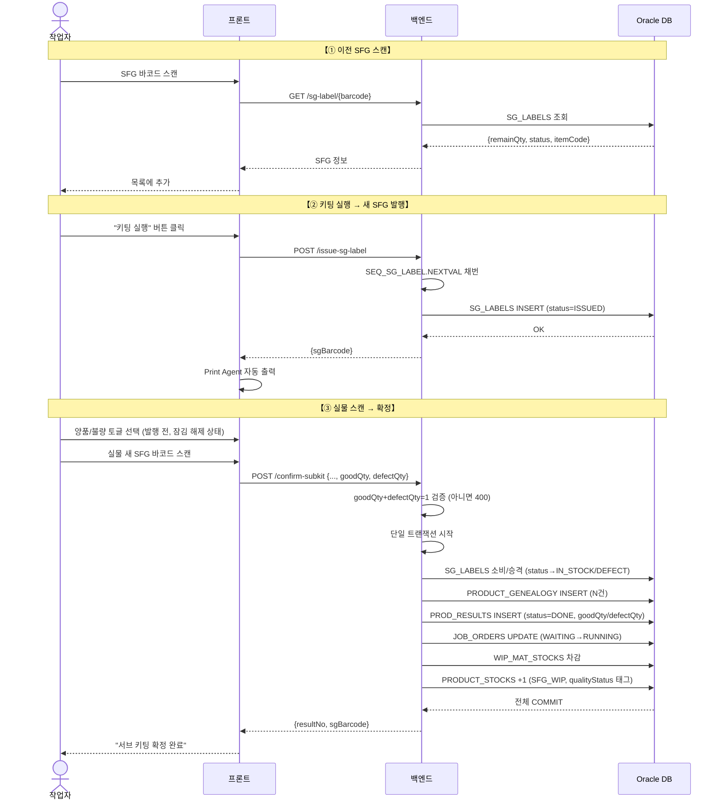
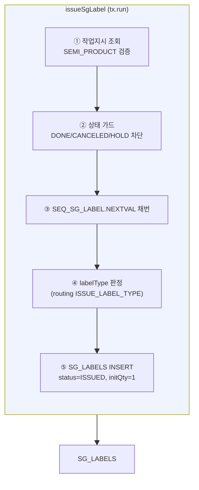
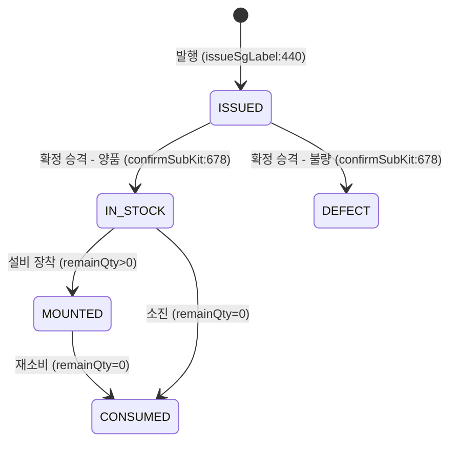
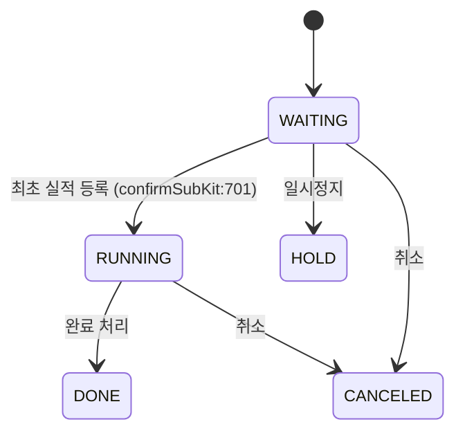

---
sources:
  - apps/frontend/src/app/(authenticated)/production/input-assembly/components/EquipMaterialMountPanel.tsx
  - apps/frontend/src/app/(authenticated)/production/subprocess-kitting/components/InputSgScanPanel.tsx
  - apps/frontend/src/components/production/JobOrderSelectModal.tsx
  - apps/backend/src/modules/production/services/subprocess-kitting.service.ts
verifiedCommit: 4f7ca9fa
---

# 실적입력(서브공정) — 비즈니스 로직 & 데이터 흐름 분석

> **Menu Code:** `PROD_KITTING`
> **Path:** `/production/subprocess-kitting`
> **Label:** `menu.production.kitting`
> **분석 기준 커밋:** `4f7ca9fa`
> **분석 일자:** `2026-07-05`

---

## 1. 화면의 목적

서브공정 키팅은 이전 공정에서 부착된 반제품(SFG) 라벨을 스캔해, BOM 기준으로 회로별 새 SFG(반제품 서브)를 발행·출력하고 genealogy(계보)를 잇는 화면이다. `workflowMap.ts:436` 노드 `subprocess-kitting` (`order: 5`).

- input-assembly(`/production/input-assembly`)의 **거울상**: 완제품 FG 대신 반제품 SFG를 만든다는 점만 다름
- 단순 실적입력이 아니라 **SG 계보**를 잇는 핵심 흐름 — 이전 SFG 소비 + 새 SFG 발행 + genealogy 연결
- 2단계 확정: (1) "키팅 실행" → `ISSUED` 저장 + 프린터 출력, (2) 실물 새 SFG 스캔 → 단일 트랜잭션 확정
- **양품/불량 선택**: 하단 액션 바에 양품/불량 토글(`resultQuality`)이 있어 확정 실적을 `goodQty=1/defectQty=0`(양품) 또는 `goodQty=0/defectQty=1`(불량) 중 하나로만 등록. 토글은 발행(`issuedSg` 설정) 후에는 잠김 — 실행 전에 선택해야 함
- **작업지시 종류**: 품목지시(`orderKind=ITEM`, 공정 무관)와 공정지시(`orderKind=OPERATION`, 현재 공정 일치)를 모두 선택 가능

## 2. 화면 구조



| 영역 | 컴포넌트 | 역할 |
| --- | --- | --- |
| ① 상단 | 설비선택 / JobOrder / 회로 | 공정 도출 + 지시선택 + 회로선택 |
| ② 좌측 | EquipMaterialMountPanel | 설비 자재 장착 (input-assembly 재사용) |
| ② 중앙 | WorkInstructionView | 작업지도서 (input-kiosk 재사용) |
| ② 우측 | InputSgScanPanel | 이전 SFG 스캔 + BOM 오투입 검증 |
| ③ 하단 | SubKitActionBar | 키팅 실행 → 발행 → 실물 스캔 확정 |

- 화면 전용 store 없음 (로컬 `useState`만 사용). 설비선택만 localStorage 편의 저장 (`SUBKIT_SELECTED_EQUIP_KEY`)

## 3. 상태 관리

| 상태 | 용도 | 초기값 |
| --- | --- | --- |
| `selectedOrder` | 선택된 작업지시 (`itemType=SEMI_PRODUCT`) | `null` |
| `processCode`, `equipCode` | 선택 설비 → 공정 도출 | `""` |
| `circuits[]`, `circuitNo` | 품목 도면 회로 목록 / 선택 | `[]`, `""` |
| `sgList[]` | 스캔된 이전 SFG 목록 | `[]` |
| `issuedSg` | 발행된 새 SFG 바코드 (확정 전까지) | `null` |
| `issuing`, `confirming` | API 호출 중 플래그 | `false` |
| `resultQuality` | 확정 실적 양품/불량 토글 (`GOOD`\|`DEFECT`) | `"GOOD"` |

## 4. API 호출 흐름

### 4-1. 진입 / 복원

| 시점 | API | 용도 |
| --- | --- | --- |
| 진입 | `GET /equipment/equips?limit=500` | 설비 목록 |
| 설비 선택 | `GET /equipment/equips/{code}` | 설비 현재 작업지시 복원 (`currentJobOrderId`) |
|           | `GET /production/job-orders/order-no/{id}` | 작업지시 full data 복원 |
| 설비 변경 시 | `PATCH /equipment/equips/{code}/job-order` | 설비에 작업지시 할당/해제 |

### 4-2. 작업지시 선택

| 시점 | API | 용도 |
| --- | --- | --- |
| 번호 입력 Enter | `GET /production/job-orders?search={no}&statuses=WAITING,RUNNING&assignableEquipCode={}&itemType=SEMI_PRODUCT` | 작업지시 검색 (서버는 `orderKind`/`processCode` 필터 없이 조회, 클라이언트에서 `isSubkitSelectableOrder`로 ITEM은 전부·OPERATION은 현재 공정 일치만 필터) |
| 모달 검색 | `JobOrderSelectModal` 공용 모달 (동일 API, `includeItemOrdersForProcess` prop) | ITEM(품목지시)/OPERATION(공정지시) 배지로 구분 표시, OPERATION만 공정 일치 강제 |
| `selectedOrder` 변경 | `GET /production/subprocess-kitting/assembly-requirements/{orderNo}` | BOM 반제품 컴포넌트 목록 |
|                    | `GET /production/subprocess-kitting/circuits-by-order/{orderNo}` | 품목 도면 회로 목록 |

### 4-3. SFG 스캔 → 발행 → 확정



## 5. 백엔드 처리 — `subprocess-kitting.service.ts`

### 5-1. `issueSgLabel()` (line 401) — SFG 발행



1. **작업지시 조회 + 반제품(`SEMI_PRODUCT`) 검증** — `jobOrder.part.itemType` 확인
2. **상태 가드** — `DONE/CANCELED/HOLD` 거부
3. **SG 바코드 채번** — `numbering.nextSgLabel(qr)` → Oracle `SEQ_SG_LABEL`
4. **라벨 종류 판정** — 라우팅 `ISSUE_LABEL_TYPE`가 `BUNDLE`이면 `BUNDLE`, 기본 `SG`
5. **`SG_LABELS` INSERT** — `status='ISSUED'`, `initQty=1`, `remainQty=1`, `resultNo=null`

> **입력SFG·자재·실적·재고 미반영** — 확정(confirm) 단계에서 모두 처리.

### 5-2. `confirmSubKit()` (line 472) — 키팅 확정 (단일 트랜잭션)

- **진입 검증**: `goodQty`/`defectQty`는 각각 0 이상 정수여야 하며 `goodQty+defectQty`는 반드시 `1`이어야 함(둘 다 미지정 시 기본 `goodQty=1, defectQty=0`). 위반 시 400 — "서브 키팅 확정 실적은 양품 1 또는 불량 1로만 등록할 수 있습니다."
- 이 결과로 정해진 `qualityStatus`(`GOOD`/`DEFECT`)가 새 SFG 상태 승격과 `PRODUCT_STOCKS` 적재에 그대로 반영됨(불량이어도 WIP 재고 수량 자체는 여전히 +1, 상태만 격리).

```mermaid
%%{init: {'themeVariables': {'fontSize': '11px'}}}%%
flowchart TD
    subgraph Tx["confirmSubKit (tx.run)"]
        T1["① 새 SgLabel 조회<br/>status=ISSUED 확인"] --> T2["② 중복 확정 방지<br/>genealogy 이력 확인"]
        T2 --> T3["③ 작업지시 + BOM 조회<br/>자식유형 분류 (SEMI/RAW)"]
        T3 --> T4["④ 입력 SFG 검증<br/>- status IN_STOCK/MOUNTED<br/>- remainQty > 0<br/>- BOM 반제품 일치 (오투입 차단)"]
        T4 --> T5["⑤ 입력 SFG 1씩 소비<br/>remainQty-1, status→CONSUMED/MOUNTED"]
        T5 --> T6["⑥ PRODUCT_GENEALOGY INSERT<br/>SG→입력SFG (회로 기록)"]
        T6 --> T7["⑦ WIP 자재 BOM 차감<br/>wipMatStockService.deductStockInTx"]
        T7 --> T8["⑧ PRODUCT_GENEALOGY INSERT<br/>SG→MAT_LOT"]
        T8 --> T9["⑨ 새 SFG 승격<br/>ISSUED→IN_STOCK(양품)/DEFECT(불량), resultNo 채움"]
        T9 --> T10["⑩ PROD_RESULTS INSERT<br/>status=DONE, goodQty/defectQty=1"]
        T10 --> T11["⑪ JOB_ORDERS WAITING→RUNNING<br/>(최초 실적 시)"]
        T11 --> T12["⑫ PRODUCT_STOCKS +1 적재<br/>warehouseId=SFG_WIP, qualityStatus 태그"]
    end
    Tx --> DB1["SG_LABELS"]
    Tx --> DB2["PRODUCT_GENEALOGY"]
    Tx --> DB3["PROD_RESULTS"]
    Tx --> DB4["JOB_ORDERS"]
    Tx --> DB5["WIP_MAT_STOCKS"]
    Tx --> DB6["PRODUCT_STOCKS"]

    style Tx fill:#f0f4ff
```



## 6. DB 테이블 영향 요약

### issue-sg-label (발행)

| 테이블 | 변경 | 주요 칼럼 |
| --- | --- | --- |
| `SG_LABELS` | INSERT | `sgBarcode=SEQ_SG_LABEL`, `status=ISSUED`, `initQty=1`, `remainQty=1`, `labelType=SG\|BUNDLE` |

### confirm-subkit (확정 — 단일 트랜잭션)

| 테이블 | 변경 | 주요 칼럼 |
| --- | --- | --- |
| `SG_LABELS` | UPDATE (소비) | `remainQty-=1`, `status=CONSUMED\|MOUNTED` |
| `SG_LABELS` | UPDATE (승격) | `status=ISSUED→IN_STOCK`(양품)\|`ISSUED→DEFECT`(불량), `resultNo=채번` |
| `PRODUCT_GENEALOGY` | INSERT (N건) | `parentType=SG`, `childType=SG\|MAT_LOT`, `circuitNo` |
| `PROD_RESULTS` | INSERT | `resultNo=SEQ_PROD_RESULT`, `status=DONE`, `goodQty=1,defectQty=0`(양품) 또는 `goodQty=0,defectQty=1`(불량) |
| `JOB_ORDERS` | UPDATE | `status=WAITING→RUNNING` (최초 실적 시) |
| `WIP_MAT_STOCKS` | 차감 | `deductStockInTx` → `WIP_MAT_TRANSACTIONS` INSERT |
| `PRODUCT_STOCKS` | INSERT/UPSERT | `warehouseId=SFG_WIP`, `qty+=1` (양품/불량 무관하게 +1, `qualityStatus`로 태그만 구분) |

### 채번 — 모두 `SEQUENCE.NEXTVAL` 사용 확인 (위반 없음)

| 대상 | Oracle Object |
| --- | --- |
| SG 바코드 | `SEQ_SG_LABEL.NEXTVAL` |
| 실적번호 | `SEQ_PROD_RESULT` |
| Genealogy ID | `SEQ_GENEALOGY` (batch) |

## 7. 상태 전이

### `SG_LABELS.status`



### `JOB_ORDERS.status`



### 인터락 게이트 (page.tsx:373)

```
canIssue = selectedOrder ≠ null ∧ processCode ≠ null ∧ equipCode ≠ null
           ∧ sgList.length > 0 ∧ issuedSq = null
```

- 발행 후 → 발행 버튼 비활성화 (`issuedSg` 설정), 이때 양품/불량 토글도 함께 잠김
- 회로 목록이 있는 품목 → `circuitNo` 필수 (`onIssue:376`, `onConfirmScan:433`)

## 8. 비고

- **공통코드 우회**: 없음. 회로는 `HarnessCircuitSpec` 기준정보, 설비·작업지시 모두 선택 방식
- **tenant scope**: 모든 쿼리에 `company, plant` 적용 확인
- **채번 방식**: 모두 `SEQUENCE.NEXTVAL` — AGENTS.md §5 준수
- **`alert()/confirm()/prompt()`**: 사용 없음
- **input-assembly 거울상**: `confirmSubKit()`은 `confirmAssembly()`의 FG→SG 대칭 구조
- **오투입 차단**: BOM `childItemCode` 기준 이중 검증 — 프론트(`InputSgScanPanel:100`) + 서버(`confirmSubKit:606`)
- **회로 추적**: 발행 단계에서는 기록 안 함, **확정 단계에서 genealogy에만** `circuitNo` 저장
- **설비 미선택 시 자재 차감 스킵**: `equipCode` 있을 때만 자재 차감 수행 (`confirmSubKit:639`)
- **양품/불량 판정**: `goodQty+defectQty≠1`이면 확정 API가 400 거부. 불량으로 확정해도 재고 수량(`PRODUCT_STOCKS`)은 동일하게 +1 적재되고 `qualityStatus`/새 SFG `status=DEFECT`로만 격리됨(수량 자체가 빠지지 않음)
- **작업지시 종류 확장**: 이전에는 `orderKind=OPERATION`(공정지시)만 서버 필터로 조회했으나, 현재는 서버 필터 없이 조회 후 클라이언트 `isSubkitSelectableOrder`로 ITEM(품목지시, 공정 무관)까지 선택 허용. `JobOrderSelectModal`도 `includeItemOrdersForProcess` prop으로 동일하게 동작하며 지시 종류를 배지로 표시
