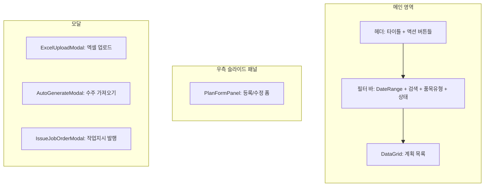
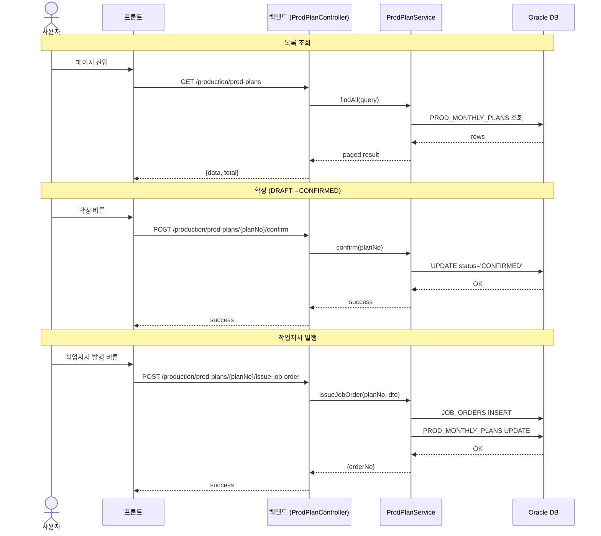
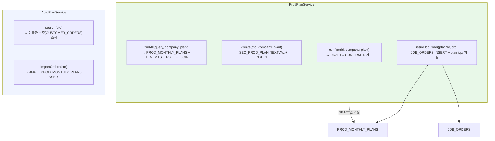
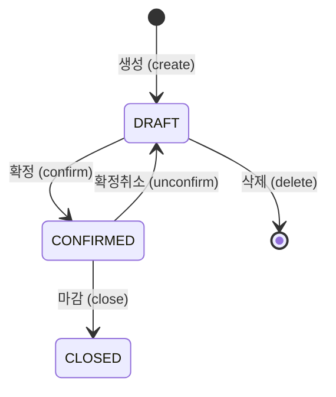

# 월간생산계획 — 비즈니스 로직 & 데이터 흐름 분석

> **Menu Code:** `PROD_MONTHLY_PLAN`
> **Path:** `/production/monthly-plan`
> **Label:** `menu.production.monthlyPlan`
> **분석 기준 커밋:** `8a7e96ea`
> **분석 일자:** `2026-07-04`

## 1. 화면 개요

월간생산계획을 등록/조회/수정/삭제하고, 엑셀 업로드 일괄 등록, 수주 기반 자동 생성, 작업지시 발행까지 처리한다. 상태 워크플로우: `DRAFT → CONFIRMED → CLOSED`

## 2. 화면 구성

| 영역 | 컴포넌트 | 역할 |
| --- | --- | --- |
| 헤더 | 버튼들 | 새로고침 / 템플릿 다운로드 / 엑셀업로드 / ERP인터페이스(미구현) / 자동생성 / 추가 |
| 필터 | DateRangeFilter + Input + ComCodeSelect + Select | 월범위 + 검색어 + 품목유형(FG/WIP) + 상태 |
| 그리드 | DataGrid + usePlanColumns | 계획 목록, 행액션(수정/삭제), 확정/확정취소/작업지시발행 |
| 패널 | PlanFormPanel | 계획 등록/수정 폼 |
| 모달 | ExcelUploadModal | 엑셀 파싱 → 일괄 등록 |
| 모달 | AutoGenerateModal | 수주 조회 → 계획 생성 |
| 모달 | IssueJobOrderModal | 계획 → 작업지시 발행 |

## 3. 상태 관리

| 상태 | 용도 | 초기값 |
| --- | --- | --- |
| `data[]` | 계획 목록 | `[]` |
| `loading` | 로딩 플래그 | `false` |
| `searchText` | 검색어 | `""` |
| `statusFilter` | 상태 필터 | `""` |
| `itemTypeFilter` | 품목유형 필터 | `""` |
| `fromDate/toDate` | 조회 기간 | 당해 1/1 ~ 12/31 |
| `isPanelOpen` | 우측 패널 열림 | `false` |
| `editingPlan` | 수정 대상 | `null` |
| `deleteTarget` | 삭제 대상 | `null` |
| `showExcel` | 엑셀 업로드 모달 | `false` |
| `showAutoGen` | 자동 생성 모달 | `false` |
| `issueTarget` | 작업지시 발행 대상 | `null` |

## 4. API 호출 흐름

| 시점 | API | 용도 |
| --- | --- | --- |
| 진입/조회 | `GET /production/prod-plans` | 계획 목록 (fromDate/toDate/search/status/itemType) |
| 등록 | `POST /production/prod-plans` | 개별 등록 (PlanFormPanel) |
| 수정 | `PUT /production/prod-plans/{planNo}` | 계획 수정 (DRAFT만 가능) |
| 삭제 | `DELETE /production/prod-plans/{planNo}` | 계획 삭제 (DRAFT만 가능) |
| 확정 | `POST /production/prod-plans/{planNo}/confirm` | DRAFT → CONFIRMED |
| 확정취소 | `POST /production/prod-plans/{planNo}/unconfirm` | CONFIRMED → DRAFT |
| 엑셀업로드 | `POST /production/prod-plans/bulk` | 일괄 등록 |
| 자동생성-조회 | `POST /production/prod-plans/auto-generate/preview` | 수주 조회 |
| 자동생성-실행 | `POST /production/prod-plans/auto-generate` | 수주 → 계획 생성 |
| 작업지시발행 | `POST /production/prod-plans/{planNo}/issue-job-order` | 계획 → 작업지시 발행 |

## 5. 백엔드 처리

**Controller:** `ProdPlanController` (`apps/backend/src/modules/production/controllers/prod-plan.controller.ts`)
**Service:** `ProdPlanService` + `AutoPlanService`

## 6. 처리 규칙 및 검증

- **상태 가드**: `DRAFT`만 수정/삭제 가능. `CONFIRMED`만 작업지시 발행 가능
- **엑셀 업로드**: 프론트에서 xlsx 파싱 후 JSON 배열을 bulk API로 전송
- **채번**: `SEQ_PROD_PLAN.NEXTVAL` (Oracle Sequence)
- **ERP 인터페이스**: 버튼은 노출되나 "준비중" 안내 모달만 표시 (미구현)

## 7. 상태 전이

## 8. 상태 코드 및 공통코드

| 그룹코드 | 용도 |
| --- | --- |
| `PROD_PLAN_STATUS` | 계획 상태 (DRAFT/CONFIRMED/CLOSED) |
| `ITEM_TYPE` | 품목유형 (FG/WIP) |

## 9. DB 테이블 영향 및 엔티티

| 테이블 | 작업 | 설명 |
| --- | --- | --- |
| `PROD_MONTHLY_PLANS` | CRUD | 월간생산계획 마스터 |
| `JOB_ORDERS` | INSERT (issueJobOrder) | 작업지시 발행 시 생성 |
| `CUSTOMER_ORDERS` | SELECT (auto-generate) | 수주 조회 (AutoPlanService) |
| `ITEM_MASTERS` | LEFT JOIN | 품목 정보 조회 |

## 10. 에러 코드

| 상황 | 처리 |
| --- | --- |
| DRAFT 아닌 상태 수정/삭제 | API 400 + interceptor 모달 |
| 중복 계획번호 | API 409 |
| 작업지시 발행 시 계획 수량 부족 | API 400 |

## 11. 비고

- `alert()/confirm()/prompt()` 사용 없음 (ConfirmModal 사용)
- 엑셀 템플릿 다운로드는 프론트 xlsx 라이브러리로 생성 (서버 미경유)
- ERP 인터페이스 버튼은 UI만 존재, 실제 연동 미구현
- tenant scope: 모든 쿼리에 `company, plant` 적용
