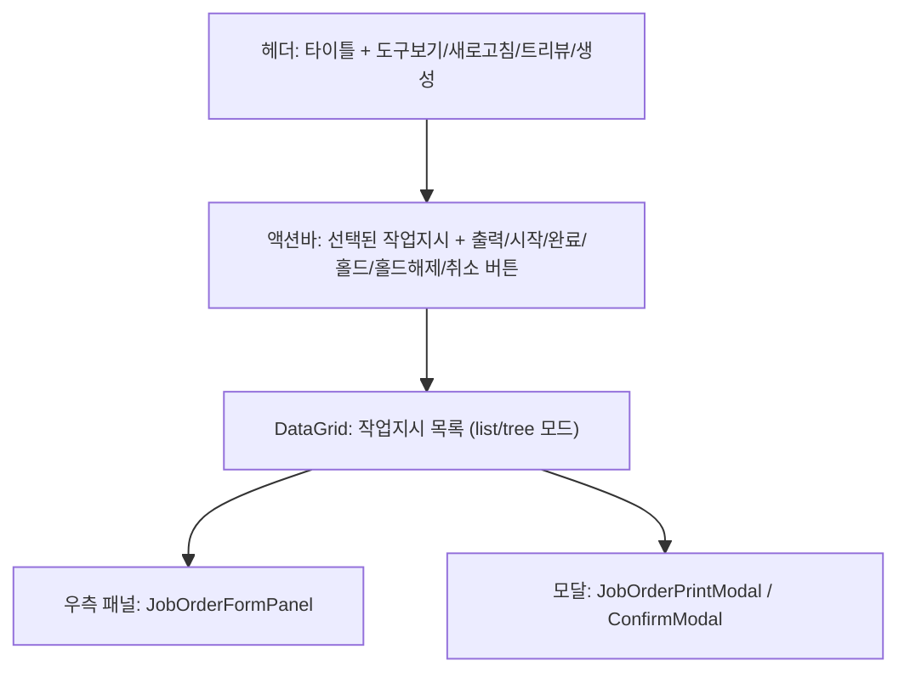
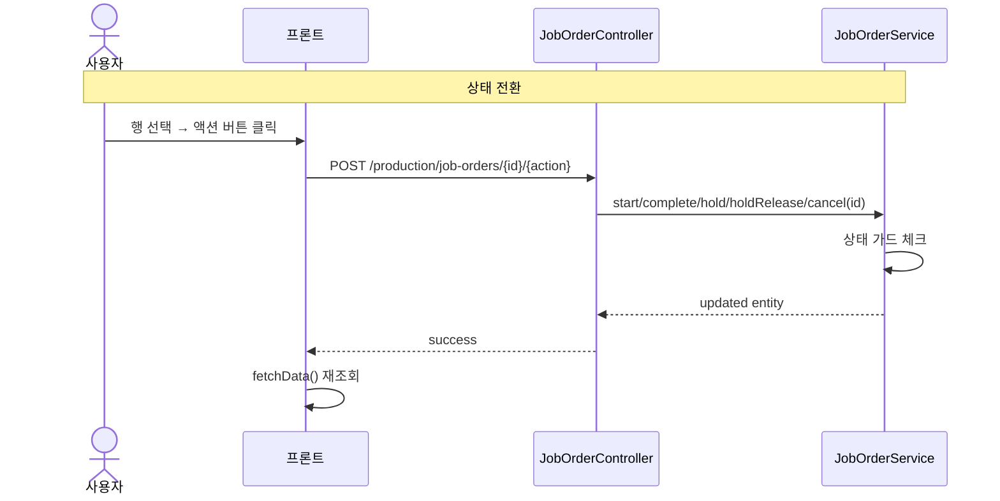
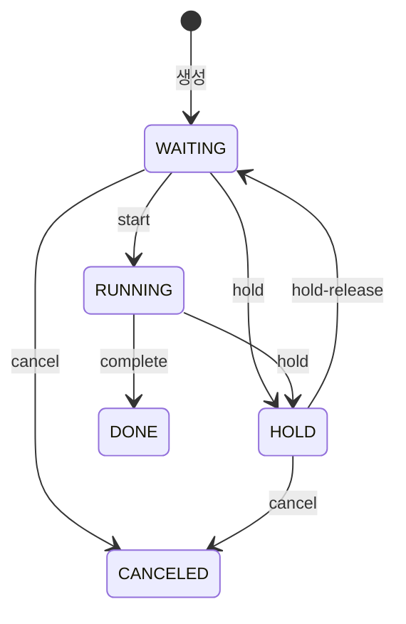

---
sources:
  - apps/backend/src/modules/production/controllers/job-order.controller.ts
verifiedCommit: 8a7e96ea
---

# 작업지시 관리 — 비즈니스 로직 & 데이터 흐름 분석

> **Menu Code:** `PROD_ORDER`
> **Path:** `/production/order`
> **Label:** `menu.production.order`
> **분석 기준 커밋:** `8a7e96ea`
> **분석 일자:** `2026-07-04`

## 1. 화면 개요

완제품/반제품 생산 명령(작업지시)을 관리한다. CRUD + 상태 전환(start/complete/hold/hold-release/cancel) + 트리뷰 + 작업지시서 출력을 제공한다.

## 2. 화면 구성

| 영역 | 컴포넌트 | 역할 |
| --- | --- | --- |
| 헤더 | 버튼들 | 도구보기(AI) / 새로고침 / 트리뷰토글 / 생성 |
| 액션바 | ComCodeBadge + 버튼들 | 선택 행의 작업지시 상태 배지 + 출력/시작/완료/홀드 등 |
| DataGrid | DataGrid + productionOrderColumns | 작업지시 목록 (일반/트리 뷰) |
| 패널 | JobOrderFormPanel | 등록/수정 슬라이드 패널 |
| 모달 | JobOrderPrintModal | 작업지시서 출력 (A4) |

## 3. 상태 관리

| 상태 | 용도 | 초기값 |
| --- | --- | --- |
| `data[]` | 작업지시 목록 | `[]` |
| `viewMode` | list/tree 모드 | `list` |
| `selectedRow` | 선택된 행 | `null` |
| `isPanelOpen` | 우측 패널 | `false` |
| `editingOrder` | 수정 대상 | `null` |
| `deleteTarget` | 삭제 대상 | `null` |
| `pendingAction` | 상태 전환 확인 | `null` |
| `printOrderNo` | 출력 대상 | `null` |

## 4. API 호출 흐름

| 시점 | API | 용도 |
| --- | --- | --- |
| 진입/조회 | `GET /production/job-orders` | 목록 조회 (search/status/planDateFrom/planDateTo) |
| 트리 조회 | `GET /production/job-orders/tree` | 완제품 기준 계층 구조 |
| 생성 | `POST /production/job-orders` | 작업지시 생성 |
| 수정 | `PUT /production/job-orders/{id}` | 작업지시 수정 |
| 삭제 | `DELETE /production/job-orders/{id}` | 작업지시 삭제 |
| 시작 | `POST /production/job-orders/{id}/start` | WAITING→RUNNING |
| 완료 | `POST /production/job-orders/{id}/complete` | RUNNING→DONE |
| 홀드 | `POST /production/job-orders/{id}/hold` | WAITING/RUNNING→HOLD |
| 홀드해제 | `POST /production/job-orders/{id}/hold-release` | HOLD→이전상태 |
| 취소 | `POST /production/job-orders/{id}/cancel` | WAITING/HOLD→CANCELED |

## 5. 백엔드 처리

**Controller:** `JobOrderController` (`apps/backend/src/modules/production/controllers/job-order.controller.ts`)
**Service:** `JobOrderService`

| 엔드포인트 | 서비스 메서드 | 상태 전이 |
| --- | --- | --- |
| `POST /:id/start` | `start()` | WAITING/PAUSED → RUNNING |
| `POST /:id/complete` | `complete()` | RUNNING → DONE |
| `POST /:id/hold` | `hold()` | WAITING/RUNNING → HOLD |
| `POST /:id/hold-release` | `holdRelease()` | HOLD → 이전 상태 |
| `POST /:id/cancel` | `cancel()` | WAITING/HOLD → CANCELED |

## 6. 처리 규칙

- **HOLD 상태**: 실적등록/출하 전부 차단 (frontend + backend)
- **트리뷰**: 완제품 기준 parent-child 계층 구조
- **QR 스캔 진입**: URL `?orderNo=`로 작업지시 자동 선택
- **AI 기능**: `usePageAiTools`로 AI 초안 작성 지원 (applyJobOrderDraft)

## 7. 상태 전이

## 8. 공통코드

| 그룹코드 | 용도 |
| --- | --- |
| `JOB_ORDER_STATUS` | 작업지시 상태 (WAITING/RUNNING/HOLD/DONE/CANCELED) |

## 9. DB 테이블 영향

| 테이블 | 작업 | 설명 |
| --- | --- | --- |
| `JOB_ORDERS` | CRUD + UPDATE status | 작업지시 마스터 |

## 10. 비고

- `alert()/confirm()/prompt()` 사용 없음 (ConfirmModal 사용)
- `usePageAiTools`로 AI 작업지시 생성 지원
- 작업지시서 출력은 `JobOrderPrintModal` 컴포넌트에서 처리
- 목록/트리 뷰 전환 가능
