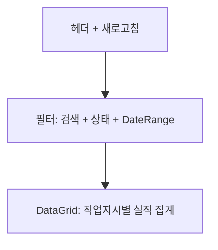

# 작업지시별 실적 집계 — 비즈니스 로직 & 데이터 흐름 분석

> **Menu Code:** `PROD_ORDER_RESULT`
> **Path:** `/production/order-result`
> **Label:** `menu.production.orderResult`
> **분석 기준 커밋:** `8a7e96ea`
> **분석 일자:** `2026-07-04`

## 1. 화면 개요

작업지시별 생산실적 집계 조회 화면. JOB_ORDERS 기준으로 PLAN_QTY와 PROD_RESULTS의 GOOD_QTY/DEFECT_QTY를 LEFT JOIN 집계하여 보여준다.

## 2. 화면 구성



## 3. API 호출

| 시점 | API | 용도 |
| --- | --- | --- |
| 진입/조회 | `GET /production/prod-results/summary/by-job-order` | 작업지시별 집계 (search/status/planDateFrom/planDateTo) |

**백엔드:** `ProdResultController.getSummaryByJobOrderList()` → `ProdResultService.getSummaryByJobOrderList()`

## 4. DB 쿼리

```sql
SELECT jo.ORDER_NO, jo.PLAN_DATE, jo.PLAN_QTY,
       NVL(SUM(pr.GOOD_QTY), 0) AS GOOD_QTY,
       NVL(SUM(pr.DEFECT_QTY), 0) AS DEFECT_QTY
FROM JOB_ORDERS jo
LEFT JOIN PROD_RESULTS pr
  ON pr.ORDER_NO = jo.ORDER_NO
 AND pr.COMPANY = jo.COMPANY
 AND pr.PLANT_CD = jo.PLANT_CD
 AND pr.STATUS <> 'CANCELED'
WHERE jo.COMPANY = '40' AND jo.PLANT_CD = '1000'
GROUP BY jo.ORDER_NO, jo.PLAN_DATE, jo.PLAN_QTY
ORDER BY jo.PLAN_DATE DESC
```

## 5. 비고

- 읽기 전용 화면 (CRUD 없음)
- 공통코드 `JOB_ORDER_STATUS`로 상태 필터링
- `alert()/confirm()/prompt()` 사용 없음
