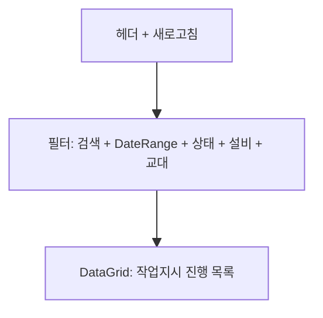

---
sources:
  - apps/backend/src/modules/production/controllers/production-views.controller.ts
  - apps/backend/src/modules/production/services/production-views.service.ts
verifiedCommit: 8a7e96ea
---

# 작업지시 진행현황 — 비즈니스 로직 & 데이터 흐름 분석

> **Menu Code:** `PROD_PROGRESS`
> **Path:** `/production/progress`
> **Label:** `menu.production.progress`
> **분석 기준 커밋:** `8a7e96ea`
> **분석 일자:** `2026-07-04`

## 1. 화면 개요

작업지시 진행현황 대시보드 - 계획수량 vs 실적수량, 진행률, 상태별 현황을 한눈에 파악한다.

## 2. 화면 구성

## 3. API 호출 흐름

| 시점 | API | 용도 |
| --- | --- | --- |
| 진입/조회 | `GET /production/job-orders` | 작업지시 목록 (search/status/equipCode/shift/planDateFrom/planDateTo) |
| 진입 시 | `GET /master/shift-patterns` | 교대 패턴 옵션 조회 |

## 4. 백엔드 처리

**Controller:** `ProductionViewsController.getProgress()` → `ProductionViewsService.getProgress()`

JOB_ORDERS + PROD_RESULTS 집계 (LEFT JOIN, status != 'CANCELED')하여 진행률 계산.

## 5. DB 테이블 영향

| 테이블 | 작업 | 설명 |
| --- | --- | --- |
| `JOB_ORDERS` | SELECT | 작업지시 정보 |
| `PROD_RESULTS` | LEFT JOIN | 실적 집계 |
| `SHIFT_PATTERNS` | SELECT | 교대 옵션 |

## 6. 비고

- 읽기 전용 화면
- 교대(shift) 옵션은 서버 `SHIFT_PATTERNS` 마스터에서 동적 조회
- `alert()/confirm()/prompt()` 사용 없음
