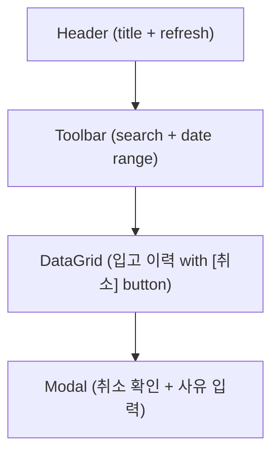
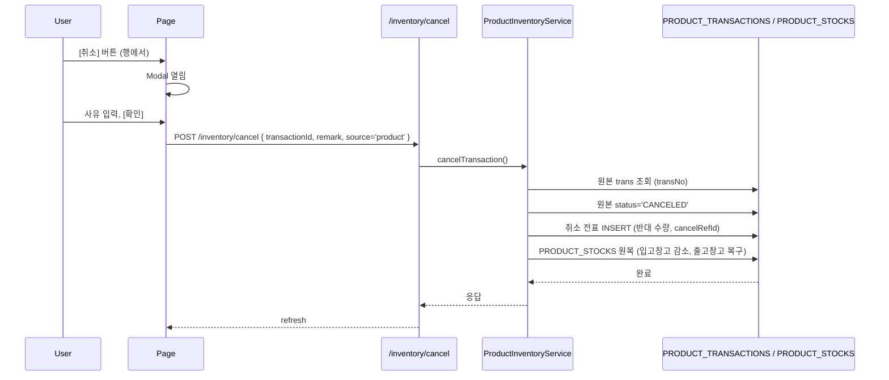
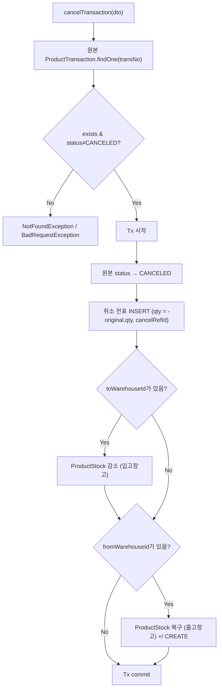
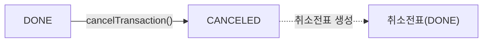

---
sources:
  - apps/frontend/src/app/(authenticated)/product/receipt-cancel/page.tsx
verifiedCommit: 8a7e96ea
---

# 제품입고취소 — 비즈니스 로직 & 데이터 흐름 분석
> **분석 기준 커밋:** `8a7e96ea`
> **분석 일자:** `2026-07-04`

## 1. 화면 개요

| 항목 | 내용 |
|------|------|
| **메뉴 코드** | `PROD_RECEIPT_CANCEL` |
| **메뉴명** | 제품입고취소 |
| **URL** | `/product/receipt-cancel` |
| **소스 경로** | `apps/frontend/src/app/(authenticated)/product/receipt-cancel/page.tsx` |
| **목적** | WIP_IN/FG_IN 제품 입고 트랜잭션 역분개 취소 |
| **사용자** | 생산관리자, 재고관리자 |
| **워크플로우 노드** | 입고 이력 조회 → 취소 대상 선택 → 사유 입력 → 취소 실행 |

## 2. 화면 구성

### 2.1 레이아웃



### 2.2 컴포넌트

| 구분 | 컴포넌트 | 소스 위치 |
|------|---------|----------|
| 레이아웃 | `Card`, `CardContent`, `Modal` | `@/components/ui` |
| Button | `Button` | `@/components/ui` |
| Input | `Input` | `@/components/ui` |
| 기간 필터 | `DateRangeFilter` | `@/components/shared/DateRangeFilter` |
| 배지 | `StatusBadge`, `StatusHeaderHelp` | `@/components/shared` |
| 그리드 | `DataGrid` | `@/components/data-grid/DataGrid` |
| 컬럼 정의 | `createProductReceiptCancelGridColumns` | `./productReceiptCancelColumns.tsx` |

### 2.3 컬럼

| 컬럼명 | 표시 | 유형 |
|--------|------|------|
| [취소] | 액션 버튼 (취소 가능 시만 표시) | `Button` |
| 거래일 | transDate | 날짜 |
| 전표번호 | transNo | 모노텍스트 |
| 유형 | transType | 배지 (취소=빨강) |
| 품목코드 | part.itemCode | 모노텍스트 |
| 품목명 | part.itemName | 텍스트 |
| 창고 | toWarehouse/fromWarehouse | 텍스트 |
| 수량 | qty (+/-) | 숫자 |
| 상태 | status | `StatusBadge` (PROD_RESULT_STATUS) |

## 3. 상태 관리

```typescript
data: ProductReceiptTx[]
loading, saving: boolean
searchText: string
fromDate, toDate: string
isModalOpen: boolean
selectedTx: ProductReceiptTx | null
reason: string
```

## 4. API 호출 흐름

### 4.1 API 목록

| Method | Endpoint | 용도 | 호출 시점 |
|--------|----------|------|----------|
| `GET` | `/inventory/product/transactions` | 입고 이력 조회 (WIP_IN,FG_IN,WIP_IN_CANCEL,FG_IN_CANCEL) | 최초 로드 / Refresh |
| `POST` | `/inventory/cancel` | 입고 취소 실행 | [취소확인] Modal |

### 4.2 API 추적

| API | Controller | Service |
|-----|-----------|---------|
| `GET /inventory/product/transactions` | `InventoryController.getProductTransactions()` | `ProductInventoryService.getTransactions()` |
| `POST /inventory/cancel` (source='product') | `InventoryController.cancelTransaction()` → product 분기 | `ProductInventoryService.cancelTransaction()` |

### 4.3 취소 시퀀스



## 5. 백엔드 처리

### 5.1 `ProductInventoryService.cancelTransaction()` (product-inventory.service.ts:710-845)



## 6. 처리 규칙 및 검증

1. **취소 가능 대상**: WIP_IN, FG_IN, WIP_IN_CANCEL, FG_IN_CANCEL — 단, 이미 취소된 행은 제외
2. **취소 불가 조건**: `status === 'CANCELED'` || `cancelRefId` || `transType.includes('CANCEL')`
3. **역분개**: 원본의 반대 방향으로 취소 트랜잭션 생성
4. **재고 원복**: 입고 취소 시 `toWarehouse` 재고 차감, 출고 취소 시 `fromWarehouse` 재고 복구
5. **source='product'** 전달로 ProductInventoryService 라우팅

## 7. 상태 전이



## 8. DB 테이블 영향 및 엔티티

| 테이블 | 엔티티 | 용도 | 읽기/쓰기 |
|--------|--------|------|----------|
| `PRODUCT_TRANSACTIONS` | `ProductTransaction` | 제품 수불 이력 | RW (UPDATE status, INSERT 취소전표) |
| `PRODUCT_STOCKS` | `ProductStock` | 제품 현재고 | RW (qty 증감) |
| `WAREHOUSES` | `Warehouse` | 창고 정보 | R |
| `ITEM_MASTER` | `ItemMaster` | 품목 정보 | R |

## 9. 공통코드

| 코드 그룹 | 설명 |
|----------|------|
| `TRANSACTION_TYPE` | WIP_IN, FG_IN, WIP_IN_CANCEL, FG_IN_CANCEL |
| `PROD_RESULT_STATUS` | DONE, CANCELED |

## 10. 에러 코드

| 조건 | 예외 | HTTP |
|------|------|------|
| 원본 없음 | `NotFoundException` | 404 |
| 이미 취소됨 | `BadRequestException` | 400 |
| 재고 부족 (취소 차감 불가) | `BadRequestException` | 400 |
| 테넌트 불일치 | `BadRequestException` | 400 |

## 11. 비고

- 취소는 동일한 PRODUCT_TRANSACTIONS 테이블에 역방향 전표 추가
- 원본 참조는 `cancelRefId` 컬럼 사용
- `mergeReceiptTransactions()`로 중복 전표 병합
