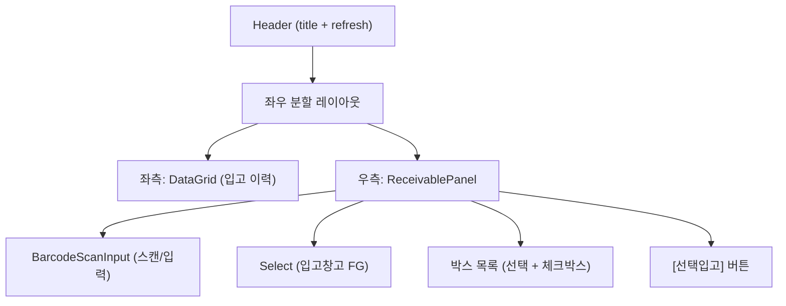
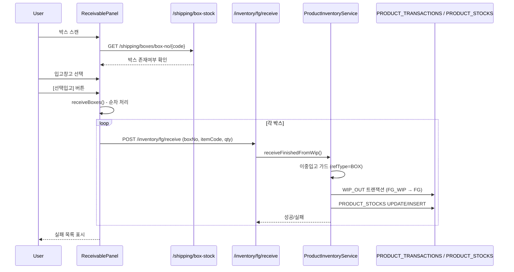
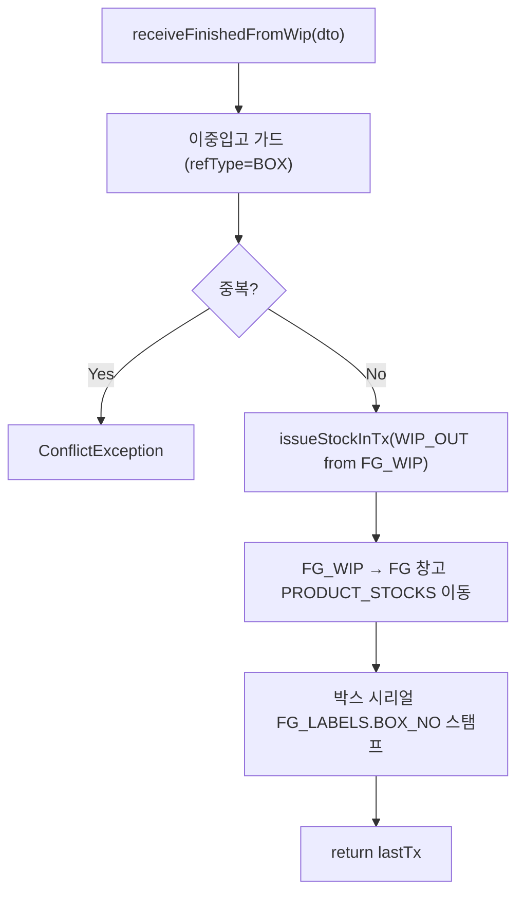
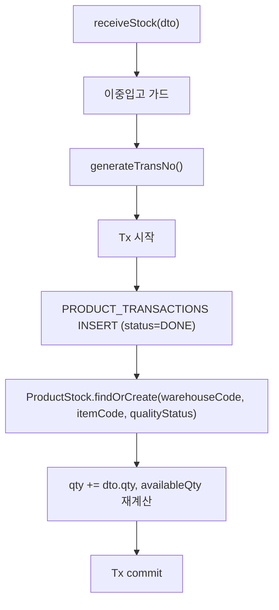
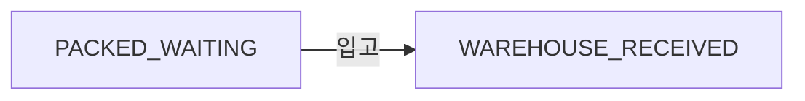

# 제품입고 — 비즈니스 로직 & 데이터 흐름 분석
> **분석 기준 커밋:** `8a7e96ea`
> **분석 일자:** `2026-07-04`

## 1. 화면 개요

| 항목 | 내용 |
|------|------|
| **메뉴 코드** | `PROD_RECEIVE` |
| **메뉴명** | 제품입고관리 |
| **URL** | `/product/receive` |
| **소스 경로** | `apps/frontend/src/app/(authenticated)/product/receive/page.tsx` |
| **목적** | 완제품(FG) 박스 스캔 및 일괄 입고 처리 |
| **사용자** | 생산관리자, 창고관리자 |
| **워크플로우 노드** | 입고 이력 조회 → 박스 스캔/선택 → 입고창고 지정 → 일괄 입고 |

## 2. 화면 구성

### 2.1 레이아웃



### 2.2 컴포넌트

| 구분 | 컴포넌트 | 소스 위치 |
|------|---------|----------|
| 좌측 그리드 | `DataGrid` | `@/components/data-grid/DataGrid` |
| 좌측 컬럼 | `createProductReceiveGridColumns` | `./productReceiveColumns.tsx` |
| 기간 필터 | `DateRangeFilter` | `@/components/shared/DateRangeFilter` |
| **우측 패널** | `ReceivablePanel` | `./components/ReceivablePanel.tsx` |
| **스캔 입력** | `BarcodeScanInput` | `@/components/shared` |
| **입고 유틸** | `receiveBoxes` | `./components/useBoxReceive.ts` |

### 2.3 좌측 입고 이력 컬럼

| 컬럼명 | 표시 | 유형 |
|--------|------|------|
| 입고일 | transDate (YYYY-MM-DD) | 날짜 |
| 전표번호 | transNo | 모노텍스트 |
| 유형 | transType | 배지 (취소=빨강) |
| 품목코드 | part.itemCode | 모노텍스트 |
| 품목명 | part.itemName | 텍스트 |
| 창고 | toWarehouse/fromWarehouse | 텍스트 |
| 수량 | qty (+/-) | 숫자 (양수=초록, 음수=빨강) |
| 작업지시 ID | orderNo | 모노텍스트 |
| 상태 | status | `StatusBadge` (PROD_RESULT_STATUS) |

## 3. 상태 관리

**좌측 페이지:**
```typescript
data: ProductTransaction[]
loading: boolean
searchText: string
fromDate, toDate: string
```

**우측 ReceivablePanel:**
```typescript
rows: BoxStockRow[]        // 입고 가능 박스 목록
loading: boolean
boxNo: string              // 스캔 입력값
warehouseId: string         // 입고창고
selected: Set<string>       // 선택된 박스번호 Set
saving: boolean
failed: {boxNo, reason}[]
```

## 4. API 호출 흐름

### 4.1 API 목록

| Method | Endpoint | 용도 | 호출 위치 |
|--------|----------|------|----------|
| `GET` | `/inventory/product/transactions` | 제품 입고 이력 조회 | `page.tsx:53` |
| `GET` | `/shipping/box-stock` | 입고 가능 박스 목록 조회 | `ReceivablePanel.tsx:56` |
| `GET` | `/shipping/boxes/box-no/:boxNo` | 박스번호 조회 (스캔 검증) | `ReceivablePanel.tsx:86` |
| `POST` | `/inventory/fg/receive` | 완제품(FG) 입고 | `useBoxReceive.ts:48` |
| `POST` | `/inventory/wip/receive` | 반제품(WIP) 입고 | `useBoxReceive.ts:48` |

### 4.2 API 추적

| API | Controller | Service |
|-----|-----------|---------|
| `GET /inventory/product/transactions` | `InventoryController.getProductTransactions()` | `ProductInventoryService.getTransactions()` |
| `GET /shipping/box-stock` | `BoxStockController.findStockByBox()` | `BoxService.findStockByBox()` |
| `GET /shipping/boxes/box-no/:boxNo` | `BoxController.findByBoxNo()` | `BoxService.findByBoxNo()` |
| `POST /inventory/fg/receive` | `InventoryController.receiveFg()` | `ProductInventoryService.receiveFinishedFromWip()` |
| `POST /inventory/wip/receive` | `InventoryController.receiveWip()` | `ProductInventoryService.receiveStock()` |

### 4.3 입고 시퀀스



## 5. 백엔드 처리

### 5.1 `receiveFinishedFromWip()` (product-inventory.service.ts:307-354)



### 5.2 `receiveStock()` (일반 WIP 입고, product-inventory.service.ts:126-212)



## 6. 처리 규칙 및 검증

1. **이중입고 방지**: 동일 `refType=BOX`, `refId=boxNo`의 DONE 트랜잭션이 존재하면 `ConflictException`
2. **순차 처리**: `receiveBoxes()`에서 한 박스씩 순차 처리 (트랜잭션번호 채번 방식으로 인한 PK 충돌 방지)
3. **FG 입고 시 FG 기본창고 조회**: `warehouseType='FG', isDefault='Y'`인 창고가 필요
4. **입고 대상**: 박스 상태 `inventoryState='PACKED_WAITING'` (포장완료·미입고)
5. **FG_LABELS 스탬프**: 입고 시 박스 내 시리얼에 BOX_NO 기록

## 7. 상태 전이



## 8. DB 테이블 영향 및 엔티티

| 테이블 | 엔티티 | 용도 | 읽기/쓰기 |
|--------|--------|------|----------|
| `PRODUCT_TRANSACTIONS` | `ProductTransaction` | 제품 수불 이력 | RW (INSERT) |
| `PRODUCT_STOCKS` | `ProductStock` | 제품 현재고 | RW (INSERT/UPDATE) |
| `WAREHOUSES` | `Warehouse` | 창고 정보 | R |
| `ITEM_MASTER` | `ItemMaster` | 품목 정보 | R |
| `FG_LABELS` | `FgLabel` | 완제품 라벨 (시리얼) | W (boxNo stamp) |
| `BOX_MASTER` | `BoxMaster` | 박스 마스터 | R |
| `BOX_STOCK` (virtual) | - | BOX_MASTER + FG_LABELS 집계 | R |

## 9. 공통코드

| 코드 | 사용처 | 설명 |
|------|--------|------|
| `TRANSACTION_TYPE` | transType 컬럼 | FG_IN, WIP_IN, FG_IN_CANCEL, WIP_IN_CANCEL |
| `PROD_RESULT_STATUS` | status 컬럼 | DONE, CANCELED |

## 10. 에러 코드

| 조건 | 예외 | HTTP |
|------|------|------|
| 이중입고 | `ConflictException` | 409 |
| FG 기본창고 없음 | `BadRequestException` | 400 |
| 재고 부족 (FG_WIP 품절) | `BadRequestException` | 400 |

## 11. 비고

- WIP(반제품) 입고는 `POST /inventory/wip/receive`로 직접 PRODUCT_STOCKS 적재
- FG(완제품) 입고는 WIP_OUT (FG_WIP→FG) 이동 방식
- **`BarcodeScanInput`** 컴포넌트 사용 (`maintainFocus`, `blinkIndicator` 옵션)
- `useWarehouseOptions("FG")`로 FG 창고 옵션 로드
