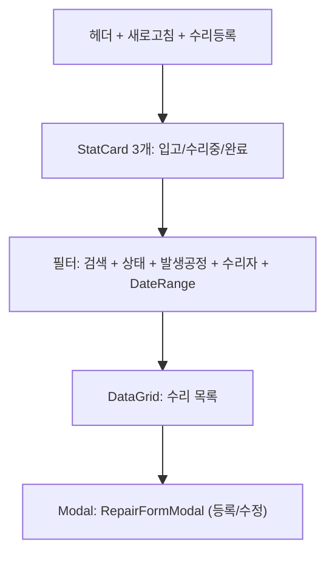
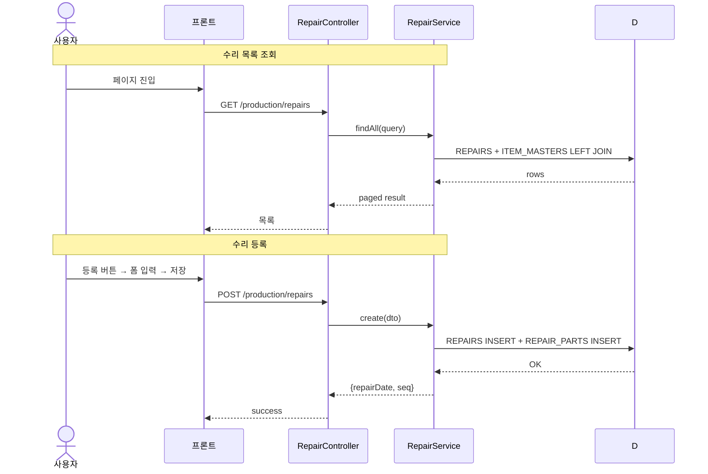

# 수리관리 — 비즈니스 로직 & 데이터 흐름 분석

> **Menu Code:** `PROD_REPAIR`
> **Path:** `/production/repair`
> **Label:** `menu.production.repair`
> **분석 기준 커밋:** `8a7e96ea`
> **분석 일자:** `2026-07-04`

## 1. 화면 개요

수리 등록/이력조회/수리실 재고를 관리하는 화면. 설비/제품의 수리 이력을 추적하고 상태(RECEIVED/IN_REPAIR/COMPLETED)별로 관리.

## 2. 화면 구성

## 3. API 호출 흐름

| 시점 | API | 용도 |
| --- | --- | --- |
| 진입/조회 | `GET /production/repairs` | 수리 목록 (search/status/sourceProcess/workerId/repairDateFrom/repairDateTo) |
| 행 클릭 | `GET /production/repairs/{date}/{seq}` | 수리 상세 (사용부품 포함) |
| 등록 | `POST /production/repairs` | 수리 + 사용부품 등록 |
| 수정 | `PUT /production/repairs/{date}/{seq}` | 수리 수정 |
| 삭제 | `DELETE /production/repairs/{date}/{seq}` | 수리 삭제 |

## 4. 백엔드 처리

**Controller:** `RepairController` (`apps/backend/src/modules/production/controllers/repair.controller.ts`)
**Service:** `RepairService`

| 엔드포인트 | 서비스 메서드 | 설명 |
| --- | --- | --- |
| `GET /` | `findAll(query)` | 수리 목록 (페이징) |
| `GET /inventory` | `getInventory()` | 수리실 현재고 (RECEIVED/IN_REPAIR) |
| `GET /:date/:seq` | `findOne(date, seq)` | 수리 상세 + 부품 |
| `POST /` | `create(dto)` | 수리 등록 |
| `PUT /:date/:seq` | `update(date, seq, dto)` | 수리 수정 |
| `DELETE /:date/:seq` | `remove(date, seq)` | 수리 삭제 |

## 5. DB 테이블 영향

| 테이블 | 작업 | 설명 |
| --- | --- | --- |
| `REPAIRS` | CRUD | 수리오더 (repairDate + seq PK) |
| `REPAIR_PARTS` | CRUD | 수리 사용부품 |

## 6. 공통코드

| 그룹코드 | 용도 |
| --- | --- |
| `REPAIR_STATUS` | 수리 상태 (RECEIVED/IN_REPAIR/COMPLETED) |

## 7. 비고

- PK 구성: `repairDate(date) + seq(number)` 복합키
- `alert()/confirm()/prompt()` 사용 없음
- 사용부품은 수리 등록/수정 시 함께 저장
