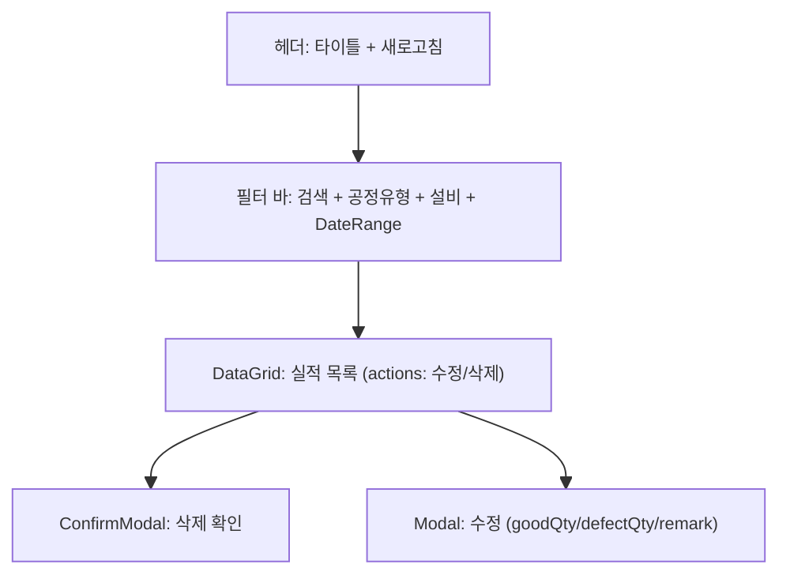
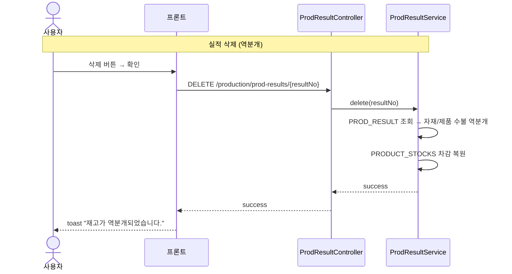

# 생산실적 조회 — 비즈니스 로직 & 데이터 흐름 분석

> **Menu Code:** `PROD_RESULT`
> **Path:** `/production/result`
> **Label:** `menu.production.result`
> **분석 기준 커밋:** `8a7e96ea`
> **분석 일자:** `2026-07-04`

## 1. 화면 개요

생산실적(PROD_RESULTS)을 통합 조회/수정/삭제한다. 절단/압착/조립/검사/포장 등 모든 공정 유형의 실적을 필터링하여 확인 가능.

## 2. 화면 구성

## 3. API 호출 흐름

| 시점 | API | 용도 |
| --- | --- | --- |
| 진입/조회 | `GET /production/prod-results` | 실적 목록 (search/processCode/equipCode/startTimeFrom/startTimeTo) |
| 수정 | `PUT /production/prod-results/{resultNo}` | 양품/불량 수량 변경 |
| 삭제 | `DELETE /production/prod-results/{resultNo}` | 실적 삭제 (재고 역분개) |

## 4. 백엔드 처리

**Controller:** `ProdResultController` (`apps/backend/src/modules/production/controllers/prod-result.controller.ts`)
**Service:** `ProdResultService`

| 엔드포인트 | 서비스 메서드 | 설명 |
| --- | --- | --- |
| `GET /` | `findAll(query)` | 실적 목록 (페이징 + 필터) |
| `PUT /:resultNo` | `update(resultNo, dto)` | goodQty/defectQty 수정 + 재고 재동기화 |
| `DELETE /:resultNo` | `delete(resultNo)` | 실적 삭제 + 자재/제품 재고 역분개 |

## 5. DB 테이블 영향

| 테이블 | 작업 | 설명 |
| --- | --- | --- |
| `PROD_RESULTS` | SELECT/UPDATE/DELETE | 생산실적 |
| `PRODUCT_STOCKS` | UPDATE (삭제 시 역분개) | 제품재고 복원 |
| `WIP_MAT_STOCKS` | UPDATE (삭제 시 역분개) | 자재재고 복원 |
| `STOCK_TRANSACTIONS` | INSERT (역분개) | 수불 이력 |

## 6. 처리 규칙

- **삭제 시 역분개**: 실적 삭제 시 연결된 자재 차감과 제품 재고를 자동 복원
- **수정 시 재동기화**: goodQty/defectQty 변경 시 자재+제품 재고 자동 재계산
- **공정 유형 필터**: CUT/CRIMP/ASSY/INSP/PACK만 표시 (PROCESS_TYPE 공통코드)

## 7. 비고

- `alert()/confirm()/prompt()` 사용 없음
- 작업자 아바타: 부서별 색상 이니셜 표시
- workerName/workerDept는 worker 관계에서 fallback 조회
