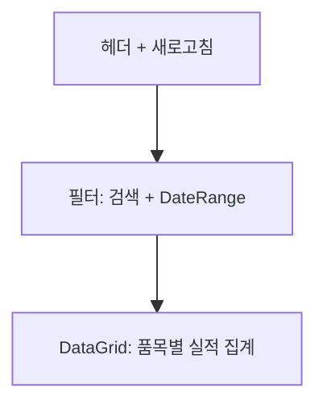

# 작업실적 통합 조회 — 비즈니스 로직 & 데이터 흐름 분석

> **Menu Code:** `PROD_RESULT_SUMMARY`
> **Path:** `/production/result-summary`
> **Label:** `menu.production.resultSummary`
> **분석 기준 커밋:** `8a7e96ea`
> **분석 일자:** `2026-07-04`

## 1. 화면 개요

완제품 기준으로 전체 공정 실적을 한눈에 확인하는 통합 조회 화면. 품목별 GROUP BY 집계로 계획달성률/양품률/불량률 표시.

## 2. 화면 구성

## 3. API 호출

| 시점 | API | 용도 |
| --- | --- | --- |
| 진입/조회 | `GET /production/prod-results/summary/by-product` | 품목별 집계 (fromDate/toDate/search) |

**백엔드:** `ProdResultController.getSummaryByProduct()` → `ProdResultService.getSummaryByProduct()`

## 4. DB 영향

| 테이블 | 작업 | 설명 |
| --- | --- | --- |
| `PROD_RESULTS` | SELECT GROUP BY | 품목별 양품/불량 집계 |
| `ITEM_MASTERS` | LEFT JOIN | 품목명/규격 |

## 5. 비고

- 읽기 전용 화면
- `alert()/confirm()/prompt()` 사용 없음
