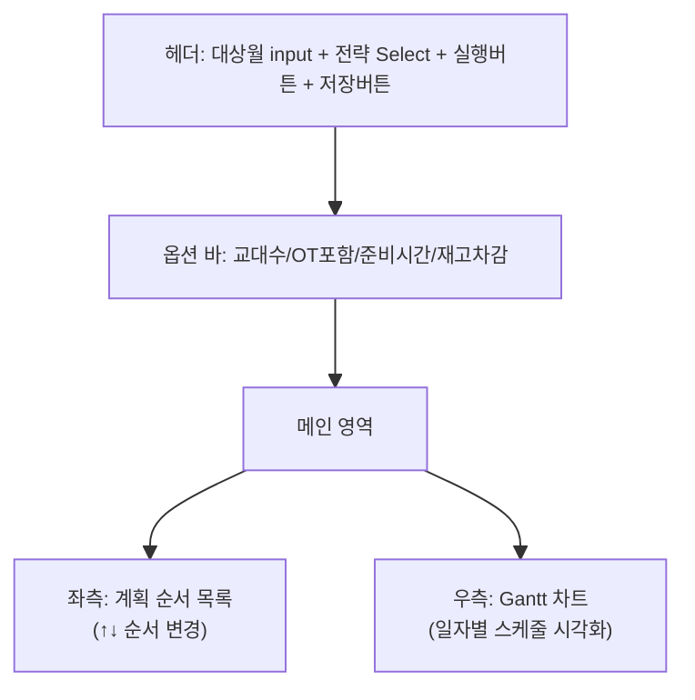
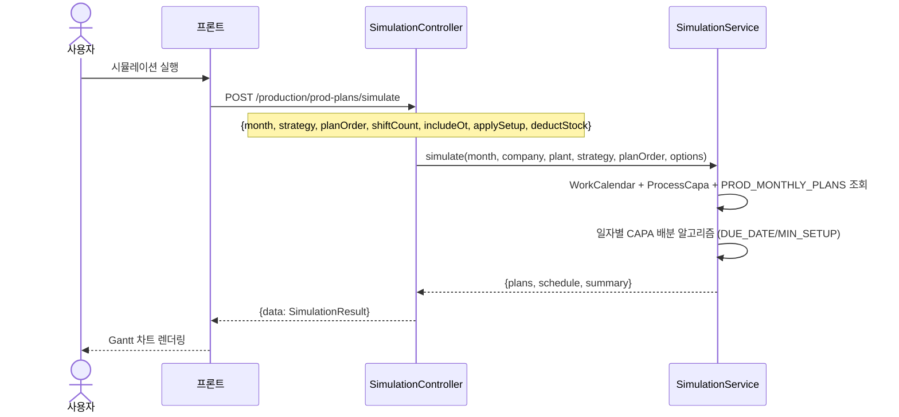
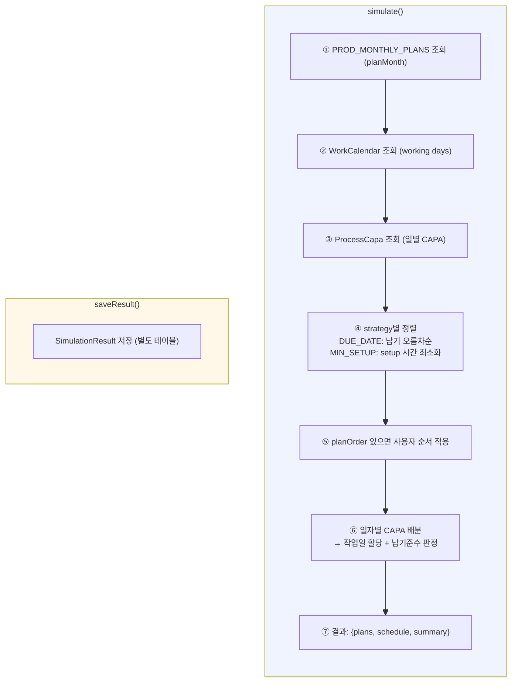

# 생산계획 시뮬레이션 — 비즈니스 로직 & 데이터 흐름 분석

> **Menu Code:** `PROD_SIMULATION`
> **Path:** `/production/simulation`
> **Label:** `menu.production.simulation`
> **분석 기준 커밋:** `8a7e96ea`
> **분석 일자:** `2026-07-04`

## 1. 화면 개요

월간 생산계획을 납기/CAPA/월력 기반으로 시뮬레이션하여 일자별 스케줄, 납기 준수 여부, 가동률을 예측한다. DUE_DATE(납기우선) / MIN_SETUP(최소준비) 전략 선택 가능.

## 2. 화면 구성

| 영역 | 역할 |
| --- | --- |
| 대상월 | `input type="month"`로 YYYY-MM 선택 |
| 전략 Select | DUE_DATE(납기우선) / MIN_SETUP(최소준비) |
| 옵션 바 | 교대수(1/2/3), OT포함, 준비시간 적용, 재고차감 |
| 좌측 패널 | 계획 순서 목록 (↑↓ 드래그 대신 버튼으로 순서 변경) |
| 우측 Gantt | GanttChart 컴포넌트로 일자별 생산 스케줄 시각화 |

## 3. 상태 관리

| 상태 | 용도 | 초기값 |
| --- | --- | --- |
| `month` | 대상월 | `YYYY-MM` (현재월) |
| `strategy` | 시뮬레이션 전략 | `DUE_DATE` |
| `shiftCount` | 교대수 | `1` |
| `includeOt` | OT 포함 | `false` |
| `applySetup` | 준비시간 적용 | `true` |
| `deductStock` | 재고차감 적용 | `false` |
| `result` | 시뮬레이션 결과 | `null` |
| `planOrder[]` | 계획 순서 목록 | `[]` |
| `loading` | 실행 중 플래그 | `false` |

## 4. API 호출 흐름

| 시점 | API | 용도 |
| --- | --- | --- |
| 월 변경 시 | `GET /production/prod-plans?planMonth={month}` | 계획 목록 조회 |
| 페이지 진입 시 | `GET /production/prod-plans/simulate/latest?month={month}` | 마지막 시뮬레이션 결과 복원 |
| 실행 버튼 | `POST /production/prod-plans/simulate` | 시뮬레이션 실행 |
| 저장 버튼 | `POST /production/prod-plans/simulate/save` | 시뮬레이션 결과 저장 |

## 5. 백엔드 처리

**Controller:** `SimulationController` (`apps/backend/src/modules/production/controllers/simulation.controller.ts`)
**Service:** `SimulationService`

## 6. 처리 규칙 및 검증

- **DUE_DATE 전략**: 납기일자 순으로 정렬하여 계획 배분
- **MIN_SETUP 전략**: 품목 변경 시 준비시간(setup) 최소화 방향으로 정렬
- **사용자 순서**: 좌측 패널에서 ↑↓ 버튼으로 순서 변경 가능
- **교대수**: 1/2/3교대 선택에 따라 가용 CAPA 배수 조정
- **저장**: 시뮬레이션 결과 저장 후 재진입 시 복원 가능

## 7. DB 테이블 영향

| 테이블 | 작업 | 설명 |
| --- | --- | --- |
| `PROD_MONTHLY_PLANS` | SELECT | 계획 목록 조회 |
| `WORK_CALENDARS` | SELECT | 월력(휴일/근무일) 조회 |
| `PROCESS_CAPAS` | SELECT | 공정별 일일 CAPA 조회 |
| `SIMULATION_RESULTS` | INSERT (save) | 시뮬레이션 결과 저장 |

## 8. 공통코드

| 그룹코드 | 용도 |
| --- | --- |
| `SIMULATION_STRATEGY` | 시뮬레이션 전략 (DUE_DATE/MIN_SETUP) |

## 9. 비고

- 시뮬레이션은 생산계획을 실제로 변경하지 않고 예측만 수행
- `save`는 시뮬레이션 결과를 보존해 재진입 시 동일 결과를 다시 볼 수 있게 함
- `deductStock` 옵션: 기존 재고를 차감한 상태로 계획 수립 (true 시 생략 가능한 생산량 계산)
