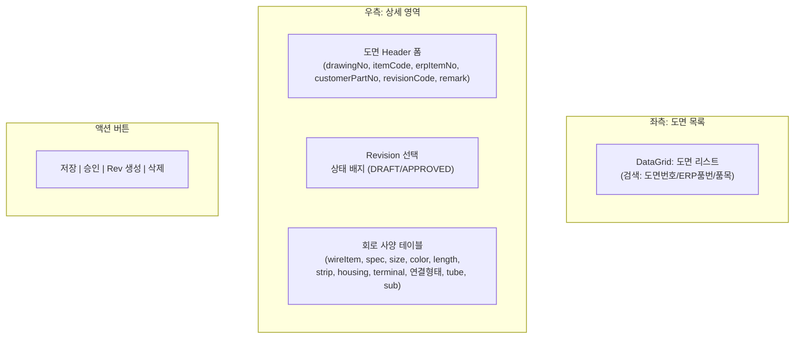
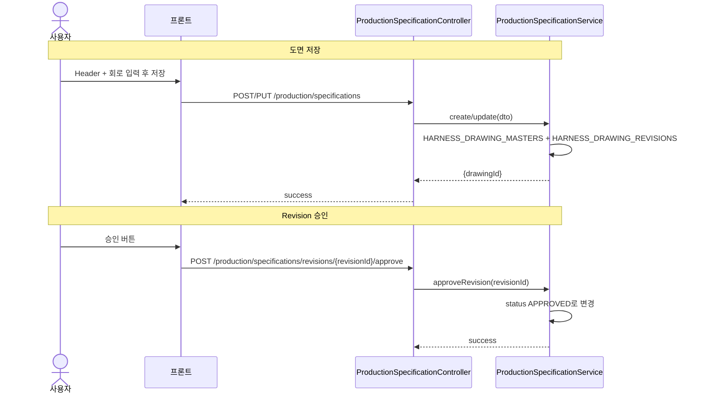
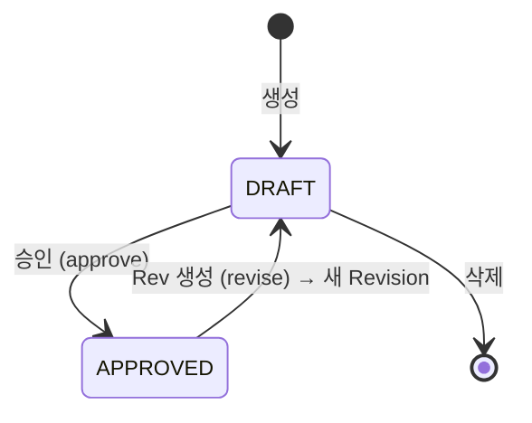

---
sources:
  - apps/backend/src/modules/production/controllers/production-specification.controller.ts
verifiedCommit: 8a7e96ea
---

# 제품 도면관리 — 비즈니스 로직 & 데이터 흐름 분석

> **Menu Code:** `PROD_SPEC_SETUP`
> **Path:** `/production/specification-setup`
> **Label:** `menu.production.specificationSetup`
> **분석 기준 커밋:** `8a7e96ea`
> **분석 일자:** `2026-07-04`

## 1. 화면 개요

제품별 하네스 도면(Harness Drawing) Revision과 회로별 제작 사양(Circuit Spec)을 관리한다. 도면 등록/수정, Revision 생성/승인, 회로 사양 입력을 처리한다.

## 2. 화면 구성

| 영역 | 컴포넌트 | 역할 |
| --- | --- | --- |
| 좌측 | DataGrid | 도면 목록 (drawingId, drawingNo, itemCode, itemName 등) |
| 우측-Header | Input × 6 | 도면 기본 정보 입력 |
| 우측-Revision | Select | Revision 선택 + 코드/상태 표시 |
| 우측-회로 | CircuitSpecTable | 회로별 wire/terminal/housing/연결형태 등 Grid |
| 버튼 | Save/승인/Rev생성/삭제 | 도면 CRUD + 승인/Revision |

## 3. 상태 관리

| 상태 | 용도 | 초기값 |
| --- | --- | --- |
| `drawings[]` | 도면 목록 | `[]` |
| `selected` | 선택된 도면 상세 | `null` |
| `selectedRevisionId` | 선택된 Revision ID | `null` |
| `headerForm` | 도면 Header 폼 값 | 기본값 |
| `circuits[]` | 회로 사양 목록 | `[emptyCircuit]` |
| `bomOptions[]` | BOM 자재 옵션 (전선/터미널/하우징) | `[]` |

## 4. API 호출 흐름

| 시점 | API | 용도 |
| --- | --- | --- |
| 진입/조회 | `GET /production/specifications?limit=5000&search=` | 도면 목록 |
| 행 클릭 | `GET /production/specifications/{drawingId}` | 도면 상세 |
| Revision 선택 | `GET /production/specifications/revisions/{revisionId}` | Revision + 회로 상세 |
| 저장(신규) | `POST /production/specifications` | 도면 + 회로 생성 |
| 저장(수정) | `PUT /production/specifications/{drawingId}` | Header 수정 |
| | `PUT /production/specifications/revisions/{revisionId}` | 회로 사양 수정 |
| 승인 | `POST /production/specifications/revisions/{revisionId}/approve` | DRAFT→APPROVED |
| Rev 생성 | `POST /production/specifications/revisions/{revisionId}/revise` | 새 Revision 생성 |
| 삭제 | `DELETE /production/specifications/{drawingId}` | 도면 삭제 |
| BOM 조회 | `GET /master/boms?parentItemCode={itemCode}` | 회로 드롭다운 옵션 |

## 5. 백엔드 처리

**Controller:** `ProductionSpecificationController` (`apps/backend/src/modules/production/controllers/production-specification.controller.ts`)
**Service:** `ProductionSpecificationService`

| 엔드포인트 | 서비스 메서드 | 설명 |
| --- | --- | --- |
| `GET /` | `findAll(query)` | 도면 목록 (페이징) |
| `GET /:id` | `findOne(id)` | 도면 상세 (Revision 목록 포함) |
| `GET /revisions/:revisionId` | `findRevision(revisionId)` | Revision + 회로 목록 |
| `POST /` | `create(dto)` | 도면 생성 (HEADER + REVISION + CIRCUITS) |
| `PUT /:id` | `update(id, dto)` | Header 수정 |
| `PUT /revisions/:revisionId` | `updateRevision(revisionId, dto)` | 회로 사양 수정 |
| `POST /.../approve` | `approveRevision(revisionId)` | 승인 |
| `POST /.../revise` | `revise(revisionId, dto)` | 복제 → 새 DRAFT Revision |
| `DELETE /:id` | `delete(id)` | 도면 삭제 |

## 6. 처리 규칙 및 검증

- **APPROVED 상태**: 회로 사양 수정/추가/삭제 불가 (읽기 전용)
- **회로 연결형태**: STRAIGHT/BOTH_CRIMP/SPLICE/BRIDGE/ONE_SIDE, 구 `LINE` → `STRAIGHT` 자동 변환
- **회로 드롭다운**: BOM 기준으로 productType 분류 (전선/터미널/하우징)
- **Rev 생성**: 현재 DRAFT/APPROVED 회로를 복제해 새 DRAFT Revision 생성, `changeReason` 기록
- **삭제**: 도면 전체 삭제 (CASCADE로 Revision/회로 함께 삭제)

## 7. 상태 전이 (Revision)

## 8. DB 테이블 영향

| 테이블 | 작업 | 설명 |
| --- | --- | --- |
| `HARNESS_DRAWING_MASTERS` | CRUD | 도면 Header |
| `HARNESS_DRAWING_REVISIONS` | CRUD | Revision (revisionCode, status, changeReason) |
| `HARNESS_CIRCUIT_SPECS` | CRUD | 회로별 제작 사양 |

## 9. 공통코드

| 그룹코드 | 용도 |
| --- | --- |
| `SPEC_REVISION_STATUS` | Revision 상태 (DRAFT/APPROVED) |
| `PRODUCT_TYPE` | BOM 자재 유형 (TERMINAL/HOUSING/CONNECTOR 등) |

## 10. 에러 코드

| 상황 | 처리 |
| --- | --- |
| 도면번호/품목코드 미입력 | `toast.error` (프론트 검증) |
| APPROVED 상태에서 수정 시도 | API 400 |
| BOM 미등록 품목 | 드롭다운에 "(미등록)" 표시 |

## 11. 비고

- `alert()` 대신 `window.confirm()`이 1회 사용됨 (삭제 확인, page.tsx:288)
- `CircuitSpecTable`은 `<table>` 태그 기반 Grid (DataGrid 미사용)
- 전선/터미널/하우징 드롭다운은 BOM `productType` 기준 분류
- tenant scope: 모든 쿼리에 `company, plant` 적용
