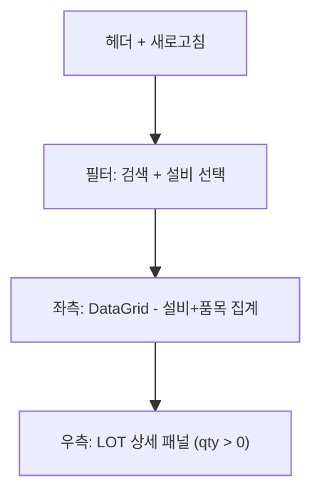

# 설비별 공정재고 — 비즈니스 로직 & 데이터 흐름 분석

> **Menu Code:** `PROD_WIP_MAT_STOCK`
> **Path:** `/production/wip-material-stock`
> **Label:** `menu.production.wipMaterialStock`
> **분석 기준 커밋:** `8a7e96ea`
> **분석 일자:** `2026-07-04`

## 1. 화면 개요

설비별 공정재고(WIP_MAT_STOCKS)를 조회하는 화면. 좌측 설비+품목 집계 그리드와 우측 선택 행의 LOT별 상세 패널로 구성.

## 2. 화면 구성

## 3. API 호출

| 시점 | API | 용도 |
| --- | --- | --- |
| 진입/조회 | `GET /inventory/wip-mat-stocks` | 설비별 공정재고 (equipCode/search) |
| 행 선택 | `GET /inventory/wip-mat-stocks/lots?equipCode=&itemCode=` | LOT 상세 |

## 4. 백엔드 처리

**Controller:** `InventoryController.getWipMatStocks()` / `getWipMatStockLots()`
**Service:** `WipMatStockService.findByEquip()` / `findLotsByEquipItem()`

## 5. DB 테이블 영향

| 테이블 | 작업 | 설명 |
| --- | --- | --- |
| `WIP_MAT_STOCKS` | SELECT | 설비+품목별 재고 집계 |
| `WIP_MAT_TRANSACTIONS` | SELECT (lots) | LOT별 상세 |

## 6. 비고

- 읽기 전용 화면
- LOT 상세는 `qty > 0`만 표시 (가용 재고 중심)
- `alert()/confirm()/prompt()` 사용 없음
