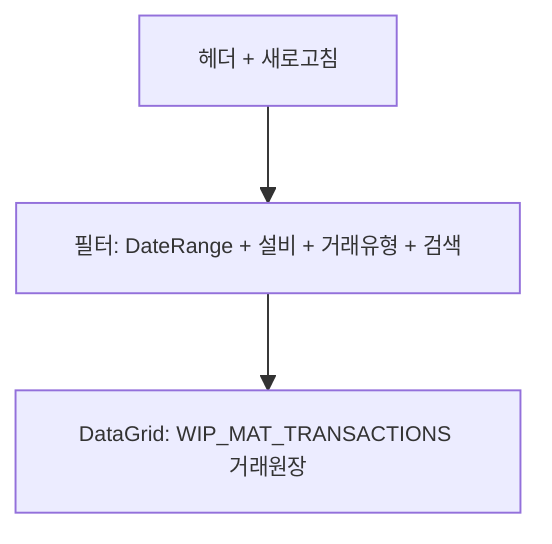

---
sources:
  - apps/backend/src/modules/inventory/inventory.controller.ts
  - apps/backend/src/modules/inventory/services/wip-mat-stock.service.ts
verifiedCommit: 8a7e96ea
---

# 공정 수불(거래원장) — 비즈니스 로직 & 데이터 흐름 분석

> **Menu Code:** `PROD_WIP_MAT_TRANS`
> **Path:** `/production/wip-material-trans`
> **Label:** `menu.production.wipMatTrans`
> **분석 기준 커밋:** `8a7e96ea`
> **분석 일자:** `2026-07-04`

## 1. 화면 개요

설비(EQUIP_CODE) 단위 공정재고의 입고/소비/취소 거래 이력을 조회하는 거래원장 화면.

## 2. 화면 구성

## 3. API 호출

| 시점 | API | 용도 |
| --- | --- | --- |
| 진입/조회 | `GET /inventory/wip-mat-transactions` | 거래원장 (fromDate/toDate/transType/equipCode/search) |

**백엔드:** `InventoryController.getWipMatTransactions()` → `WipMatStockService.findTransactions()`

## 4. 거래 유형

| 코드 | 설명 |
| --- | --- |
| `WIP_IN` | 공정입고 |
| `WIP_IN_CANCEL` | 공정입고취소 |
| `PROD_CONSUME` | 생산소비 |
| `PROD_CONSUME_CANCEL` | 생산소비취소 |

## 5. DB 테이블 영향

| 테이블 | 작업 | 설명 |
| --- | --- | --- |
| `WIP_MAT_TRANSACTIONS` | SELECT | 거래원장 |
| `EQUIP_MASTERS` | LEFT JOIN | 설비명 |
| `ITEM_MASTERS` | LEFT JOIN | 품목명 |

## 6. 비고

- 읽기 전용 화면
- `alert()/confirm()/prompt()` 사용 없음
- 원자재 수불(STOCK_TRANSACTIONS)과 완전 분리된 공정 전용 원장
