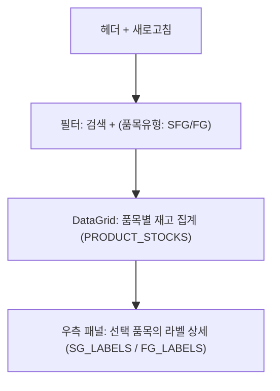

# 반제품 재공재고 — 비즈니스 로직 & 데이터 흐름 분석

> **Menu Code:** `PROD_WIP_STOCK`
> **Path:** `/production/wip-stock`
> **Label:** `menu.production.wipStock`
> **분석 기준 커밋:** `8a7e96ea`
> **분석 일자:** `2026-07-04`

## 1. 화면 개요

반제품(SEMI_PRODUCT) 재공재고를 품목별로 조회하고, 선택 품목의 상세 라벨 정보를 확인한다.

## 2. 화면 구성



## 3. API 호출

| 시점 | API | 용도 |
| --- | --- | --- |
| 진입/조회 | `GET /production/wip-stock` | 품목별 재고 집계 (search/itemType) |
| 행 선택 | `GET /production/wip-stock/labels?itemCode=&itemType=` | 선택 품목 라벨 상세 |

## 4. 백엔드 처리

**Controller:** `ProductionViewsController.getWipStock()` / `getWipStockLabels()`
**Service:** `ProductionViewsService`

**SQL (WipStockView):**
```sql
SELECT s.ITEM_CODE, im.ITEM_NAME, s.ITEM_TYPE, s.QUALITY_STATUS,
       s.WAREHOUSE_CODE, wh.WAREHOUSE_NAME, s.QTY, im.UNIT, s.UPDATED_AT
FROM PRODUCT_STOCKS s
LEFT JOIN ITEM_MASTERS im ON im.ITEM_CODE = s.ITEM_CODE ...
LEFT JOIN WAREHOUSES wh ON wh.WAREHOUSE_CODE = s.WAREHOUSE_CODE ...
WHERE s.WAREHOUSE_CODE IN ('FG_WIP', 'SFG_WIP') ...
```

## 5. DB 테이블 영향

| 테이블 | 작업 | 설명 |
| --- | --- | --- |
| `PRODUCT_STOCKS` | SELECT | 품목별 재고 집계 |
| `ITEM_MASTERS` | LEFT JOIN | 품목 정보 |
| `WAREHOUSES` | LEFT JOIN | 창고 정보 |
| `SG_LABELS` | SELECT (itemType=SEMI_PRODUCT) | 라벨 상세 |
| `FG_LABELS` | SELECT (itemType=FINISHED) | 라벨 상세 |

## 6. 비고

- `fg-stock` 페이지는 `WipStockView`를 `itemType="FINISHED"`로 재사용
- 읽기 전용 화면
- 재고는 `FG_WIP` / `SFG_WIP` 창고만 조회
