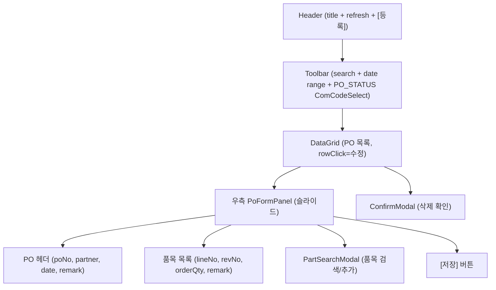
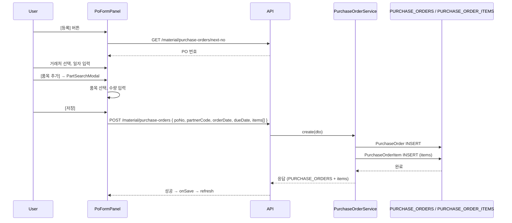
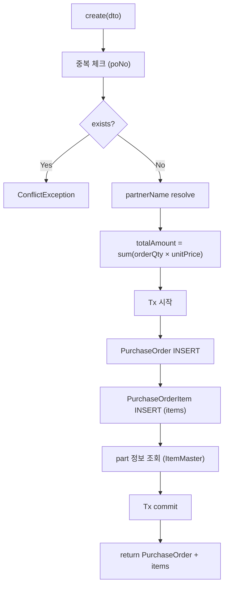
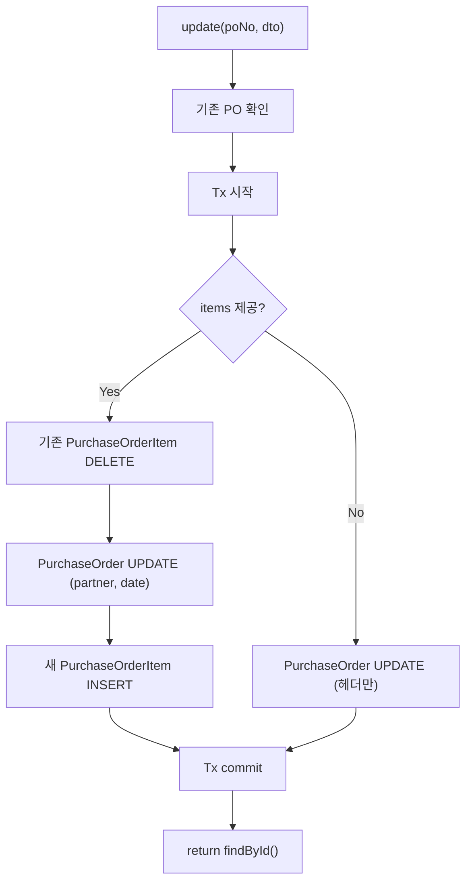
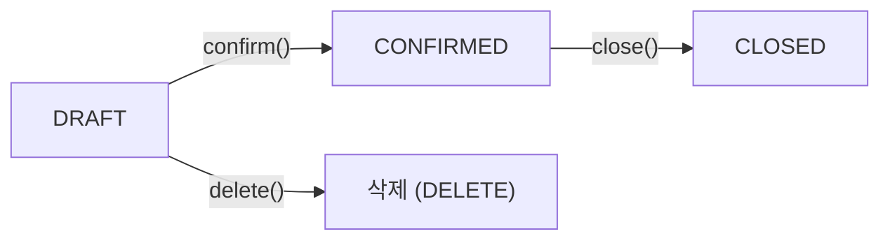

# PO관리 — 비즈니스 로직 & 데이터 흐름 분석
> **분석 기준 커밋:** `8a7e96ea`
> **분석 일자:** `2026-07-04`

## 1. 화면 개요

| 항목 | 내용 |
|------|------|
| **메뉴 코드** | `PUR_PO` |
| **메뉴명** | PO관리 |
| **URL** | `/material/po` |
| **소스 경로** | `apps/frontend/src/app/(authenticated)/material/po/page.tsx` |
| **목적** | 원자재 구매발주(PO) CRUD — 등록, 수정, 삭제, 조회 |
| **사용자** | 구매/자재관리자 |
| **워크플로우 노드** | PO 목록 조회 → 등록/수정/삭제 → 저장 |

## 2. 화면 구성

### 2.1 레이아웃



### 2.2 컴포넌트

| 구분 | 컴포넌트 | 소스 위치 |
|------|---------|----------|
| 레이아웃 | `Card`, `CardContent`, `ConfirmModal` | `@/components/ui` |
| Input | `Input` | `@/components/ui` |
| Button | `Button` | `@/components/ui` |
| 공통코드 Select | `ComCodeSelect` | `@/components/shared` |
| 거래처 Select | `PartnerSelect` | `@/components/shared` |
| 품목 검색 Modal | `PartSearchModal` | `@/components/shared/PartSearchModal` |
| 기간 필터 | `DateRangeFilter` | `@/components/shared/DateRangeFilter` |
| 그리드 | `DataGrid` | `@/components/data-grid/DataGrid` |
| **PO 폼 패널** | `PoFormPanel` | `./components/PoFormPanel.tsx` |
| 컬럼 정의 | `createPoGridColumns` | `./poColumns.tsx` |
| 공통코드 훅 | `useComCodeMap("PO_STATUS")` | `@/hooks/useComCode` |

### 2.3 DataGrid 컬럼

| 컬럼명 | 표시 | 유형 |
|--------|------|------|
| 액션 | Edit/Delete 아이콘 버튼 | 아이콘 |
| PO No | poNo | 모노텍스트 |
| 거래처명 | partnerName | 텍스트 |
| 발주일 | orderDate | 날짜 |
| 납기일 | dueDate | 날짜 |
| 품목수 | items.length | 숫자 |
| 총금액 | totalAmount | 숫자 (천단위) |
| 상태 | status | 배지 (PO_STATUS 공통코드 attr1) |

### 2.4 Filter

| 필터명 | 유형 | 비고 |
|--------|------|------|
| 검색 | Input | search (poNo, partnerName) |
| 발주일 | `DateRangeFilter` | 기본값 = 오늘 |
| 상태 | `ComCodeSelect` (PO_STATUS) | |

## 3. 상태 관리

```typescript
data: PurchaseOrder[]
loading: boolean
searchText: string
statusFilter: string
fromDate, toDate: string
isFormOpen: boolean
editingPo: PurchaseOrder | null
deleteTarget: PurchaseOrder | null
poStatusMap (useComCodeMap)
```

## 4. API 호출 흐름

### 4.1 API 목록

| Method | Endpoint | 용도 | 호출 시점 |
|--------|----------|------|----------|
| `GET` | `/material/purchase-orders` | PO 목록 조회 | 최초 로드 / Refresh / 저장 후 |
| `GET` | `/material/purchase-orders/next-no` | 다음 PO 번호 채번 | 신규등록 시 |
| `GET` | `/material/purchase-orders/:id` | PO 상세 조회 | (PoFormPanel에서 필요시) |
| `POST` | `/material/purchase-orders` | PO 생성 | PoFormPanel 저장 |
| `PUT` | `/material/purchase-orders/:id` | PO 수정 | PoFormPanel 저장(수정) |
| `DELETE` | `/material/purchase-orders/:id` | PO 삭제 | 삭제 확인 Modal |

### 4.2 API 추적

| API | Controller | Service |
|-----|-----------|---------|
| `GET /material/purchase-orders` | `PurchaseOrderController.findAll()` | `PurchaseOrderService.findAll()` |
| `GET /material/purchase-orders/next-no` | `PurchaseOrderController.nextPoNo()` | `PurchaseOrderService.nextPoNo()` |
| `POST /material/purchase-orders` | `PurchaseOrderController.create()` | `PurchaseOrderService.create()` |
| `PUT /material/purchase-orders/:id` | `PurchaseOrderController.update()` | `PurchaseOrderService.update()` |
| `DELETE /material/purchase-orders/:id` | `PurchaseOrderController.delete()` | `PurchaseOrderService.delete()` |

### 4.3 등록 시퀀스



## 5. 백엔드 처리

### 5.1 `PurchaseOrderService.create()` (purchase-order.service.ts:185-251)



### 5.2 `PurchaseOrderService.update()` (purchase-order.service.ts:253-297)



### 5.3 `PurchaseOrderService.delete()` (purchase-order.service.ts:329-349)

- 조건: `status='DRAFT'`만 삭제 가능
- 입하(MAT_ARRIVALS) 존재 시 삭제 불가

## 6. 처리 규칙 및 검증

1. **PO 번호**: `PO-YYYYMMDD-XXX` 형식 (NumberingService)
2. **상태 제약**: DRAFT만 삭제 가능, 확정(CONFIRMED)은 마감(CLOSED)만 가능
3. **수량 검증**: `orderQty >= 1` 정수, 서버 400 방지
4. **거래처**: SUPPLIER 유형의 `PartnerSelect` 사용
5. **품목 유형**: `itemType='RAW_MATERIAL'` (PartSearchModal 제한)

## 7. 상태 전이



백엔드에서 추가 상태: RECEIVED, PARTIAL (입고 진행 중)

## 8. DB 테이블 영향 및 엔티티

| 테이블 | 엔티티 | 용도 | 읽기/쓰기 |
|--------|--------|------|----------|
| `PURCHASE_ORDERS` | `PurchaseOrder` | PO 헤더 | RW |
| `PURCHASE_ORDER_ITEMS` | `PurchaseOrderItem` | PO 품목 내역 | RW |
| `ITEM_MASTER` | `ItemMaster` | 품목 정보 | R |
| `PARTNER_MASTER` | `PartnerMaster` | 거래처 정보 | R |
| `MAT_ARRIVALS` | `MatArrival` | 입하 (삭제 체크용) | R |

## 9. 공통코드

| 코드 그룹 | 설명 |
|----------|------|
| `PO_STATUS` | DRAFT, CONFIRMED, RECEIVED, PARTIAL, CLOSED |

## 10. 에러 코드

| 조건 | 예외 | HTTP |
|------|------|------|
| 중복 PO 번호 | `ConflictException` | 409 |
| PO 없음 | `NotFoundException` | 404 |
| DRAFT가 아닌 상태 삭제 | `BadRequestException` | 400 |
| 입하 존재 삭제 | `BadRequestException` | 400 |
| DRAFT가 아닌 확정 | `BadRequestException` | 400 |
| 확정 가능 상태 아님 마감 | `BadRequestException` | 400 |

## 11. 비고

- `PartSearchModal`은 `itemType="RAW_MATERIAL"`로 원자재만 검색
- `PartnerSelect`는 `partnerType="SUPPLIER"`로 공급처만 검색
- 폼 패널에서 `CompactItemInput` 하위 컴포넌트로 필드 간소화
- 우측 560px 슬라이드 패널 사용
