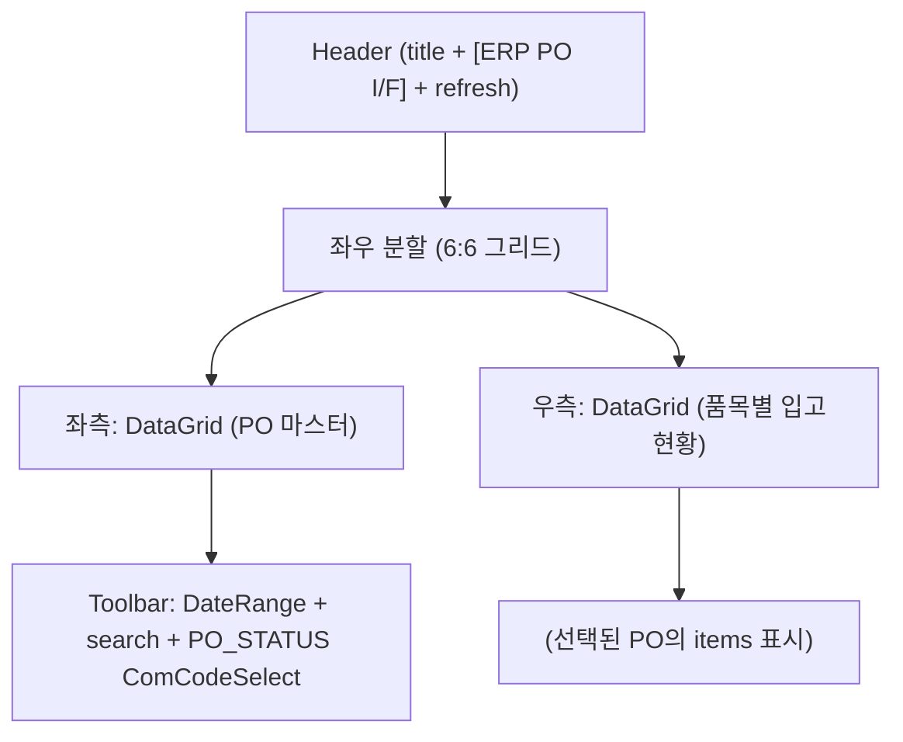
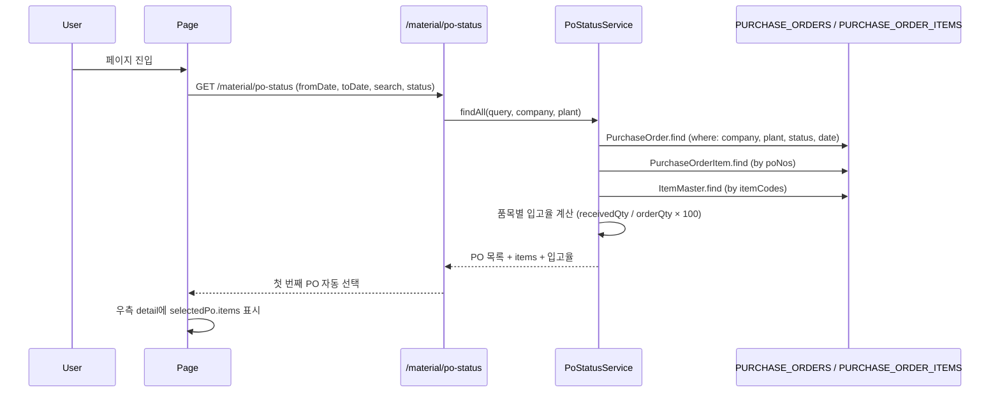
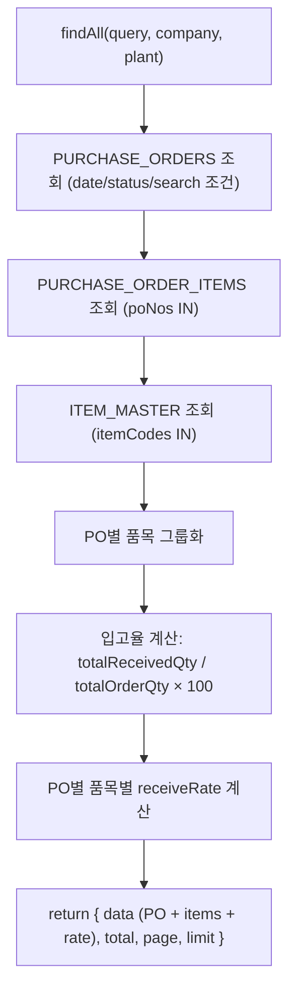

# PO현황 — 비즈니스 로직 & 데이터 흐름 분석
> **분석 기준 커밋:** `8a7e96ea`
> **분석 일자:** `2026-07-04`

## 1. 화면 개요

| 항목 | 내용 |
|------|------|
| **메뉴 코드** | `PUR_PO_STATUS` |
| **메뉴명** | PO현황 |
| **URL** | `/material/po-status` |
| **소스 경로** | `apps/frontend/src/app/(authenticated)/material/po-status/page.tsx` |
| **목적** | PO 마스터-디테일 조회 — PO별 입고율/진행현황 분석 |
| **사용자** | 구매/자재관리자 |
| **워크플로우 노드** | PO 목록 조회 → PO 선택 → 품목별 입고현황 확인 → (예정) ERP I/F |

## 2. 화면 구성

### 2.1 레이아웃



### 2.2 컴포넌트

| 구분 | 컴포넌트 | 소스 위치 |
|------|---------|----------|
| 레이아웃 | `Card`, `CardContent`, `ConfirmModal` | `@/components/ui` |
| Input | `Input` | `@/components/ui` |
| Button | `Button` | `@/components/ui` |
| 공통코드 Select | `ComCodeSelect` | `@/components/shared` |
| FilterBar | `FilterBar` | `@/components/shared/FilterBar` |
| 기간 필터 | `DateRangeFilter` | `@/components/shared/DateRangeFilter` |
| 그리드 | `DataGrid` | `@/components/data-grid/DataGrid` |
| 마스터 컬럼 | `createPoStatusGridColumns` | `./poStatusColumns.tsx` |
| 디테일 컬럼 | `createPoStatusDetailGridColumns` | `./poStatusColumns.tsx` |
| 공통코드 훅 | `useComCodeMap("PO_STATUS")` | `@/hooks/useComCode` |

### 2.3 좌측 마스터 컬럼

| 컬럼명 | 표시 | 유형 |
|--------|------|------|
| PO No | poNo | 모노텍스트 |
| 거래처명 | partnerName | 텍스트 |
| 발주일 | orderDate | 날짜 |
| 입고율 | receiveRate | 진행바 + 퍼센트 |
| 상태 | status | 배지 (입고율 100%면 RECEIVED) |

우측 디테일 컬럼:

| 컬럼명 | 표시 | 유형 |
|--------|------|------|
| LINE NO | lineNo | 숫자 |
| 품목코드 | itemCode | 모노텍스트 |
| 품목명 | itemName | 텍스트 |
| 규격 | spec | 텍스트 |
| 단위 | unit | 텍스트 |
| REL NO | relNo | 숫자 |
| 발주수량 | orderQty | 숫자 |
| 입고수량 | receivedQty | 숫자 |
| 입고율 | receiveRate | 진행바 + 퍼센트 |

### 2.4 Filter

| 필터명 | 유형 | 비고 |
|--------|------|------|
| 발주일 | `DateRangeFilter` | 기본값 = 1개월 전 ~ 오늘 |
| 검색 | `Input` | poNo 검색 |
| 상태 | `ComCodeSelect` (PO_STATUS) | |

## 3. 상태 관리

```typescript
data: PoStatusRaw[]            // PO 목록
loading: boolean
erpIfRunning: boolean
erpIfConfirmOpen: boolean
searchText: string
statusFilter: string
selectedPo: PoStatusRaw | null  // 선택된 PO (우측 패널)
fromDate, toDate: string        // 기본값: 1개월 전 ~ 오늘
poStatusMap (useComCodeMap)
```

## 4. API 호출 흐름

### 4.1 API 목록

| Method | Endpoint | 용도 | 호출 시점 |
|--------|----------|------|----------|
| `GET` | `/material/po-status` | PO 현황 목록 조회 (품목 포함) | 최초 로드 / Refresh |

### 4.2 API 추적

| 계층 | 파일 | 라인 |
|------|------|------|
| **프론트 호출** | `page.tsx:62` | `api.get('/material/po-status', { params })` |
| **Controller** | `po-status.controller.ts:18-23` | `@Get()` → `PoStatusService.findAll()` |
| **Service** | `po-status.service.ts:32-127` | `findAll()`: PURCHASE_ORDERS + PURCHASE_ORDER_ITEMS 조인 |

### 4.3 조회 시퀀스



## 5. 백엔드 처리

### 5.1 `PoStatusService.findAll()` (po-status.service.ts:32-127)



### 5.2 입고율 계산

```typescript
totalOrderQty = sum(items.orderQty)
totalReceivedQty = sum(items.receivedQty)
receiveRate = Math.round(totalReceivedQty / totalOrderQty * 100)
```

## 6. 처리 규칙 및 검증

1. **읽기 전용 페이지**: 데이터 변경 없음
2. **PK = PURCHASE_ORDER_ITEMS.SEQ**: PURCHASE_ORDER_ITEMS의 `receivedQty` 필드로 입고율 계산
3. **상태 오버라이드**: `receiveRate >= 100`이면 status를 `RECEIVED`로 표시 (프론트에서 처리)
4. **PO 선택 유지**: 새로고침 후에도 `selectedPo`가 목록에 있으면 유지, 없으면 첫 번째 선택
5. **ERP PO I/F**: TODO — 아직 백엔드 미구현 (toast.error 표시)

## 7. DB 테이블 영향 및 엔티티

| 테이블 | 엔티티 | 용도 | 읽기/쓰기 |
|--------|--------|------|----------|
| `PURCHASE_ORDERS` | `PurchaseOrder` | PO 헤더 | R |
| `PURCHASE_ORDER_ITEMS` | `PurchaseOrderItem` | PO 품목 (receivedQty 포함) | R |
| `ITEM_MASTER` | `ItemMaster` | 품목 정보 | R |

**읽기 전용 (Read-Only)**.

## 8. 공통코드

| 코드 그룹 | 설명 |
|----------|------|
| `PO_STATUS` | DRAFT, CONFIRMED, RECEIVED, PARTIAL, CLOSED |

## 9. 에러 코드

- 별도 에러 코드 없음. 실패 시 `[]` 반환.

## 10. 비고

- `FilterBar` 공통 컴포넌트로 툴바 간소화
- `receiveRate >= 100`이면 PO_STATUS 배지에 RECEIVED로 표시 (프론트 판단)
- 좌측 DataGrid `selectedRowId={selectedPo?.poNo}`로 선택 행 하이라이트
- ERP PO I/F는 `POST /interface/erp/po-sync`로 예정되어 있으나 미구현
- `enableFullscreen` 옵션으로 전체화면 전환 지원
- PURCHASE_ORDER_ITEMS의 `receivedQty`는 자재입고 시 업데이트되는 필드
