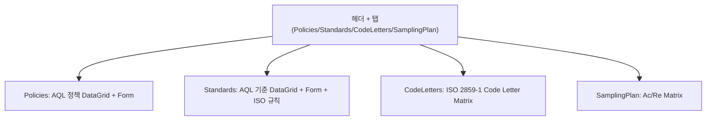

# AQL 기준관리 — 비즈니스 로직 & 데이터 흐름 분석

> **Menu Code:** `QC_AQL`
> **Path:** `/quality/aql`
> **Label:** `menu.quality.aql`
> **분석 기준 커밋:** `8a7e96ea`
> **분석 일자:** `2026-07-04`

## 1. 화면 개요

IATF 16949/AQL(ISO 2859-1) 기준을 관리. AQL 정책(Policy), AQL 기준(Standard), Code Letter 표, Sampling Plan 표의 4개 탭으로 구성.

## 2. 화면 구성

| 탭 | 컴포넌트 | 역할 |
| --- | --- | --- |
| Policies | `DataGrid` + Policy Form | IQC_AQL_POLICIES (Major/Minor 조합 관리) |
| Standards | `DataGrid` + AQL Standard Form | AQL_STANDARDS (Ac/Re 규칙 관리) |
| CodeLetters | `IsoCodeLetterMatrix` | LOT 수량+검사수준별 Code Letter 표 |
| SamplingPlan | `IsoSamplingPlanMatrix` | Code Letter+AQL별 Ac/Re 표 |

## 3. API 호출 흐름

| 시점 | API | 용도 |
| --- | --- | --- |
| 진입 | `GET /quality/aql` | AQL 기준 목록 |
| 진입 | `GET /quality/aql/policies` | AQL 정책 목록 |
| 진입 | `GET /quality/aql/iso` | ISO 표 데이터 (Code Letter/Sampling Plan) |
| 등록 | `POST /quality/aql` | AQL 기준 등록 |
| 수정 | `PUT /quality/aql/{aqlCode}` | AQL 기준 수정 |
| 삭제 | `DELETE /quality/aql/{aqlCode}` | AQL 기준 사용중지 |
| 정책 등록 | `POST /quality/aql/policies` | AQL 정책 등록 |
| 정책 수정 | `PUT /quality/aql/policies/{policyCode}` | AQL 정책 수정 |

## 4. DB 테이블 영향

| 테이블 | 작업 | 설명 |
| --- | --- | --- |
| `AQL_STANDARDS` | CRUD | AQL 기준 (Ac/Re 규칙) |
| `IQC_AQL_POLICIES` | CRUD | AQL 정책 (Major/Minor 조합) |
| `AQL_CODE_LETTER_RULES` | SELECT | ISO Code Letter 규칙 |
| `AQL_CODE_LETTER_SAMPLES` | SELECT | Code Letter별 샘플수량 |
| `AQL_ACCEPTANCE_RULES` | SELECT | Ac/Re 판정 규칙 |

## 5. 공통코드

| 그룹코드 | 용도 |
| --- | --- |
| `AQL_INSP_LEVEL` | 검사수준 (I/II/III/S1~S4) |
| `AQL_VALUE` | AQL 값 |
| `USE_YN` | 사용여부 |

## 6. 비고

- Code Letter / Sampling Plan 표는 ISO 2859-1 기준으로 읽기전용 표시
- 화살표(↑↓)는 실제 Sampling Code Letter 변경 필요 표시
- Policies 탭에서 Major AQL + Minor AQL 조합으로 정책 정의
- `alert()/confirm()/prompt()` 사용 없음
