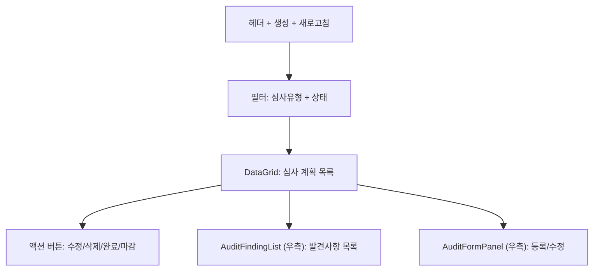
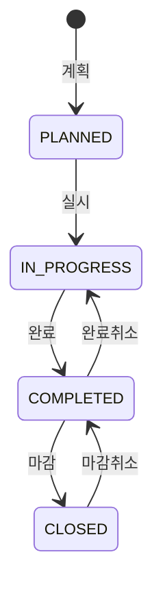

# 내부심사 관리 — 비즈니스 로직 & 데이터 흐름 분석

> **Menu Code:** `QC_AUDIT`
> **Path:** `/quality/audit`
> **Label:** `menu.quality.audit`
> **분석 기준 커밋:** `8a7e96ea`
> **분석 일자:** `2026-07-04`

## 1. 화면 개요

IATF 16949 9.2 내부심사 관리. DataGrid + AuditFormPanel + AuditFindingList(발견사항). 상태: PLANNED → IN_PROGRESS → COMPLETED → CLOSED.

## 2. 화면 구성

## 3. API 호출 흐름

| 시점 | API | 용도 |
| --- | --- | --- |
| 진입 | `GET /quality/audits` | 심사 목록 |
| 등록 | `POST /quality/audits` | 심사 계획 등록 |
| 수정 | `PUT /quality/audits/{id}` | 심사 수정 |
| 삭제 | `DELETE /quality/audits/{id}` | PLANNED만 삭제 |
| 완료 | `PATCH /quality/audits/complete/{id}` | IN_PROGRESS → COMPLETED |
| 마감 | `PATCH /quality/audits/close/{id}` | COMPLETED → CLOSED |
| 발견사항 | `GET /quality/audits/{id}/findings` | 발견사항 목록 |
| 발견사항 등록 | `POST /quality/audit-findings` | 발견사항 CRUD |
| CAPA 연결 | `PATCH /quality/audit-findings/{id}/link-capa` | 발견사항→CAPA |

## 4. 상태 전이

## 5. DB 테이블 영향

| 테이블 | 작업 | 설명 |
| --- | --- | --- |
| `QA_AUDITS` | CRUD + status UPDATE | 심사 마스터 |
| `QA_AUDIT_FINDINGS` | CRUD | 발견사항 |

## 6. 공통코드

| 그룹코드 | 용도 |
| --- | --- |
| `AUDIT_TYPE` | 심사 유형 |
| `AUDIT_STATUS` | 심사 상태 |

## 7. 비고

- 발견사항은 CAPA로 연계 가능
- 완료/마감 취소 지원
- `alert()/confirm()/prompt()` 사용 없음
