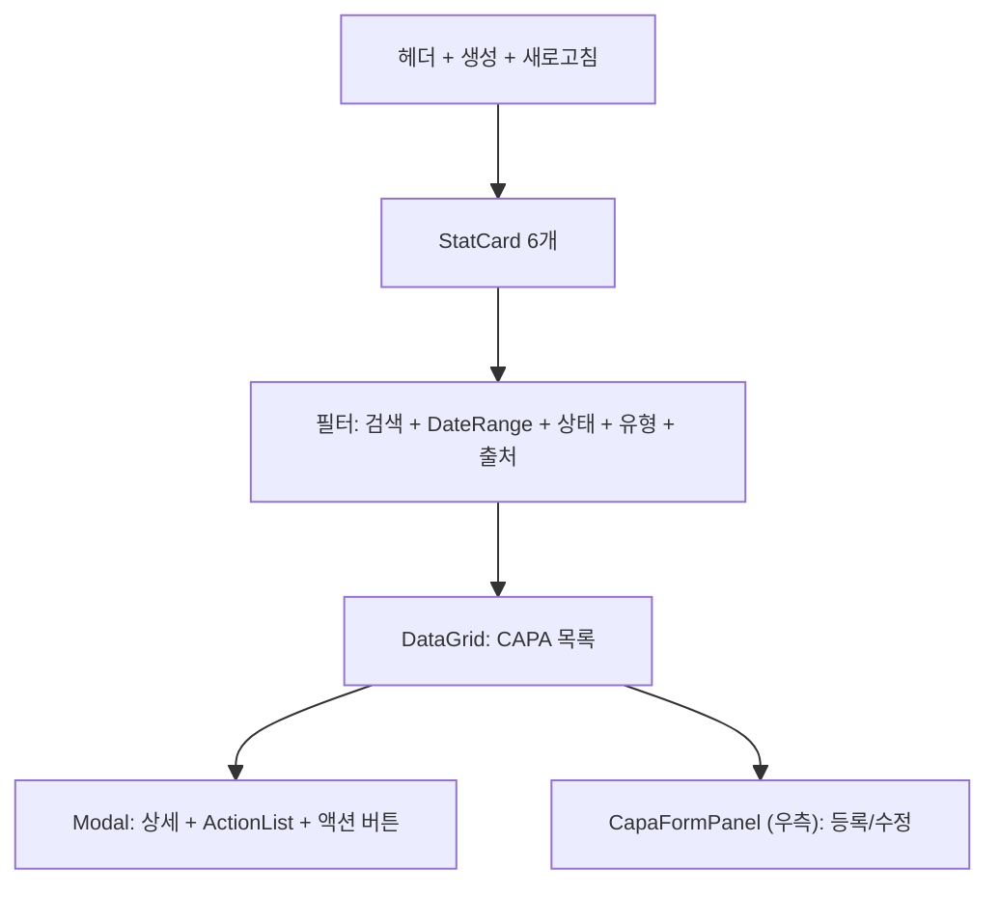
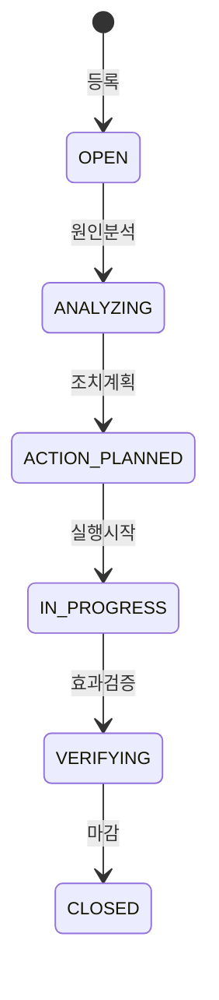

# CAPA 관리 — 비즈니스 로직 & 데이터 흐름 분석

> **Menu Code:** `QC_CAPA`
> **Path:** `/quality/capa`
> **Label:** `menu.quality.capa`
> **분석 기준 커밋:** `8a7e96ea`
> **분석 일자:** `2026-07-04`

## 1. 화면 개요

IATF 16949 10.2 시정/예방조치(CAPA) 관리. StatCard(전체/Open/분석중/진행중/검증중/마감) + DataGrid + CapaFormPanel + ActionList. 상태: OPEN → ANALYZING → ACTION_PLANNED → IN_PROGRESS → VERIFYING → CLOSED.

## 2. 화면 구성

## 3. API 호출 흐름

| 시점 | API | 용도 |
| --- | --- | --- |
| 진입 | `GET /quality/capas` | CAPA 목록 |
| 등록 | `POST /quality/capas` | CAPA 등록 |
| 분석 | `PATCH /quality/capas/{id}/analyze` | OPEN → ANALYZING (rootCause 입력) |
| 계획 | `PATCH /quality/capas/{id}/plan` | ANALYZING → ACTION_PLANNED (actionPlan 입력) |
| 시작 | `PATCH /quality/capas/{id}/start` | ACTION_PLANNED → IN_PROGRESS |
| 검증 | `PATCH /quality/capas/{id}/verify` | IN_PROGRESS → VERIFYING |
| 마감 | `PATCH /quality/capas/{id}/close` | VERIFYING → CLOSED |

## 4. 상태 전이

## 5. DB 테이블 영향

| 테이블 | 작업 | 설명 |
| --- | --- | --- |
| `QA_CAPAS` | CRUD + status/rootCause/actionPlan/verificationResult UPDATE | CAPA 마스터 |
| `QA_CAPA_ACTIONS` | CRUD | 조치 항목 |

## 6. 공통코드

| 그룹코드 | 용도 |
| --- | --- |
| `CAPA_STATUS` | CAPA 상태 |
| `CAPA_TYPE` | CAPA 유형 |
| `CAPA_SOURCE_TYPE` | 출처 유형 |

## 7. 비고

- TextInputModal로 rootCause/actionPlan/verificationResult 입력
- ActionList에서 개별 조치 항목 CRUD
- `alert()/confirm()/prompt()` 사용 없음
