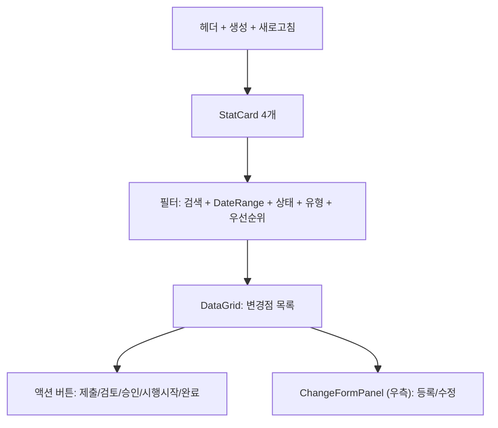
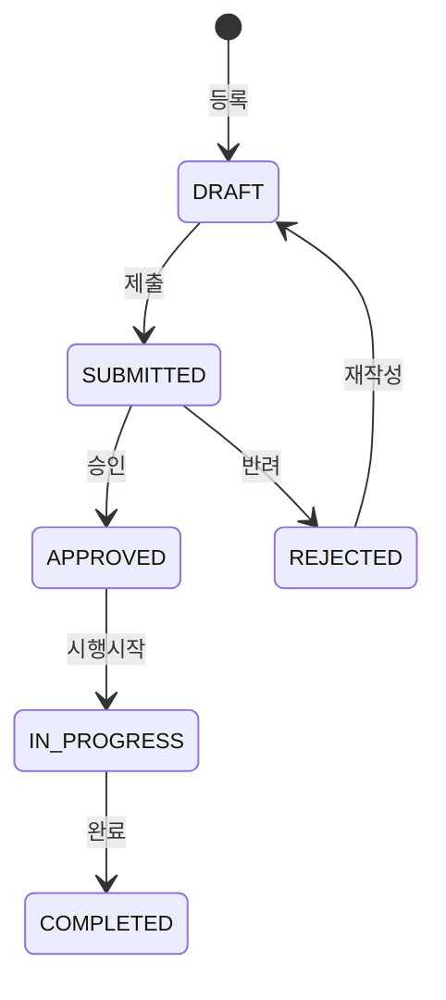

---
sources:
  - apps/frontend/src/app/(authenticated)/quality/change-control/components/ChangeFormPanel.tsx
verifiedCommit: 8a7e96ea
---

# 4M 변경점관리 — 비즈니스 로직 & 데이터 흐름 분석

> **Menu Code:** `QC_CHANGE`
> **Path:** `/quality/change-control`
> **Label:** `menu.quality.changeControl`
> **분석 기준 커밋:** `8a7e96ea`
> **분석 일자:** `2026-07-04`

## 1. 화면 개요

IATF 16949 8.5.6 4M 변경 관리. StatCard(전체/검토대기/진행중/완료) + DataGrid + 우측 ChangeFormPanel. 상태: DRAFT → SUBMITTED → APPROVED/REJECTED → IN_PROGRESS → COMPLETED.

## 2. 화면 구성

## 3. API 호출 흐름

| 시점 | API | 용도 |
| --- | --- | --- |
| 진입 | `GET /quality/changes` | 변경점 목록 |
| 진입 | `GET /quality/changes/stats` | 상태별 통계 |
| 등록 | `POST /quality/changes` | 변경점 등록 |
| 수정 | `PUT /quality/changes/{id}` | 변경점 수정 |
| 제출 | `PATCH /quality/changes/{id}/submit` | DRAFT → SUBMITTED |
| 검토 | `PATCH /quality/changes/{id}/review` | SUBMITTED → APPROVED/REJECTED |
| 시행시작 | `PATCH /quality/changes/{id}/start` | APPROVED → IN_PROGRESS |
| 완료 | `PATCH /quality/changes/{id}/complete` | IN_PROGRESS → COMPLETED |

## 4. 상태 전이

## 5. DB 테이블 영향

| 테이블 | 작업 | 설명 |
| --- | --- | --- |
| `QA_CHANGE_CONTROLS` | CRUD + status UPDATE | 변경점 마스터 |

## 6. 공통코드

| 그룹코드 | 용도 |
| --- | --- |
| `CHANGE_STATUS` | 변경 상태 |
| `CHANGE_TYPE` | 변경 유형 (4M) |
| `CHANGE_PRIORITY` | 우선순위 |

## 7. 비고

- `alert()/confirm()/prompt()` 사용 없음
