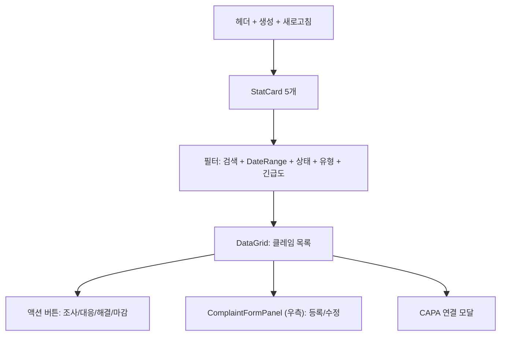
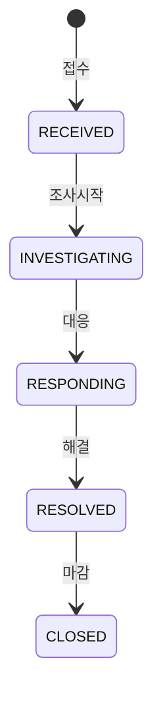

# 고객클레임 관리 — 비즈니스 로직 & 데이터 흐름 분석

> **Menu Code:** `QC_COMPLAINT`
> **Path:** `/quality/complaint`
> **Label:** `menu.quality.complaint`
> **분석 기준 커밋:** `8a7e96ea`
> **분석 일자:** `2026-07-04`

## 1. 화면 개요

IATF 16949 10.2.6 고객클레임 관리. StatCard(전체/접수/조사중/대응중/해결) + DataGrid + 우측 ComplaintFormPanel. 상태: RECEIVED → INVESTIGATING → RESPONDING → RESOLVED → CLOSED.

## 2. 화면 구성

## 3. API 호출 흐름

| 시점 | API | 용도 |
| --- | --- | --- |
| 진입 | `GET /quality/complaints` | 클레임 목록 |
| 등록 | `POST /quality/complaints` | 클레임 등록 |
| 수정 | `PUT /quality/complaints/{id}` | 클레임 수정 |
| 조사시작 | `PATCH /quality/complaints/{id}/investigate` | RECEIVED → INVESTIGATING |
| 대응 | `PATCH /quality/complaints/{id}/respond` | INVESTIGATING → RESPONDING |
| 해결 | `PATCH /quality/complaints/{id}/resolve` | RESPONDING → RESOLVED |
| 마감 | `PATCH /quality/complaints/{id}/close` | RESOLVED → CLOSED |
| CAPA 연결 | `PATCH /quality/complaints/{id}/link-capa` | CAPA ID 연결 |

## 4. 상태 전이

## 5. DB 테이블 영향

| 테이블 | 작업 | 설명 |
| --- | --- | --- |
| `QA_COMPLAINTS` | CRUD + status UPDATE | 클레임 마스터 |

## 6. 공통코드

| 그룹코드 | 용도 |
| --- | --- |
| `COMPLAINT_STATUS` | 클레임 상태 |
| `COMPLAINT_TYPE` | 클레임 유형 |
| `COMPLAINT_URGENCY` | 긴급도 |

## 7. 비고

- CAPA 연계 가능 (link-capa)
- `alert()/confirm()/prompt()` 사용 없음
