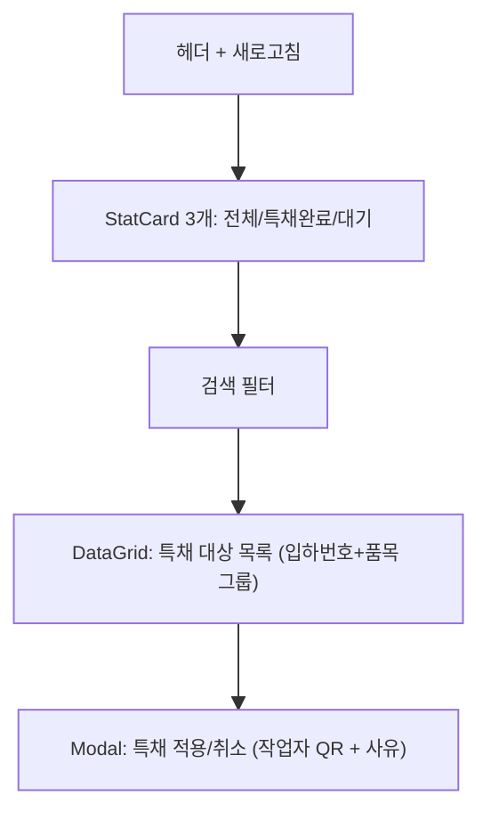

# 특채처리 — 비즈니스 로직 & 데이터 흐름 분석

> **Menu Code:** `QC_CONCESSION`
> **Path:** `/material/concession`
> **Label:** `menu.material.concession`
> **분석 기준 커밋:** `8a7e96ea`
> **분석 일자:** `2026-07-04`

## 1. 화면 개요

IQC 불합격(FAIL) 자재를 조건부로 양품 입고 허용하는 특별채택(Concession) 처리. StatCard(전체/특채완료/대기) + DataGrid + 적용/취소 모달.

## 2. 화면 구성

## 3. API 호출 흐름

| 시점 | API | 용도 |
| --- | --- | --- |
| 진입 | `GET /material/concession/targets` | 특채 대상 목록 (iqcStatus=FAIL 그룹) |
| 적용 | `POST /material/concession` | 특채 처리 (arrivalNo+itemCode+workerCode+reason) |
| 취소 | `POST /material/concession/cancel` | 특채 취소 |

## 4. DB 테이블 영향

| 테이블 | 작업 | 설명 |
| --- | --- | --- |
| `MAT_LOTS` | UPDATE specialAcceptYn | Y/N 변경 |
| `IQC_HISTORIES` | UPDATE | 특채 이력 기록 |

## 5. 공통코드

| 그룹코드 | 용도 |
| --- | --- |
| `IQC_STATUS` | IQC 상태 (FAIL) |

## 6. 비고

- 대상: IQC 결과 FAIL인 LOT 그룹 (arrivalNo+itemCode 기준)
- 특채 적용 시 작업자 QR 스캔 또는 WorkerSelect 필수
- 특채 완료 시 입고 화면에서 양품창고 입고 가능
- `alert()/confirm()/prompt()` 사용 없음
