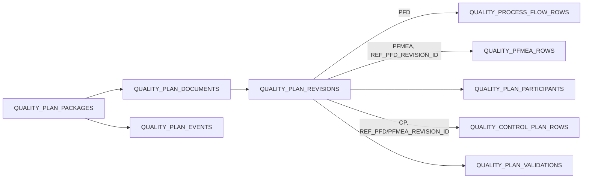

---
sources:
  - apps/frontend/src/app/(authenticated)/quality/control-plan/page.tsx
  - apps/frontend/src/app/(authenticated)/quality/control-plan/useControlPlanWorkspace.ts
  - apps/backend/src/modules/quality/control-plan/
  - packages/shared/src/utils/quality-control-plan.rules.ts
verifiedCommit: pending
---

# 관리계획 통합 문서체계

> Menu Code: `QC_CONTROL_PLAN` 
> Path: `/quality/control-plan` 
> 기준 절차/양식: `QREKA-PR-025`, `QREKA-PR-025-01` ~ `04`

## 업무 범위

하나의 품목·단계 패키지에서 PFD, PFMEA, Control Plan을 고정 Revision 참조로 연결한다. 전자결재는 사용하지 않으며 작성자·발행자와 시각만 기록한다.

## 상태와 불변성

- 생성 시 3개 문서와 `REV.00 / DRAFT`를 함께 만든다.
- 최초 발행 전에는 패키지 기본정보를 수정할 수 있고, 발행 이력이 생기면 공통 기본정보는 고정된다.
- `DRAFT`만 메타데이터와 행을 수정·삭제할 수 있다.
- 발행 전 PFD 참조, PFMEA RPN, 특별특성 전개, Control Plan 필수 관리정보를 검증한다.
- 빈 문서를 포함해 오류가 하나라도 있으면 발행 트랜잭션을 중단한다.
- 발행하면 `PUBLISHED`, 같은 문서의 이전 발행본은 `SUPERSEDED`가 된다.
- 개정은 발행본을 복제해 다음 2자리 Revision의 새 `DRAFT`를 만든다.
- PFMEA CFT와 23개 물리열(예방·검출 관리, 권고조치, 담당, 목표·완료일, 조치 후 S/O/D/RPN 포함)도 Revision snapshot으로 함께 복제한다.

## API

| API | 역할 |
| --- | --- |
| `GET/POST /quality/plan-packages`, `PUT /quality/plan-packages/{id}` | 문서함 조회·새 묶음 생성·최초 발행 전 기본정보 수정 |
| `POST /quality/plan-packages/{id}/generate-draft` | 라우팅·공정·설비·검사·압착 기준 자동 초안 |
| `GET /quality/documents/{id}/revisions` | 문서별 이력 |
| `POST /quality/revisions/{id}/validate` | 검증 snapshot 저장 |
| `POST /quality/revisions/{id}/publish` | 오류 없는 DRAFT 발행 |
| `POST /quality/revisions/{id}/create-revision` | 새 Revision 생성 |
| `GET /quality/revisions/{id}/compare/{otherId}` | 같은 문서의 두 Revision 머리정보·행 비교 |
| `GET/POST/PUT/DELETE /quality/...-rows` | PFD·PFMEA·CP 행 관리 |
| `GET/POST /quality/revisions/{id}/participants`, `DELETE /quality/participants/{id}` | PFMEA DRAFT의 CFT 참여자 조회·추가·삭제 |
| `GET /quality/plan-packages/{id}/print-model` | 최신 발행 snapshot 출력 모델 |
| `POST /quality/plan-packages/{id}/output-events` | 미리보기·PDF/Excel 다운로드·인쇄 감사이력 |

구 `/quality/control-plans` 조회 API는 신규 Revision 테이블을 읽는 호환 어댑터로 유지한다. 구 등록·수정·삭제·승인·개정 API는 레거시 테이블과 신규 문서 원장이 갈라지지 않도록 `410 Gone`으로 종료하고 신규 패키지/Revision API를 안내한다.

## 자동 초안과 출력

초안은 `ROUTING_GROUPS`, `ROUTING_PROCESSES`, `PROCESS_QUALITY_CONDITIONS`, `INSPECT_ITEM_SPECS`, `TERMINAL_CRIMP_SPECS`를 tenant·품목 범위로 조회한다. 원천이 없어도 빈 문서 묶음은 유지한다.

- PFD: A4 가로, `QREKA-PR-025-01`
- PFMEA: A3 가로, `QREKA-PR-025-02`
- 개정이력: A4 세로, `QREKA-PR-025-03`
- Control Plan: A3 가로, `QREKA-PR-025-04`
- PDF는 Noto Sans KR CID `Identity-H`를 사용하고 DOM 캡처 없이 Blob을 미리보기·다운로드·인쇄한다.
- Excel은 동일 발행 snapshot으로 4개 Sheet를 만든다.

## 운영 확인

JSHANES 적용 후 신규 테이블 9개, Sequence 12개, 공통코드 16개(PFD lane 3, 기호 8, 특별특성 2, Revision 상태 3)를 확인한다. `DRAFT` 중복과 고아 FK는 항상 0이어야 한다.
