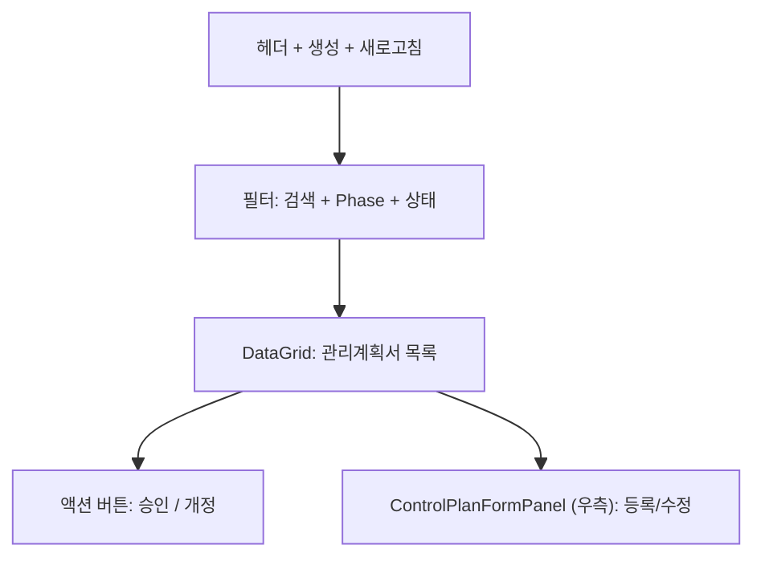
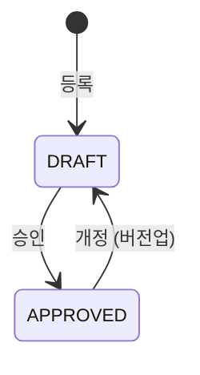

# 관리계획서 — 비즈니스 로직 & 데이터 흐름 분석

> **Menu Code:** `QC_CONTROL_PLAN`
> **Path:** `/quality/control-plan`
> **Label:** `menu.quality.controlPlan`
> **분석 기준 커밋:** `8a7e96ea`
> **분석 일자:** `2026-07-04`

## 1. 화면 개요

IATF 16949 8.5.1.1 관리계획서(Control Plan) 관리. DataGrid + ControlPlanFormPanel. 승인(APPROVE) / 개정(REVISE) 워크플로우.

## 2. 화면 구성

## 3. API 호출 흐름

| 시점 | API | 용도 |
| --- | --- | --- |
| 진입 | `GET /quality/control-plans` | 관리계획서 목록 |
| 등록 | `POST /quality/control-plans` | 관리계획서 등록 |
| 수정 | `PUT /quality/control-plans/{planNo}` | 관리계획서 수정 |
| 승인 | `PATCH /quality/control-plans/approve/{planNo}` | DRAFT → APPROVED |
| 개정 | `POST /quality/control-plans/revise/{planNo}` | APPROVED → DRAFT (버전업) |

## 4. 상태 전이

## 5. DB 테이블 영향

| 테이블 | 작업 | 설명 |
| --- | --- | --- |
| `QA_CONTROL_PLANS` | CRUD + status/version UPDATE | 관리계획서 마스터 |

## 6. 공통코드

| 그룹코드 | 용도 |
| --- | --- |
| `CP_PHASE` | Phase (Prototype/Pilot/Production) |
| `CP_STATUS` | 상태 (DRAFT/APPROVED) |

## 7. 비고

- 개정 시 version 자동 증가
- `alert()/confirm()/prompt()` 사용 없음
